# Lab 1 Utilities

---

## Assignment 1 —— sleep

​	这个任务要求利用调用**系统调用函数sleep**完成sleep n 。我们调用的是syscall的sleep，这时xv6提供的，而不是Linux环境中的< sys >中的sleep。

​	**步骤**：

- 在user文件夹下新建sleep.c，判断一下输入格式，调用一下sleep即可。

- 导包，user.h为xv6提供的系统函数，types.h为其提供的变量类型。

​	sleep.c文件：

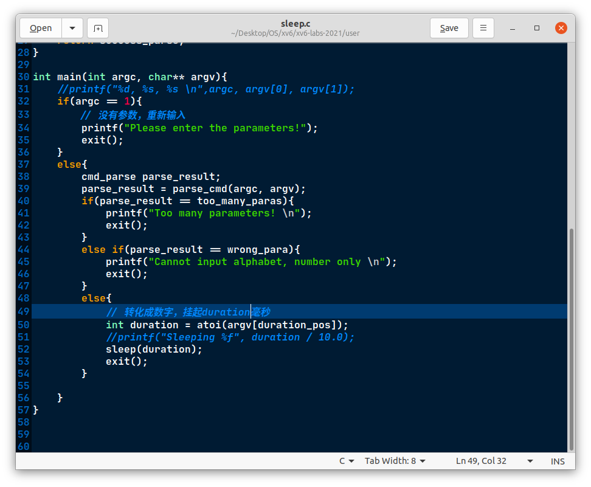

​	cmd_parse是枚举类型，作为parse_cmd函数的返回类型.enum {wrong_para, success_parse, too_many_paras} cmd_parse三个值分别表示输入的sleep参数错误、输入成功、太多参数。

​	sleep运行结果及自动评价:

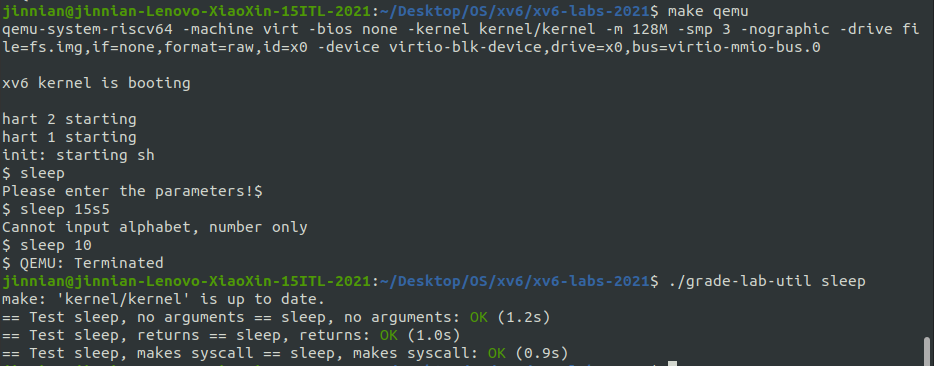


---

## Assignment 2 —— pingpong

本任务要求实现利用管道实现进程间的通信：父进程发送ping，子进程收到后发送pong，父进程收到后将其打印出来，下图方便理解

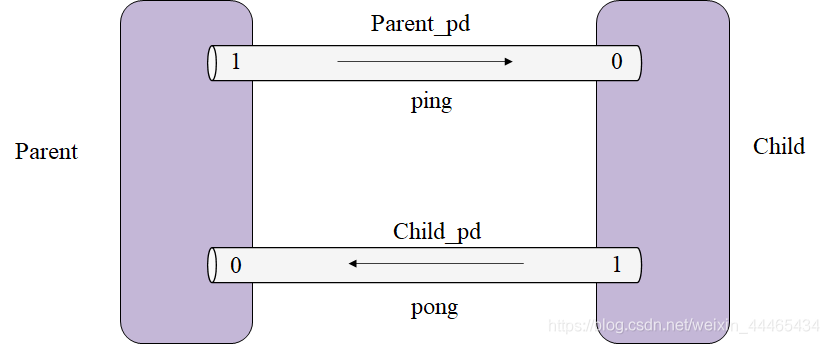

​	Hints 1：利用pipe()函数创建管道，pipe()函数接收一个长度为2的数组，数组下标0为读端、1为写端；
​	Hints 2：利用fork()函数创建新的进程；
​	Hints 3：利用read、write函数读写管道；

​	fd是文件描述符file description flag。每个进程都有一张表，而xv6 内核就以文件描述符作为这张表的索引，所以每个进程都有一个从0开始的文件描述符空间。按照惯例，进程从文件描述符0读入（标准输入），从文件描述符1输出（标准输出），从文件描述符2输出错误（标准错误输出）。	管道两端正是文件描述符，1表示输出，0表示读入，在其中任意一端操作都要关闭另一端(通过close系统调用)

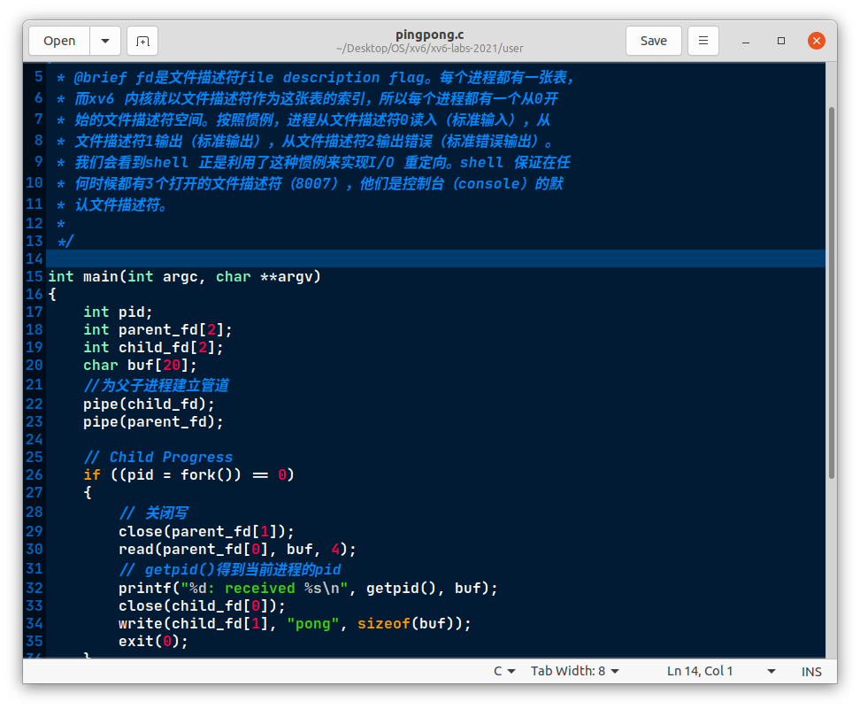

​	main函数中展示了子中的进程操作，先从管道中读出	buffer中四个字节，读之前先关闭管道的写端，读完后输出子进程接收到'ping'，然后向另一管道（xv6中的管道是单向的）中写端，同理，写之前应该关闭该管道的读一端。

​	pingpong运行结果及自动评价：

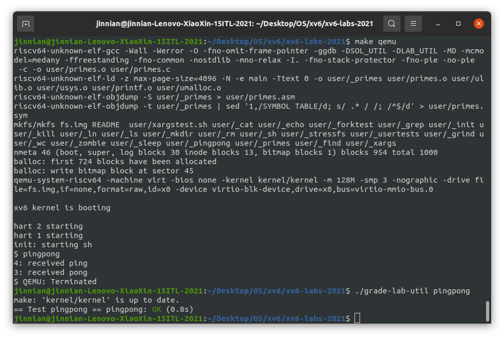

---

## Assignment 3 —— primes

​	本任务要求完成质数筛选器，它要求用fork和pipe实现：输入为2 ~ 35，输出为2 ~ 35间的所有质数，例如：2、3、5、7等。第一次我们将2 ~ 35给到一个进程，这个进程发现给到的第一个数为2，则输出2，然后将不能被2除尽的数（3、5、7、9……）发送给下一个进程，下一个进程发现给到的第一个数为3，则输出3，然后将不能被3除尽的数（5、7……）发送给下一个进程……以此类推。下图辅助理解：

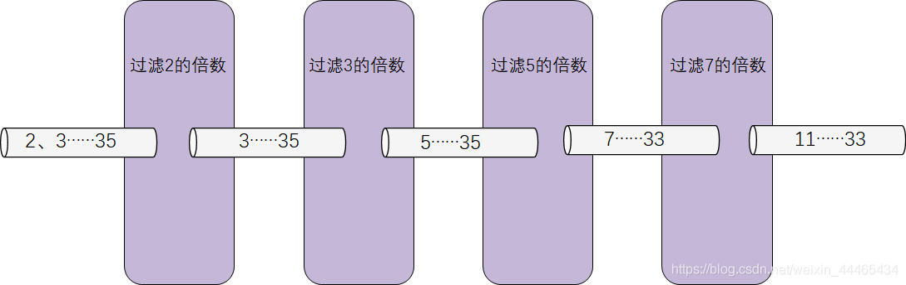

​	`read(fd, buf, n)`从 `fd` 读最多n 个字节（`fd`可能没有n 个字节），将它们拷贝到 `buf` 中，然后返回读出的字节数。每一个指向文件的文件描述符都和一个偏移关联（文件内指针）。`read`从当前文件偏移处读取数据，然后把偏移增加读出字节数。紧随其后的 `read` 会从新的起点开始读数据。当没有数据可读时，`read`就会返回0，这就表示文件结束了。

​	`write(fd, buf, n)`写 `buf` 中的n 个字节到 `fd` 并且返回实际写出的字节数。如果返回值小于n 那么只可能是发生了错误。就像 `read` 一样，`write`也从当前文件的偏移处开始写，在写的过程中增加这个偏移。

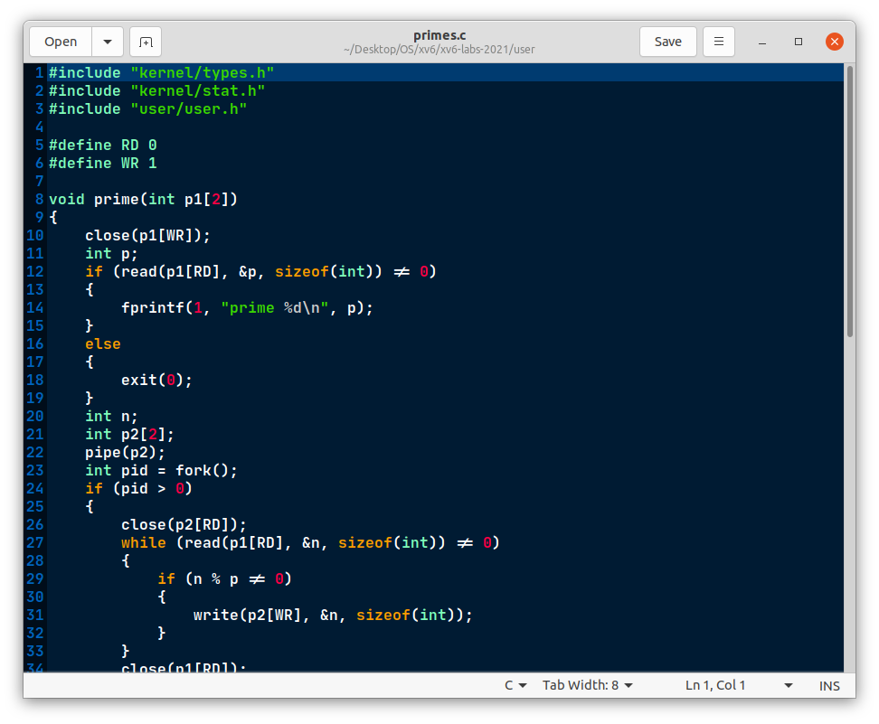

主函数如下：

```c
int main()
{
    // 创建管道
    int p1[2];
    pipe(p1);
    // 创建下一子进程
    int pid = fork();
    if (pid < 0)
    {
        fprintf(2, "fork error!\n");
        close(p1[RD]);
        close(p1[WR]);
        exit(1);
    }
    // child
    else if (pid == 0)
    {
        prime(p1);
    }
    // parent 
    else
    { // 关闭读
        close(p1[RD]);
        for (int i = 2; i <= 35; i++)
        {
            write(p1[WR], &i, sizeof(int));
        }
        close(p1[WR]);
        wait((int *)0);
    }

    exit(0);
}
```

主函数中创建初始管道，初始化管道中写入2～35数字，prime函数中是递归的子进程和管道，筛选每一个数的倍数，第一次递归输出2，然后筛选掉2的倍数；第二次输出3，递归筛选掉3的倍数；第三次输出5(4被筛掉了)，筛选掉5的倍数......依次类推。

​	primes运行结果及自动评价：

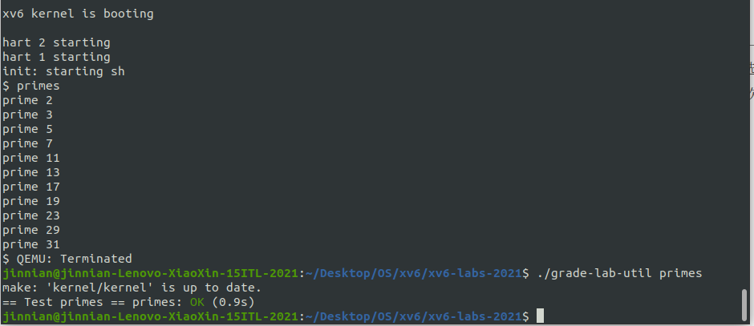

---

## Assignment 4 —— find

​	本任务要求写一个find函数，其基本用法为 find arg1 arg2， 即在目录arg1下找到arg2。这和file system有关。任务的一个Hint：Look at user/ls.c to see how to read directories。参考ls.c的写法。再复制grep.c的正则匹配代码，匹配目录或文件

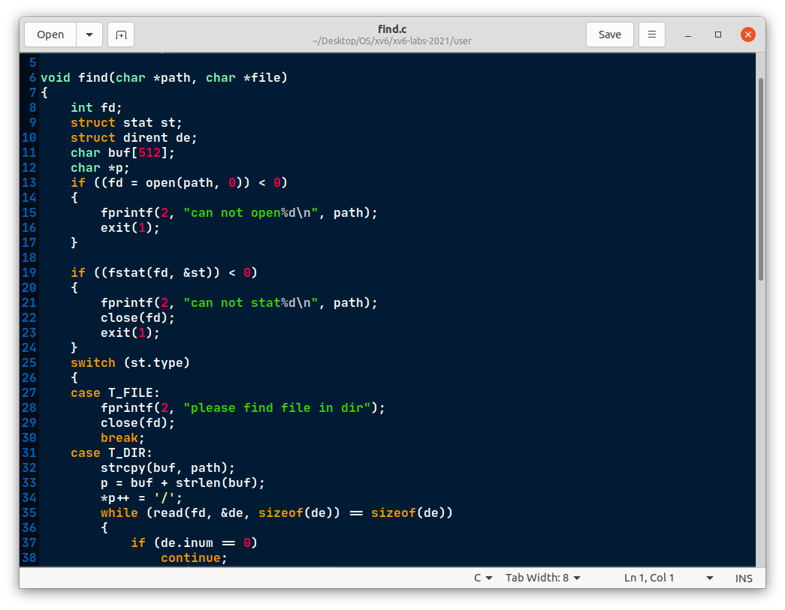

​	其中用到了两个函数：`fstat` 可以获取一个文件描述符指向的文件的信息。它填充一个名为 `stat` 的结构体（程序中为实例化的st），它在 `stat.h` 中定义为：

```C
struct stat {
  int dev;     // File system's disk device
  uint ino;    // Inode number
  short type;  // Type of file
  short nlink; // Number of links to file
  uint64 size; // Size of file in bytes
};
```

​	`open`函数返回指定路径的文件描述符，用以传递给`fstat`函数

​	find运行结果及自动评价：

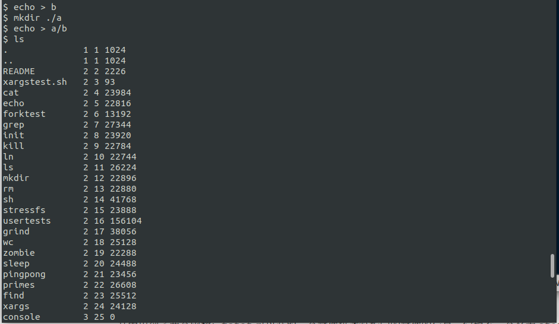

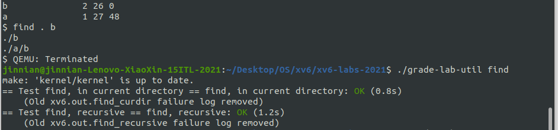

##  Assignment 5 —— xargs:star:

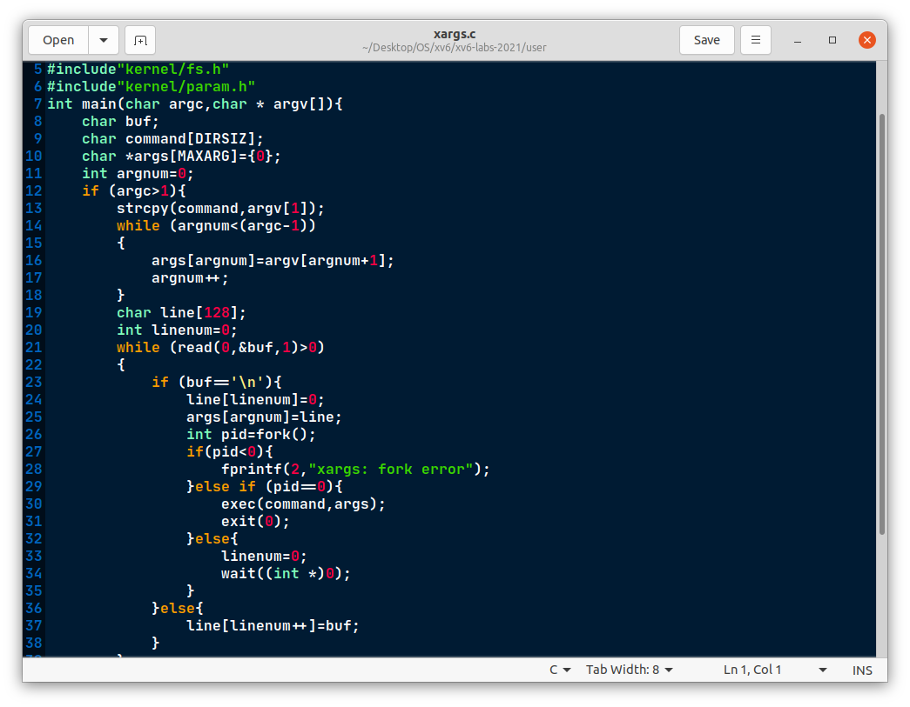

多参数实现，当用户输入"ctrl+d"时停止参数的输入。这里要说明的是：对于输入的命令，我们要用exec执行，其中exec接收两个参数，第一个参数为命令cmd，第二个参数为一个数组，该数组的格式必须为{cmd, “arg1”, “arg2”, …, 0}，以下是`xargstest.sh`中的内容

```shell
$ $ cat xargstest.sh
mkdir a
echo hello > a/b
mkdir c
echo hello > c/b
echo hello > b
find . b | xargs grep hello

```


​	xargs运行结果及自动评价：

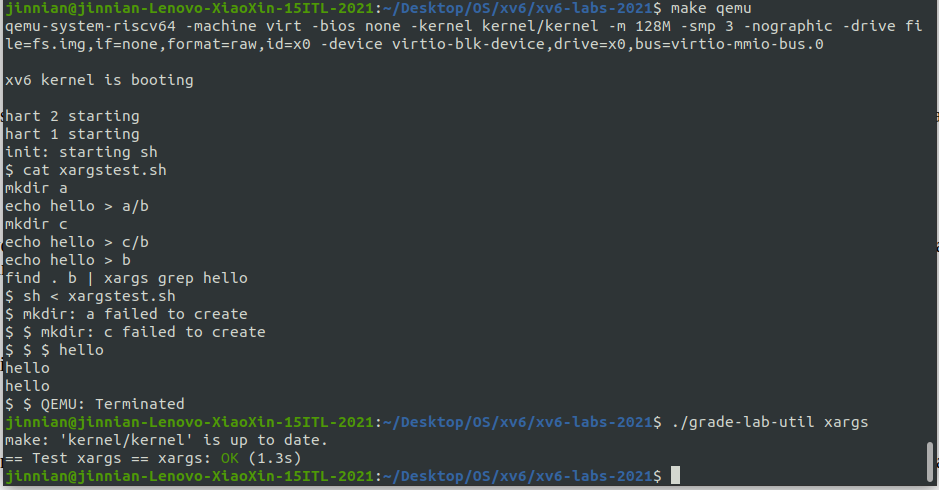

​	由于第一次实验时已经创建了a和b文件夹，所以再一次创建会失败。

---


