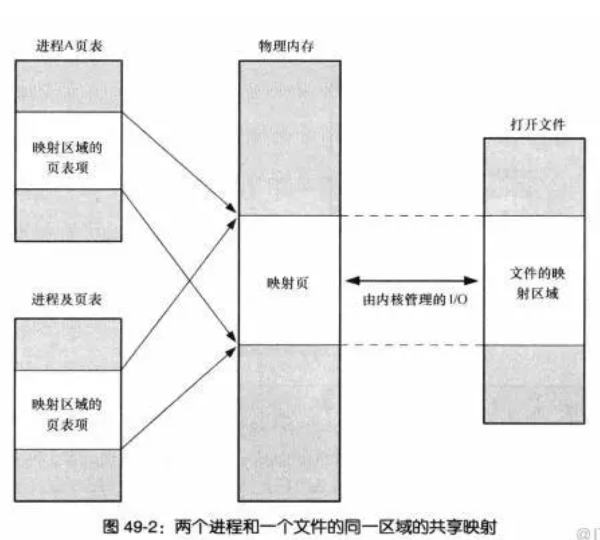
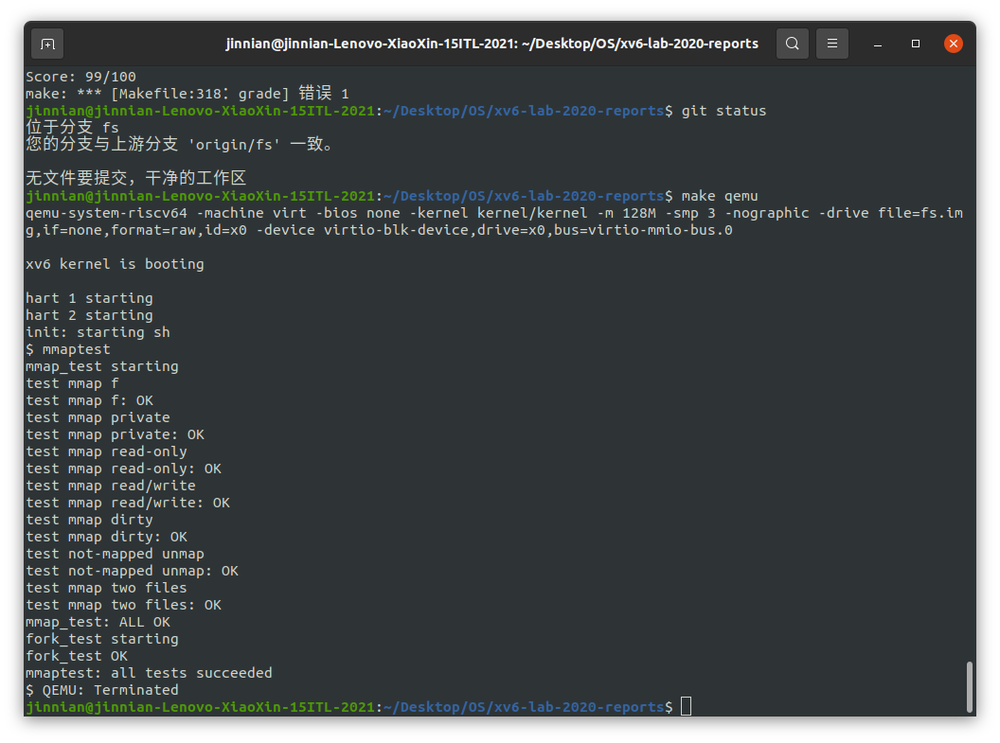
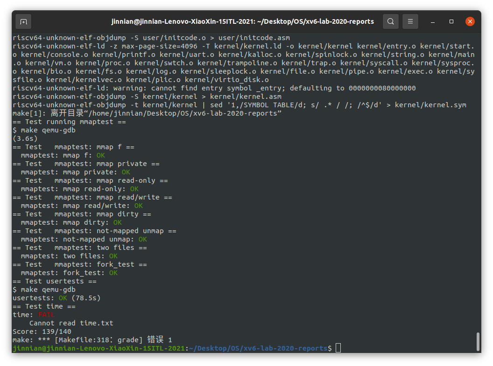

# Lab 10 Mmap

---

## 写在前面

> mmap：将一个文件或者其他对象映射到进程的地址空间，实现文件磁盘地址和进程虚拟地址空间中一段虚拟地址的一一对应关系。
>
> 
>
> 为什么要建立文件磁盘地址和进程虚拟地址空间的映射？因为常规的文件系统操作是用户态发起`read`syscall，然后在buffer cache中查找是否有相应的数据，如果没有就从磁盘中拷贝数据到buffer cache中，因为buffer cache处在内核态，因此需要将buffer cache`copyout`到用户进程的虚拟内存中，这就需要2次拷贝操作，而在mmap中只需要直接将文件数据拷贝到对应的用户空间虚拟内存即可。

---

## Assignment 1 —— mmap

​	`mmap`和`munmap`系统调用允许UNIX程序对其地址空间进行详细控制。它们可用于在进程之间共享内存，将文件映射到进程地址空间，并作为用户级页面错误方案的一部分，如本课程中讨论的垃圾收集算法。本实验将把`mmap`和`munmap`添加到xv6中，重点关注内存映射文件（memory-mapped files）。

```sh
$ man 2 mmap
void *mmap(void *addr, size_t length, int prot, int flags, int fd, off_t offset);
```


​	可以通过多种方式调用`mmap`，但本实验只需要与内存映射文件相关的功能子集。假设`addr`始终为零，这意味着内核应该决定映射文件的虚拟地址。`mmap`返回该地址，如果失败则返回`0xffffffffffffffff`。`length`是要映射的字节，它可能与文件的长度不同。`prot`指示内存是否应映射为可读、可写，以及/或者可执行的；可以认为`prot`是`PROT_READ`或`PROT_WRITE`或两者兼有。`flags`要么是`MAP_SHARED`（映射内存的修改应写回文件），要么是`MAP_PRIVATE`（映射内存的修改不应写回文件）。不必在`flags`中实现任何其他位。`fd`是要映射的文件的打开文件描述符。可以假定`offset`为零（它是要映射的文件的起点）。允许进程映射同一个`MAP_SHARED`文件而不共享物理页面。

​	`munmap(addr, length)`应删除指定地址范围内的`mmap`映射。如果进程修改了内存并将其映射为`MAP_SHARED`，则应首先将修改写入文件。`munmap`调用可能只覆盖`mmap`区域的一部分，但您可以认为它取消映射的位置要么在区域起始位置，要么在区域结束位置，要么就是整个区域(但不会在区域中间“打洞”)。

**Question：**

​	实现`mmap`和`munmap`的功能以通过mmaptest的测试。

**Hints：**

- 首先，向`UPROGS`添加`_mmaptest`，以及`mmap`和`munmap`系统调用，以便让***user/mmaptest.c***进行编译。现在，只需从`mmap`和`munmap`返回错误。
- 惰性地填写页表，以响应页错误。也就是说，`mmap`不应该分配物理内存或读取文件。相反，在`usertrap`中（或由`usertrap`调用）的页面错误处理代码中执行此操作，就像在lazy page allocation实验中一样。惰性分配的原因是确保大文件的`mmap`是快速的，并且比物理内存大的文件的`mmap`是可能的。
- 跟踪`mmap`为每个进程映射的内容。定义VMA（虚拟内存区域）结构体，记录`mmap`创建的虚拟内存范围的地址、长度、权限、文件等。由于xv6内核中没有内存分配器，因此可以声明一个固定大小的VMA数组，并根据需要从该数组进行分配。大小为16应该就足够了。
- 实现`mmap`：在进程的地址空间中找到一个未使用的区域来映射文件，并将VMA添加到进程的映射区域表中。VMA应该包含指向映射文件对应`struct file`的指针；`mmap`应该增加文件的引用计数，以便在文件关闭时结构体不会消失（提示：请参阅`filedup`）。运行`mmaptest`：第一次`mmap`应该成功，但是第一次访问被`mmap`的内存将导致页面错误并终止`mmaptest`。
- 添加代码以导致在`mmap`的区域中产生页面错误，从而分配一页物理内存，将4096字节的相关文件读入该页面，并将其映射到用户地址空间。使用`readi`读取文件，它接受一个偏移量参数，在该偏移处读取文件（但必须lock/unlock传递给`readi`的索引结点）。不要忘记在页面上正确设置权限。运行`mmaptest`；它应该到达第一个`munmap`。
- 实现`munmap`：找到地址范围的VMA并取消映射指定页面（提示：使用`uvmunmap`）。如果`munmap`删除了先前`mmap`的所有页面，它应该减少相应`struct file`的引用计数。如果未映射的页面已被修改，并且文件已映射到`MAP_SHARED`，请将页面写回该文件。查看`filewrite`以获得灵感。
- 理想情况下，您的实现将只写回程序实际修改的`MAP_SHARED`页面。RISC-V PTE中的脏位（`D`）表示是否已写入页面。但是，`mmaptest`不检查非脏页是否没有回写；因此，您可以不用看`D`位就写回页面。
- 修改`exit`将进程的已映射区域取消映射，就像调用了`munmap`一样。运行`mmaptest`；`mmap_test`应该通过，但可能不会通过`fork_test`。
- 修改`fork`以确保子对象具有与父对象相同的映射区域。不要忘记增加VMA的`struct file`的引用计数。在子进程的页面错误处理程序中，可以分配新的物理页面，而不是与父级共享页面。后者会更酷，但需要更多的实施工作。运行`mmaptest`；它应该通过`mmap_test`和`fork_test`。

**Solution：**

> 在`kernel/proc.h`中添加对`vma`结构体的定义，每个进程中最多可以有16个VMA。

```C
#define MAXVMA 16
struct vma {
  int valid;                // whether the vma is valid
  uint64 addr;              // starting virtual address of vma
  int len;                  // length of vma, unit: bytes
  int prot;                 // permission
  int flags;                // flag
  struct file *f;           // pointer to mapped file
  int off;                  // offset of the valid mapped address
  int valid_len;            // length of the valid mapped address
};
struct vma procvma[MAXVMA]; // process vma
```

> `kernel/sysfile.c`中添加注册`sys_mmap`，在`mmap`中先不要分配物理内存，只是完成对`vma`结构体的写入。找到新的空闲内存地址`p->sz`作为`vma`返回的地址并`p->sz+=len`，让后面需要使用这个返回的内存地址时陷入缺页异常，在trap中再分配物理内存完成lazy allocation

```c
uint64
sys_mmap(void)
{
  int length, prot, flags, fd;
  struct file *f;
  if (argint(1, &length)<0 || argint(2, &prot)<0 || argint(3, &flags)<0 || argfd(4, &fd, &f)<0) {
    return -1;
  }
  if (!f->writable && (prot & PROT_WRITE) && (flags & MAP_SHARED)) return -1; // to assert that readonly file could not be opened with PROT_WRITE && MAP_SHARED flags
  struct proc *p = myproc();
  struct vma *pvma = p->procvma;
  for (int i = 0; i < MAXVMA; i++) {
    if(pvma[i].valid == 0) {
      pvma[i].addr = p->sz;
      pvma[i].f = filedup(f);  // increment the refcount for f
      pvma[i].flags = flags;
      pvma[i].len = PGROUNDUP(length);
      pvma[i].prot = prot;
      pvma[i].valid = 1;
      pvma[i].off = 0;
      pvma[i].valid_len = pvma[i].len;
      p->sz += pvma[i].len;
      return pvma[i].addr;
    }
  }
  return -1;
}
```

> 在`kernel/trap.c`中添加lazy allocation：需要判断page fault的地址是合理的，如果fault的地址低于了当前进程的栈底(`p->trapframe->sp`)或者高于等于当前进程的堆顶(`p->sz`)就说明是不合理的，需要进入exception。然后判断当前fault的地址是在哪一个VMA的合法范围中，找到这个VMA后分配一页物理页，并用`mappages`将这一页物理页映射到fault的用户内存中，然后用`readi`打开需要映射的文件，将对应的文件内容用`readi`放入这一页内存中去。

```c
  } else if((which_dev = devintr()) != 0){
    // ok
  } else if (r_scause() == 13 || r_scause() == 15) {
    uint64 va = r_stval();
    if (va < p->trapframe->sp || va >= p->sz) {
      goto exception;
    }
    struct vma *pvma = p->procvma;
    va = PGROUNDDOWN(va);

    for (int i = 0; i < MAXVMA; i++) {
      if (pvma[i].valid && va >= pvma[i].addr + pvma[i].off && va < pvma[i].addr + pvma[i].off + pvma[i].valid_len) {  
        // allocate one page in the physical memory
        char *mem = kalloc();
        if (mem == 0) goto exception;
        memset(mem, 0, PGSIZE);
        int flag = (pvma[i].prot << 1) | PTE_U; // PTE_R == 2 and PROT_READ == 1
        if (mappages(p->pagetable, va, PGSIZE, (uint64)mem, flag) != 0) {
          kfree(mem);
          goto exception;
        }   
        int off = va - pvma[i].addr;
        ilock(pvma[i].f->ip);
        readi(pvma[i].f->ip, 1, va, off, PGSIZE);
        iunlock(pvma[i].f->ip);
        break;
      }
    }
  } else {
    exception:
    printf("usertrap(): unexpected scause %p pid=%d\n", r_scause(), p->pid);
    printf("            sepc=%p stval=%p\n", r_sepc(), r_stval());
    p->killed = 1;
  }
```

> 实现`munmap`：首先需要找到对应的vma，然后根据unmap的大小和起点的不同进行讨论。如果是从vma有效部分的起点开始，当整个vma都被unmap掉时，需要标记这个打开的文件被关闭（但是现在还不能关闭，因为后面可能需要写回硬盘中的文件），将当前的vma设置为invalid，减小`p->sz`（这一部分可能有点问题，因为如果是unmap中间的vma的话不需要减小`p->sz`，但是本实验中是可以通过测试的）。如果只是部分vma被unmap，则修改vma的`off`和`valid_len`，如果是从中间部分开始被unmap一直到结尾，则不需要修改`off`，只需要修改`valid_len`和需要被`uvmunmap`的`length`。然后判断是否是`MAP_SHARED`，如果是就用`_filewrite`写回原文件，这里是对`filewrite`函数进行了修改，使其能够从某个offset开始写。

```c
int sys_munmap(void)
{
  uint64 addr;
  int length;
  if (argaddr(0, &addr) < 0 || argint(1, &length) < 0) {
    return -1;
  }
  struct proc *p = myproc();
  struct vma *pvma = p->procvma;
  int close = 0;
  // find the corresponding vma
  for (int i = 0; i < MAXVA; i++) {
    if (pvma[i].valid && addr >= pvma[i].addr && addr < pvma[i].addr + pvma[i].len) {
      addr = PGROUNDDOWN(addr);
      if (addr == pvma[i].addr + pvma[i].off) {
        // starting at begin of the valid address of vma
        if (length >= pvma[i].valid_len) {
          // whole vma is unmmaped
          pvma[i].valid = 0;
          length = pvma[i].valid_len;
          close = 1;
          p->sz -= pvma[i].len;
        } else {
          pvma[i].off += length;
          pvma[i].valid_len -= length;
        }
      } else {
        // starting at middle, should unmap until the end
        length = pvma[i].addr + pvma[i].off + pvma[i].valid_len - addr;
        pvma[i].valid_len -= length;
      }
      if (pvma[i].flags & MAP_SHARED) {
        // write the page back to the file
        if (_filewrite(pvma[i].f, addr, length, addr - pvma[i].addr) == -1) return -1; 
      }
      uvmunmap(p->pagetable, addr, PGROUNDUP(length)/PGSIZE, 0);
      if (close) fileclose(pvma[i].f);
      return 0;
    }
  }
  return -1;
} 

int
_filewrite(struct file *f, uint64 addr, int n, uint off) {
  int r, ret = 0;

  if(f->writable == 0)
    return -1;

  if(f->type == FD_PIPE){
    ret = pipewrite(f->pipe, addr, n);
  } else if(f->type == FD_DEVICE){
    if(f->major < 0 || f->major >= NDEV || !devsw[f->major].write)
      return -1;
    ret = devsw[f->major].write(1, addr, n);
  } else if(f->type == FD_INODE){
    // write a few blocks at a time to avoid exceeding
    // the maximum log transaction size, including
    // i-node, indirect block, allocation blocks,
    // and 2 blocks of slop for non-aligned writes.
    // this really belongs lower down, since writei()
    // might be writing a device like the console.
    int max = ((MAXOPBLOCKS-1-1-2) / 2) * BSIZE;
    int i = 0;
    while(i < n){
      int n1 = n - i;
      if(n1 > max)
        n1 = max;

      begin_op();
      ilock(f->ip);
      if ((r = writei(f->ip, 1, addr + i, off, n1)) > 0)
        off += r;
      iunlock(f->ip);
      end_op();

      if(r != n1){
        // error from writei
        break;
      }
      i += r;
    }
    // ret = (i == n ? n : -1);
  } else {
    panic("filewrite");
  }
  return ret;
}
```

最后`uvmunmap`掉这个vma中对应的虚拟内存（这里释不释放物理内存都可以通过测试），如果需要关闭文件就调用`fileclose`。

最后，由于`p->sz`以内的内存不是都有对应的映射，因此可能会造成`uvmunmap`和`uvmcopy`出现panic。直接将对应的panic注释掉并continue就可以

```c
// uvmunmap
// if((*pte & PTE_V) == 0)
      // panic("uvmunmap: not mapped");

// uvmcopy
    if((*pte & PTE_V) == 0)
      panic("uvmcopy: page not present");
      continue;
    //  panic("uvmcopy: page not present");
```

测试过程中发现`kfree`中似乎会试图杀掉0这个物理内存，没有搞明白是在哪里杀的，因此直接修改`kfree`，当`pa==0`时直接return避免panic

**运行结果：**



**评分**：



---

