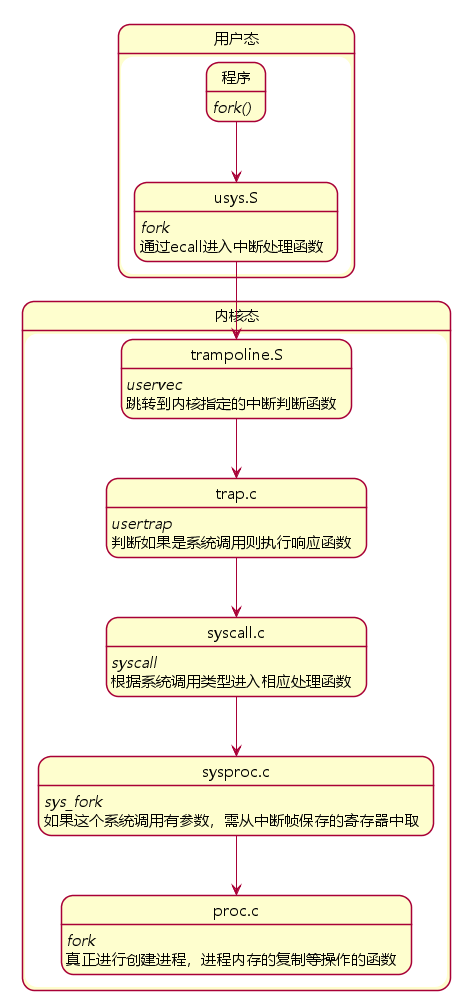
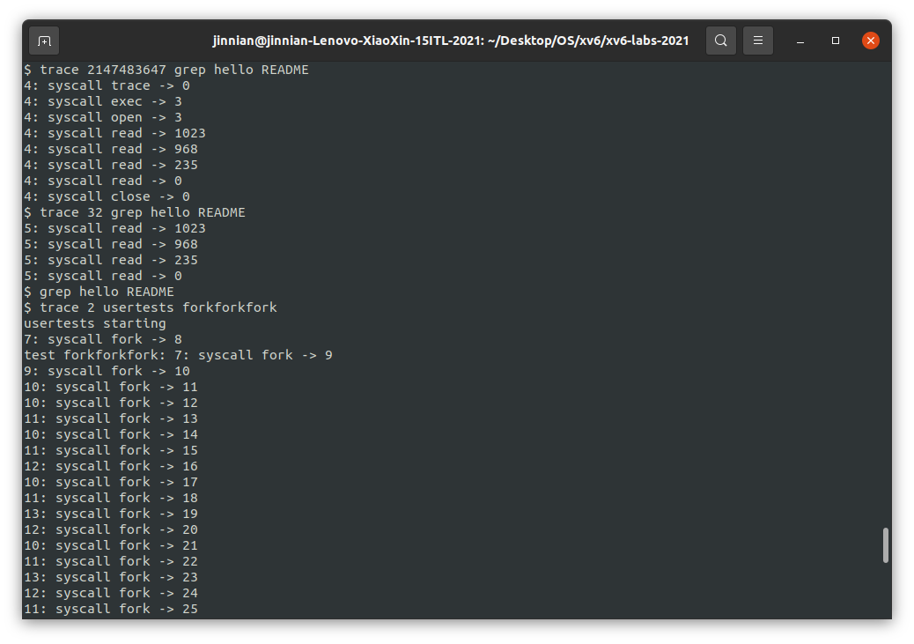

# Lab 2 Syscall

> 该实验添加两个系统调用`trace`和`sysinfo`

---

## Assignment 1 —— System call tracing

​	本任务中要求添加一个系统调用跟踪功能，该功能可能会在以后调试实验时帮助您。您将创建一个新的`trace`系统调用来控制跟踪。它应该采用一个参数`mask`，int 整数类型，其位指定要跟踪的系统调用。例如，为了跟踪 fork 系统调用，程序调用`trace(1 << SYS_fork)`，其中`SYS_fork`是来自`kernel/syscall.h`的系统调用号。如果掩码中设置了系统调用号，则必须修改 xv6 内核以在每个系统调用即将返回时打印一行。该行应包含进程 id、系统调用的名称和返回值；不需要打印系统调用参数。`trace`系统调用应该启用对调用它的进程以及它随后产生的任何子进程的跟踪，但不应影响其他进程。

​	系统调用原理（以 fork 为例）：

​	该实验需要打印其他系统调用的信息。根据上面的分析和文档说明，首先需要给user.h、usys.pl（用来生成usys.S的辅助脚本）和syscall.h添加对应的函数的系统调用号，然后给syscall.c的系统调用数组添加对应的函数指针和函数头，在sysproc.c添加对应的函数实现，sysproc.c里主要是接收参数并给proc结构体复制，具体代码如下：

```c
# kernel/sysproc.c
uint64 sys_trace(void) {
    int mask;
    if (argint(0, &mask) < 0) return -1;
    myproc()->mask = mask; return 0;
}

# user/user.h
// system calls
...
int trace(int);//添加trace原型

# user/usys.pl
...
entry("trace");

# kernel/syscall.h
// System call numbers
...
#define SYS_trace  22
    
# kernel/proc.h
// Per-process state
struct proc {
  ...
  char name[16];               // Process name (debugging)
  int mask;                    // Tracing parameter
};

# kernel/syscall.c
...
extern uint64 sys_trace(void);

static uint64 (*syscalls[])(void) = {
...
[SYS_trace]   sys_trace,
};

char* syscalls_name[] = {
[SYS_fork]    "fork",
[SYS_exit]    "exit",
[SYS_wait]    "wait",
[SYS_pipe]    "pipe",
[SYS_read]    "read",
[SYS_kill]    "kill",
[SYS_exec]    "exec",
[SYS_fstat]   "fstat",
[SYS_chdir]   "chdir",
[SYS_dup]     "dup",
[SYS_getpid]  "getpid",
[SYS_sbrk]    "sbrk",
[SYS_sleep]   "sleep",
[SYS_uptime]  "uptime",
[SYS_open]    "open",
[SYS_write]   "write",
[SYS_mknod]   "mknod",
[SYS_unlink]  "unlink",
[SYS_link]    "link",
[SYS_mkdir]   "mkdir",
[SYS_close]   "close",
[SYS_trace]   "trace",
};

void
syscall(void)
{
  ...
  if(num > 0 && num < NELEM(syscalls) && syscalls[num]) {
    p->trapframe->a0 = syscalls[num]();
    if((1 << num) & p->mask){//mask的二进制下为1的数位表示需要跟踪的进程
    	printf("%d: syscall %s -> %d\n",
    	       p->pid, syscalls_name[num], p->trapframe->a0);
    }
  } 
  ...
}

# kernel/proc.c
int
fork(void)
{
  ...
  safestrcpy(np->name, p->name, sizeof(p->name));
  np->mask = p->mask; //添加mask给子进程
  pid = np->pid;
  ...
}

static struct proc*
allocproc(void)
{
  ...
  p->context.sp = p->kstack + PGSIZE;
  p->mask = 0;//给每个进程mask赋个初值即可。

  return p;
}
```

`trace`运行结果及自动评测：结构是`pid: syscall '调用类型' -> 返回值`




---

## Assignment 2 —— Sysinfo

​	在这个任务中，添加一个系统调用`sysinfo`，它收集有关正在运行的系统的信息。系统调用有一个参数：指向`struct sysinfo`的指针 （参见`kernel/sysinfo.h`）。内核应填写此结构的字段：`freemem`字段应设置为空闲内存的字节数，`nproc` 字段应设置为`状态` 不是`UNUSED`即正在进行的进程数。官方提供了一个测试程序`sysinfotest`；如果它打印“sysinfotest：OK”，表示通过了这个任务。如下：

```C
struct sysinfo {
  uint64 freemem;   // amount of free memory (bytes)
  uint64 nproc;     // number of process
};
```

​	同上面的syscall一样，首先需要给user.h、usys.pl（用来生成usys.S的辅助脚本）和syscall.h添加对应的函数和系统调用号。

### 2.1 获取空闲内存和空闲进程

接下来，完善`getfreemem()`和`getnproc()`这两个函数。

### getfreemem()

根据提示查看`kernel/kalloc.c`文件，从中可以看出，`xv6`系统维护着一个`kmem.freelist`链表来存储空闲页，遍历`kmem.freelist`即可计算出空闲内存。因为要遍历该链表，为防止冲突，需要先获取`lock`，计算完后再`release`。

```C
# kernel/kalloc.c
uint64 getfreemem(void)
{
  uint64 freemem = 0;
  struct run *r;
  // 循环等待锁
  acquire(&kmem.lock);
  r = kmem.freelist;
  while(r){
    freemem += PGSIZE;//若r存在，加上页的内存大小
    r = r->next;
  }
  // 释放锁
  release(&kmem.lock);
  return freemem;
}

```

### getnproc()

根据提示查看`kernel/proc.c`，其内部定义了`struct proc proc[NPROC]`，所以我们只要遍历这个数组，统计其中`state != UNUSED`的个数即可。

```c
uint64 getnproc(void)
{
  uint64 res = 0;
  struct proc *p;
  for(p = proc; p < &proc[NPROC]; p++){
    if(p->state != UNUSED) res++;
  }
  return res;
}
```

### 2.2 sysinfo函数

​	仿照`sys_fstat()` (`kernel/sysfile.c`)和 `filestat()` (`kernel/file.c`)即可实现`sys_sysinfo()`的核心功能，把内核中的结构体`sysinfo`拷贝到用户区的指针中。

```C
# kernal/sysproc.c
uint64 sys_sysinfo(void)
{
  uint64 addr;
  struct sysinfo sinfo;
  // 获取用户态传入的sysinfo结构体
  if(argaddr(0, &addr) < 0)
    return -1;
  sinfo.freemem = getfreemem();
  sinfo.nproc = getnproc();
  // 将内核态中的info复制到用户态
  if(copyout(myproc()->pagetable, addr, (char *)&sinfo, sizeof(sinfo)) < 0)
    return -1;
  return 0;
}
```

​	运行结果及自动评分：


​	由于实验最后有一项提交`time.txt`文件的要求，没有提交故`FAIL`
