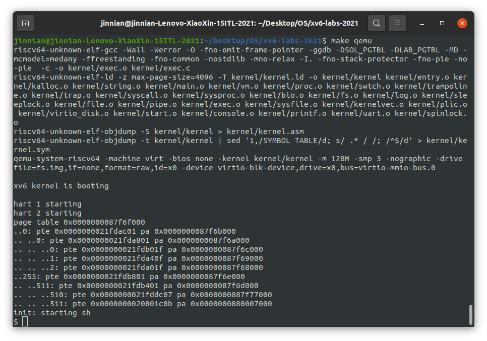

# Lab 3 Page Table

---

## Assignment 1 —— vmprint

​	定义一个名为`vmprint()`的函数。它应该接受一个`pagetable_t`参数，并以下面描述的格式打印该页表。`在 exec.c 中的return argc`之前插入`if(p->pid==1) vmprint(p->pagetable)`，以打印第一个进程的页表,通过`make Grade`的`pte` 打印输出测试。

​	Hints:

- 可以将`vmprint()`放在`kernel/vm.c`中。
- 使用文件 kernel/riscv.h 末尾的宏。
- `freewalk`的功能可能有用。
- `在 kernel/defs.h 中定义vmprint`的原型，以便可以从 exec.c 中调用它。
- 在的 printf 调用中使用`%p`打印出完整的 64 位十六进制 PTE 和地址，如示例中所示。

​	示例：

```shell
xv6 kernel is booting

hart 2 starting
hart 1 starting
init: starting sh
page table 0x0000000087f6e000
..0: pte 0x0000000021fda801 pa 0x0000000087f6a000
.. ..0: pte 0x0000000021fda401 pa 0x0000000087f69000
.. .. ..0: pte 0x0000000021fdac1f pa 0x0000000087f6b000
.. .. ..1: pte 0x0000000021fda00f pa 0x0000000087f68000
.. .. ..2: pte 0x0000000021fd9c1f pa 0x0000000087f67000
..255: pte 0x0000000021fdb401 pa 0x0000000087f6d000
.. ..511: pte 0x0000000021fdb001 pa 0x0000000087f6c000
.. .. ..510: pte 0x0000000021fdd807 pa 0x0000000087f76000
.. .. ..511: pte 0x0000000020001c0b pa 0x0000000080007000
  
```

​	`vmprint`函数：

```cpp
# kernel/excu.c:119 return argc；前插入
if(p->pid==1) vmprint(p->pagetable);

# kernel/vm.c
void _vmprint(pagetable_t pagetable, int level)
{
  for(int i = 0; i < 512; i++){
    pte_t pte = pagetable[i];
    if((pte & PTE_V)){
      // this PTE points to a lower-level page table.
      for (int j = 0; j < level; j++)
      {
        if (j == 0) printf("..");
        else printf(" ..");
      }
      uint64 child = PTE2PA(pte);
      printf("%d: pte %p pa %p\n", i, pte, child);
      // 查看flag位是否被设置，若被设置则为最低一层，
      // 见vm.c161行，可以看到只有最底层被设置了符号位
      if ((pte & (PTE_R|PTE_W|PTE_X)) == 0)
        _vmprint((pagetable_t)child, level + 1);
    }
  }
}

void vmprint(pagetable_t pagetable)
{
  printf("page table %p\n", pagetable);
  _vmprint(pagetable, 1);
}
```

​	`vmprint`运行结果：



---

## Assignment 2 —— A kernel page table per process

​	xv6 拥有一个单独的内核页表供所有进入内核的进程使用，该页表与实际物理内存直接映射，不需要转换地址。但如果想使用用户态的一个地址时，当内核态需要使用一个用户态指针时，需要翻译转换虚拟地址为物理地址。因此，本实验的目标是给每个进程创建一个内核态页表。第一项工作是修改内核，以便每个进程在内核中执行时都使用自己的内核页表副本。修改`struct proc`为每个进程维护一个内核页表，并修改调度器在切换进程时切换内核页表。对于这一步，每个进程的内核页表应该与现有的全局内核页表相同。如果`usertests`运行正确，就通过了这部分的实验。

​	Hints:

- 为进程的内核页表 添加一个字段到`struct proc 。`

  ```C
  # kernel/proc.h
  struct proc {
    struct spinlock lock;
    ......
    pagetable_t kernelpt;        // 内核映射表
  };
  ```

- 为新进程生成内核页表的合理方法是实现`kvminit`的修改版本，该版本生成新页表而不是修改`kernel_pagetable`。需要从`allocproc`调用此函数。

  ```C
  # kernel/vm.c
  // 模仿vm.c中kvminit的方式构建每个进程自己的内核映射表 TODO:删除
  pagetable_t proc_kpt_init()
  {
    pagetable_t kpt;
    kpt = uvmcreate();
    if (kpt == 0) return 0;
    uvmmap(kpt, UART0, UART0, PGSIZE, PTE_R | PTE_W);
    uvmmap(kpt, VIRTIO0, VIRTIO0, PGSIZE, PTE_R | PTE_W);
    uvmmap(kpt, CLINT, CLINT, 0x10000, PTE_R | PTE_W);
    uvmmap(kpt, PLIC, PLIC, 0x400000, PTE_R | PTE_W);
    uvmmap(kpt, KERNBASE, KERNBASE, (uint64)etext-KERNBASE, PTE_R | PTE_X);
    uvmmap(kpt, (uint64)etext, (uint64)etext, PHYSTOP-(uint64)etext, PTE_R | PTE_W);
    uvmmap(kpt, TRAMPOLINE, (uint64)trampoline, PGSIZE, PTE_R | PTE_X);
    return kpt;
  }
  
  // 添加映射到用户进程的kernel pagetable
  void uvmmap(pagetable_t pagetable, uint64 va, uint64 pa, uint64 sz, int perm)
  {
    if(mappages(pagetable, va, sz, pa, perm) != 0)
      panic("kvmmap");
  }
  
  # kernel/proc.c/allocproc allocproc调用，仿照创建空表
    // 添加kernel pagetable
    p->kernelpt = proc_kpt_init();
    if (p->kernelpt == 0){
      freeproc(p);
      release(&p->lock);
      return 0;
    }
  ```

- 确保每个进程的内核页表都有该进程的内核堆栈的映射。在未修改的 xv6 中，所有内核堆栈都设置在`procinit`中。需要将部分或全部功能移至`allocproc`。

  ```C
  #  kernel/proc.c/allocproc 
    // 把内核映射放到到进程的内核栈里
    // Allocate a page for the process's kernel stack.
    // Map it high in memory, followed by an invalid
    // guard page.
    char *pa = kalloc();
    if(pa == 0)
      panic("kalloc");
    uint64 va = KSTACK((int) (p - proc));
    // 添加kernel stack的映射到用户的kernel pagetable里
    uvmmap(p->kernelpt, va, (uint64)pa, PGSIZE, PTE_R | PTE_W);
    p->kstack = va;
  ```

- 修改`scheduler()`以将进程的内核页表加载到内核的`satp`寄存器中（请参阅`kvminithart`以获得灵感）。不要忘记在调用`w_satp()` 之后调用`sfence_vma()`。

- `scheduler()`应该在没有进程运行时 使用`kernel_pagetable 。`

  ```C
  # kernel/proc.c
  void
  scheduler(void)
  {
    struct proc *p;
    struct cpu *c = mycpu();
    
    c->proc = 0;
    for(;;){
      // Avoid deadlock by ensuring that devices can interrupt.
      intr_on();
  
      int found = 0;
      for(p = proc; p < &proc[NPROC]; p++) {
        acquire(&p->lock);
        if(p->state == RUNNABLE) {
          // Switch to chosen process.  It is the process's job
          // to release its lock and then reacquire it
          // before jumping back to us.
          p->state = RUNNING;
          c->proc = p;
          // 将当前进程的kernel page存入stap寄存器中
          w_satp(MAKE_SATP(p->kernelpt));
          sfence_vma();
          swtch(&c->context, &p->context);
  
          // Process is done running for now.
          // It should have changed its p->state before coming back.
          c->proc = 0;
          found = 1;
        }
        release(&p->lock);
      }
  #if !defined (LAB_FS)
      if(found == 0) {
        intr_on();
        // 没有进程在运行则使用内核原来的kernel pagtable
        w_satp(MAKE_SATP(kernel_pagetable));
        sfence_vma();
        asm volatile("wfi");
      }
  #else
      ;
  #endif
    }
  }
  ```

- `在freeproc`中释放进程的内核页表。

  ```C
  # kernel/proc.c
  static void
  freeproc(struct proc *p)
  {
    if(p->trapframe)
      kfree((void*)p->trapframe);
    p->trapframe = 0;
    // 删除kernel stack
    if (p->kstack)
    {
      pte_t* pte = walk(p->kernelpt, p->kstack, 0);
      if (pte == 0)
        panic("freeproc: kstack");
      kfree((void*)PTE2PA(*pte));
    }
    p->kstack = 0;
  .........
  }
  ```

- `vmprint`在调试页表时可能会派上用场。

- 修改xv6功能或添加新功能都可以；可能至少需要在`kernel/vm.c` 和`kernel/proc.c`中执行此操作。（但是，不要修改`kernel/vmcopyin.c`、`kernel/stats.c`、 `user/usertests.c`和`user/stats.c`。）

- 缺少页表映射可能会导致内核遇到页面错误。它将打印一个包含`sepc=0x00000000XXXXXXXXX`的错误。 可以通过在`kernel/kernel.asm中搜索``XXXXXXXX`来找出故障发生的位置。

---

## Assignment 3 —— Simplify `copyin/copyinstr`

​	`将kernel/vm.c中的``copyin` 主体替换为对`copyin_new` 的调用（在 kernel `/vmcopyin.c`中定义）；`对copyinstr`和`copyinstr_new`执行相同的操作。将用户地址的映射添加到每个进程的内核页表，以便 `copyin_new`和`copyinstr_new`工作。如果`usertests`运行正确并且所有的`make Grade`测试都通过了，那么你就通过了这个作业。

​	Hints:

- `先将copyin()`替换为对`copyin_new` 的调用，并使其工作，然后再转到`copyinstr`。
- 在内核更改进程的用户映射的每一点，都以相同的方式更改进程的内核页表。这些点包括`fork()`、`exec()`和`sbrk()`。
- 不要忘记在`userinit`的内核页表中包含第一个进程的用户页表。
- 用户地址的 PTE 在进程的内核页表中需要什么权限？（在内核模式下无法访问设置 了`PTE_U的页面。）`
- 不要忘记上述 PLIC 限制。

```C
# kernel/vm.c
//先仿照uvmcopy创建一个从用户态页表复制到内核态页表的函数
void
uvm_user2ker_copy(pagetable_t u, pagetable_t k, uint64 start, uint64 end)
{
  
  pte_t *user;
  pte_t *kernel;
  for(uint64 i = start; i < end; i += PGSIZE)
  {
    user = walk(u, i, 0);
    kernel = walk(k, i, 1);
/*
	根据内核态页表的特点--直接映射到物理内存
	我们无需使用mappage建立映射
	记得消除PTE_U标志位
*/
    *kernel = (*user) & (~PTE_U);
  }

}


# kernel/proc.c	
void
userinit(void)
{
  struct proc *p;
  ......
  uvminit(p->pagetable, initcode, sizeof(initcode));
  p->sz = PGSIZE;

  uvm_user2ker_copy(p->pagetable, p->kernel_pagetable, 0, p->sz);
  ......
}


int
fork(void)
{
  int i, pid;
  	....
  np->sz = p->sz;
  uvm_user2ker_copy(np->pagetable, np->kernel_pagetable, 0, np->sz);
    ....
  return pid;
}


# kernel/exec.c	
int
exec(char *path, char **argv)
{
  char *s, *last;
  ......
  // Load program into memory.
  for(i=0, off=elf.phoff; i<elf.phnum; i++, off+=sizeof(ph)){
    ......
    uint64 sz1;
    if((sz1 = uvmalloc(pagetable, sz, ph.vaddr + ph.memsz)) == 0)
      goto bad;
/*
	判断是否越界
*/
    if(sz1 > PLIC)
      goto bad;
	......
  }
  ......
  uvm_user2ker_copy(p->pagetable, p->kernel_pagetable, 0, sz);

  if(p->pid == 1)
    vmprint(p->pagetable);
  
  return argc; // this ends up in a0, the first argument to main(argc, argv)
  ......
}


# kernel/syproc.c
uint64
sys_sbrk(void)
{
  .....
  if(growproc(n) < 0)
    return -1;
  if(n > 0)
  {
    uvm_user2ker_copy(myproc()->pagetable, myproc()->kernel_pagetable, addr, addr + n);
  }
  //考虑到内核页表内容是根据用户页表改变，所以只增加/覆盖内容，不删除内容（我猜可行

  return addr;
}

```

