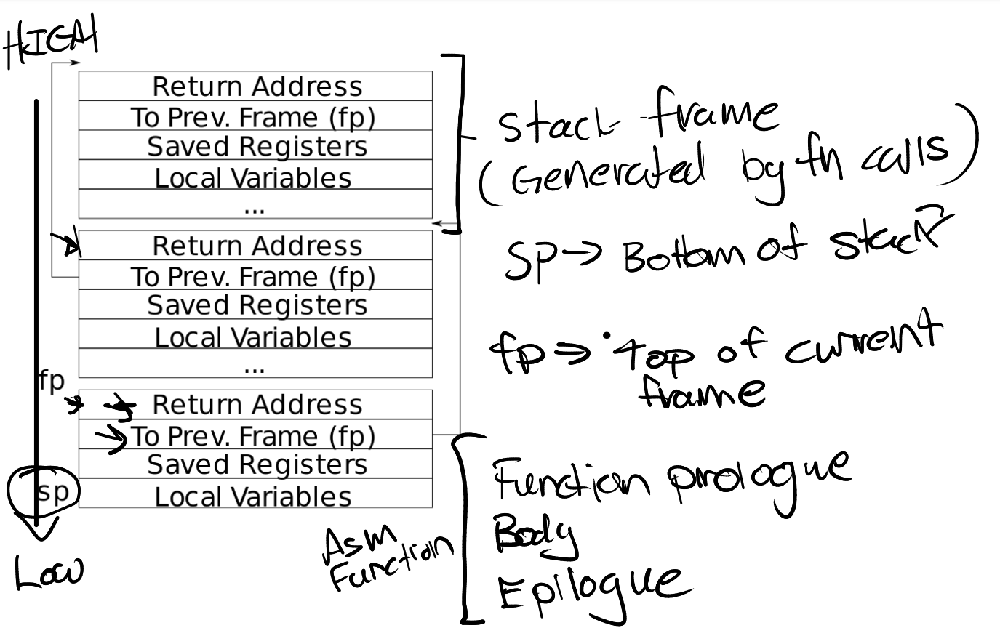
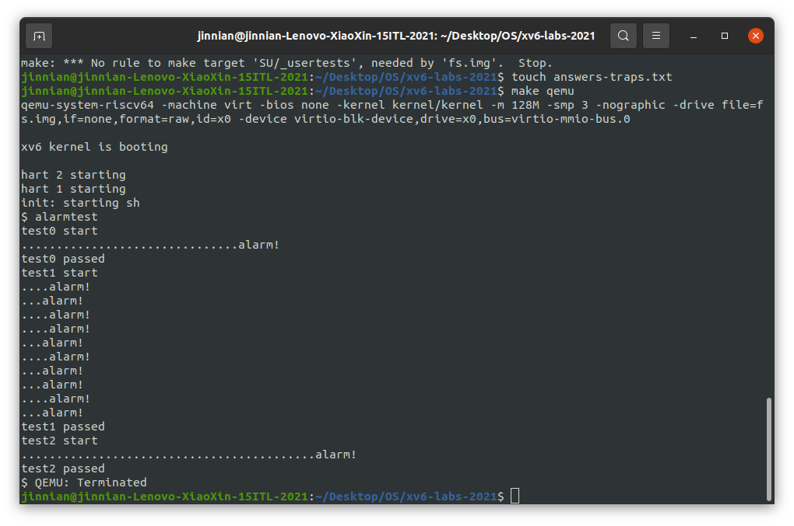
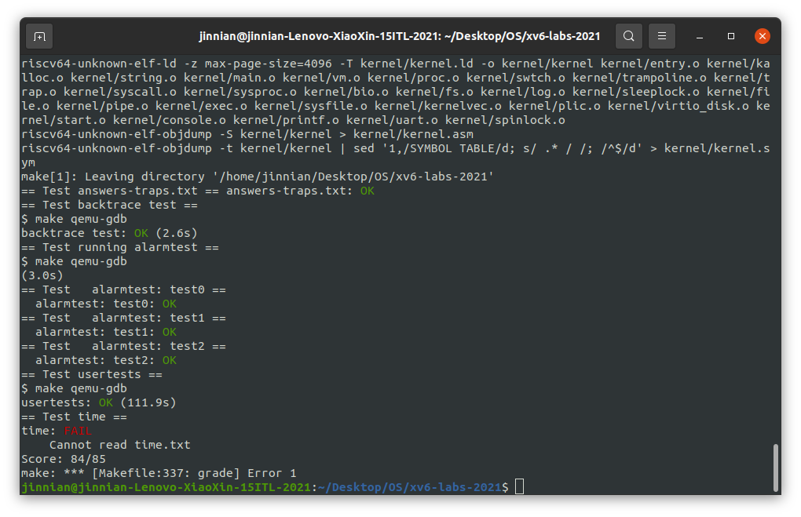

# Lab 4 Traps

---

## Assignment 2 —— RISC-V assembly

```assembly
Q: 哪些寄存器存储了函数调用的参数？举个例子，main 调用 printf 的时候，13 被存在了哪个寄存器中？
A: a0-a7; a2;

Q: main 中调用函数 f 对应的汇编代码在哪？对 g 的调用呢？ (提示：编译器有可能会内联(inline)一些函数)
A: 没有这样的代码。 g(x) 被内联到 f(x) 中，然后 f(x) 又被进一步内联到 main() 中

Q: printf 函数所在的地址是？
A: 0x0000000000000630, main 中使用 pc 相对寻址来计算得到这个地址。

Q: 在 main 中 jalr 跳转到 printf 之后，ra 的值是什么？
A: 0x0000000000000040, jalr 指令的下一条汇编指令的地址。

Q: 运行下面的代码

	unsigned int i = 0x00646c72;
	printf("H%x Wo%s", 57616, &i);      

输出是什么？
如果 RISC-V 是大端序的，要实现同样的效果，需要将 i 设置为什么？需要将 57616 修改为别的值吗？
A: "He110 World"; 0x726c6400; 不需要，57616 的十六进制是 110，无论端序（十六进制和内存中的表示不是同个概念）

Q: 在下面的代码中，'y=' 之后会答应什么？ (note: 答案不是一个具体的值) 为什么?

	printf("x=%d y=%d", 3);

A: 输出的是一个受调用前的代码影响的“随机”的值。因为 printf 尝试读的参数数量比提供的参数数量多。
第二个参数 `3` 通过 a1 传递，而第三个参数对应的寄存器 a2 在调用前不会被设置为任何具体的值，而是会
包含调用发生前的任何已经在里面的值。
```

---

## Assignment 2 —— Back trace 

​	`在kernel/printf.c`中 实现`backtrace()`函数。`在sys_sleep`中插入对该函数的调用，然后运行，它调用`sys_sleep`。您的输出应如下所示： ``bttest``

```
backtrace：
0x0000000080002cda 
0x0000000080002bb6 
0x0000000080002898
```

​	`bttest` 后退出 qemu。在终端中：地址可能略有不同，但如果运行`addr2line -e kernel/kernel`（或`riscv64-unknown-elf-addr2line -e kernel/kernel`）并剪切并粘贴上述地址，如下所示：

```
$ addr2line -e kernel/kernel
0x0000000080002de2 
0x0000000080002f4a 
0x0000000080002bfc 
Ctrl-D
```

​	应该可以看到如下内容：

```
 kernel/sysproc.c:74
 kernel/syscall.c:224
 kernel/trap.c:85
```

​	Hints:

- 将回溯的原型添加到`kernel/defs.h`以便您可以在`sys_sleep`中调用回溯。

  ```C
  // kernel/printf.c
  ...
  void            printfinit(void);
  void            backtrace(void);
  
  // kernel/sysproc.c
  
  uint64 sys_sleep(void)
  {
    int n;
    uint ticks0;
  
    backtrace(); // print stack backtrace.
    ...
  }
  ```

  

- GCC 编译器将当前执行函数的帧指针存储在寄存器 s0 中。将以下函数添加到 `kernel/riscv.h`：

  ```c
  // 获取上一级栈帧地址
  static inline uint64
  r_fp()
  {
    uint64 x;
    asm volatile("mv %0, s0" : "=r" (x) );
    return x;
  }
  ```

  并在`backtrace`中调用此函数以读取当前帧指针。此函数使用内联汇编来读取 s0 。

- 堆栈帧布局，请注意，返回地址位于距堆栈帧的帧指针的固定偏移量 (-8) 处，而保存的帧指针位于距帧指针的固定偏移量 (-16) 处。

  

  fp 指向当前栈帧的开始地址，sp 指向当前栈帧的结束地址。（栈从高地址往低地址生长，所以 fp 虽然是帧开始地址，但是地址比 sp 高）。栈帧中从高到低第一个 8 字节 `fp-8` 是 return address，也就是当前调用层应该返回到的地址。栈帧中从高到低第二个 8 字节 `fp-16` 是 previous address，指向上一层栈帧的 fp 开始地址。剩下的为保存的寄存器、局部变量等。一个栈帧的大小不固定，但是至少 16 字节。 在 xv6 中，使用一个页来存储栈，如果 fp 已经到达栈页的上界，则说明已经到达栈底。

- xv6 为 xv6 内核中的每个堆栈在 PAGE 对齐地址处分配一个页面。可以使用`PGROUNDDOWN(fp)`和`PGROUNDUP(fp)`计算堆栈页面的顶部和底部地址 （请参阅`kernel/riscv.h`。这些数字有助于`回溯`终止其循环。

​	`backtrace`函数：

```C
// kernel/printf.c
void backtrace() {
  uint64 fp = r_fp();
  while(fp != PGROUNDUP(fp)) { // 如果已经到达栈底
    uint64 ra = *(uint64*)(fp - 8); // return address
    printf("%p\n", ra);
    fp = *(uint64*)(fp - 16); // previous fp
  }
}
```

​	实验运行结果：


---

## Assignment 3 —— Alarm

​	在本任务中，向 xv6 添加一个功能，该功能会在进程使用 CPU 时间时定期提醒它。这对于想要限制它们占用多少 CPU 时间的计算绑定进程，或者对于想要计算但又想要采取一些定期操作的进程可能很有用。更一般地说，您将实现一种原始形式的用户级中断/故障处理程序；例如，您可以使用类似的东西来处理应用程序中的页面错误。如果它通过了警报测试和用户测试，则您的解决方案是正确的。

​	添加一个新的`sigalarm(interval, handler)`系统调用。如果应用程序调用`sigalarm(n, fn)` ，那么在程序消耗的 每` n `个CPU 时间之后，内核应该调用应用程序函数`fn`。当`fn`返回时，应用程序应该从中断的地方继续。在 xv6 中，`tick` 是一个相当随意的时间单位，由硬件定时器产生中断的频率决定。如果应用程序调用`sigalarm(0, 0)`，内核应该停止生成定期警报调用。在 xv6 存储库中找到文件`user/alarmtest.c`，将其添加到 Makefile。在添加`sigalarm`和`sigreturn` 系统调用（见下文） 之前，它不会正确编译。alarmtest` 在`test0`中调用`sigalarm(2,periodic)`以要求内核每 2 个滴答声强制调用一次`periodic()`，然后旋转一段时间。可以在user/alarmtest.asm 中看到alarmtest 的汇编代码，这对于调试可能很方便。当 `alarmtest`产生这样的输出并且 usertests 也正确运行时，解决方案是正确的。

​	test 0 : 调用中断程序：

- 添加调用：在`user.h`声明调用，在`syscall.h`添加系统调用号等等

  ```C
  # kernel/user.h
  int sigalarm(int ticks, void (*handler)());
  int sigreturn(void);
  
  # kernel/syscall.h
  #define SYS_sigalarm 22
  #define SYS_sigreturn 23
  ```

- 将警报间隔和指向处理函数的指针存储在`proc` 结构的新字段中（在`kernel/proc.h `中）

  ```C
  # kernel/proc.h
  struct proc {
    // ......
    int alarm_interval;          // 时钟周期，0 为禁用
    void(*alarm_handler)();      // 时钟回调处理函数
    int alarm_ticks;             // 下一次时钟响起前还剩下的 ticks 数
    struct trapframe *alarm_trapframe;  // 时钟中断时刻的 trapframe，用于中断处理完成后恢复原程序的正常执行
    int alarm_goingoff;          // 是否已经有一个时钟回调正在执行且还未返回（用于防止在 alarm_handler 中途闹钟到期再次调用 alarm_handler，导致 alarm_trapframe 被覆盖）
  };
  ```

- `sigalarm`和`sigreturn`实现：:star2:不要忘记`defs.h`添加函数声明

  ```C
  # kernel/sysproc.c
  uint64 sys_sigalarm(void) {
    int n;
    uint64 fn;
    if(argint(0, &n) < 0)
      return -1;
    if(argaddr(1, &fn) < 0)
      return -1;
    
    return sigalarm(n, (void(*)())(fn));
  }
  
  uint64 sys_sigreturn(void) {
  	return sigreturn();
  }
  
  // kernel/trap.c
  int sigalarm(int ticks, void(*handler)()) {
    // 设置 myproc 中的相关属性
    struct proc *p = myproc();
    p->alarm_interval = ticks;
    p->alarm_handler = handler;
    p->alarm_ticks = ticks;
    return 0;
  }
  
  int sigreturn() {
    // 将 trapframe 恢复到时钟中断之前的状态，恢复原本正在执行的程序流
    struct proc *p = myproc();
    *p->trapframe = *p->alarm_trapframe;
    p->alarm_goingoff = 0;
    return 0;
  }
  ```

- 仿照`allocproc`中分配中断帧的方式分配`alarm`中断帧和初始化

  ```C
  # kernel/proc.c/allocproc:130
    // Allocate a trapframe page for alarm_trapframe.
    if((p->alarm_trapframe = (struct trapframe *)kalloc()) == 0){
      release(&p->lock);
      return 0;
    }
  
    p->alarm_interval = 0;
    p->alarm_handler = 0;
    p->alarm_ticks = 0;
    p->alarm_goingoff = 0;
  ```

- 释放代码：

  ```C
  # kernel/proc.c/freeproc:169
    if(p->alarm_trapframe)
      kfree((void*)p->alarm_trapframe);
    p->alarm_trapframe = 0;
    
    // ......
    
    p->alarm_interval = 0;
    p->alarm_handler = 0;
    p->alarm_ticks = 0;
    p->alarm_goingoff = 0;
  
  ```

- 在 `usertrap `函数中，实现时钟机制具体代码：

  ```C
  # kernel/trap.c/usertrap:80
  ...
    if(p->killed)
      exit(-1);
  
  --> begin:80
    // give up the CPU if this is a timer interrupt.
    // if(which_dev == 2)
    //   yield();
  
    // give up the CPU if this is a timer interrupt.
    if(which_dev == 2) {
      if(p->alarm_interval != 0) { // 如果设定了时钟事件
        if(--p->alarm_ticks <= 0) { // 时钟倒计时 -1 tick，如果已经到达或超过设定的 tick 数
          if(!p->alarm_goingoff) { // 确保没有时钟正在运行
            p->alarm_ticks = p->alarm_interval;
            // jump to execute alarm_handler
            *p->alarm_trapframe = *p->trapframe; // backup trapframe
            p->trapframe->epc = (uint64)p->alarm_handler;
            p->alarm_goingoff = 1;
          }
          // 如果一个时钟到期的时候已经有一个时钟处理函数正在运行，则会推迟到原处理函数运行完成后的下一个 tick 才触发这次时钟
        }
      }
      yield();
    }
  
    usertrapret();
  ```

  在每次时钟中断的时候，如果进程有已经设置的时钟（`alarm_interval != 0`），则进行 alarm_ticks 倒数。当 alarm_ticks 倒数到小于等于 0 的时候，如果没有正在处理的时钟，则尝试触发时钟，将原本的程序流保存起来（`*alarm_trapframe = *trapframe`），然后通过修改 pc 寄存器的值，将程序流转跳到 alarm_handler 中，alarm_handler 执行完毕后再恢复原本的执行流（`*trapframe = *alarm_trapframe`）。这样从原本程序执行流的视角，就是不可感知的中断了。

  ​	实验运行结果：

  
  
  ​	测试结果：
  
  