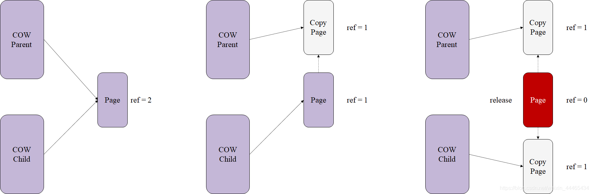
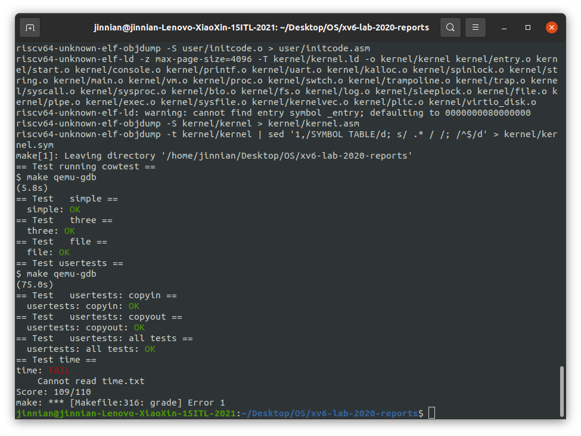

# Lab 6 Copy-on-Write

---

## Assignment 1 Implement copy-on write

- Problem：

  xv6 中的 `fork()` 系统调用将所有父进程的用户空间内存复制到子进程中。如果父级很大，则复制可能需要很长时间。更糟糕的是，这项工作常常被大量浪费。例如，子进程中的 `fork()` 后跟 `exec() `将导致子进程丢弃复制的内存，可能不会使用大部分内存。另一方面，如果父母和孩子都使用一个页面，并且一个或两个都写它，那么确实需要一个副本。

- Solution：

  写时复制 `(COW) fork()` 的目标是推迟为子进程分配和复制物理内存页面，直到实际需要副本（如果有的话）。`COW fork() `只为子级创建一个页表，用户内存的 PTE 指向父级的物理页面。`COW fork() `将 `parent `和 `child` 中的所有用户 PTE 标记为不可写。当任一进程尝试写入这些 COW 页之一时，CPU 将强制发生页错误。内核页面错误处理程序检测到这种情况，为出错进程分配物理内存页面，将原始页面复制到新页面中，并修改出错进程中的相关 PTE 以引用新页面，这次使用PTE 标记为可写。当页面错误处理程序返回时，用户进程将能够写入它的页面副本。

  `COW fork()` 使实现用户内存的物理页面的释放变得有点麻烦。一个给定的物理页可以被多个进程的页表引用，并且只有在最后一个引用消失时才应该被释放。

  > 基于cow的fork()函数只在子进程中创建指向父进程物理页面的页表，而不创建真实的物理页面；在调用fork()函数后，子进程和父进程的PTE（page table entry）均被置为不可写，并且予以一个COW标记（每个 PTE，有一种方法来记录它是否是 COW 映射可能很有用。为此，可以使用 RISC-V PTE 中的 RSW（为软件保留）位），表示该PTE是属于cow的，这样，当其中一个进程要写的时候，就会在trap.c中捕捉到写错误同时发现va对应的PTE是被COW标记的，就会对原物理页进行复制操作，并修改该PTE映射的物理页为被复制的物理页。此外还需要注意一个细节：我们应该为每一块物理页面添加一个引用指针，用于记录它被进程引用的次数。当其引用次数为0的时候，我们就应该将其释放。这种情况对应着两个进程都复制了原物理页，那么原物理页就没有存在的必要了，调用kfree释放即可。如下：
  >
  > 

​	Hints：

1. 修改 `uvmcopy()` 以将父级的物理页面映射到子级，而不是分配新页面。在子级和父级的 PTE 中使`PTE_W`（写权限）无效。

   ```C
   int
   uvmcopy(pagetable_t old, pagetable_t new, uint64 sz)
   {
     pte_t *pte;
     uint64 pa, i;
     uint flags;
   //  char *mem;
      
     for(i = 0; i < sz; i += PGSIZE){
       if((pte = walk(old, i, 0)) == 0)
         panic("uvmcopy: pte should exist");
       if((*pte & PTE_V) == 0)
         panic("uvmcopy: page not present");
       pa = PTE2PA(*pte);
       flags = PTE_FLAGS(*pte);
       if (flags & PTE_W) {
         flags = (flags | PTE_COW) & (~PTE_W);
         *pte = PA2PTE(pa) | flags;
       } 
       refcinc((void*)pa); // increase the reference count of the physical page to 1
   //    if((mem = kalloc()) == 0)
   //      goto err;
   //    memmove(mem, (char*)pa, PGSIZE);
       if(mappages(new, i, PGSIZE, pa, flags) != 0){
   //      kfree(mem);
         goto err;
       }
     }
     return 0;
   }
   ```

2. 修改 `usertrap()` 以识别页面错误。当 COW 页面发生缺页时，使用 kalloc() 分配新页面，将旧页面复制到新页面，并将新页面安装到 PTE 中并设置`PTE_W` 。

   > 在`usertrap()`中用`scause() == 13 || scause() == 15`来判断是否为page fault，当发现是page fault并且`r_stval()`的物理页是COW页时，说明需要分配物理页，并重新映射到这个页表相应的虚拟地址上，当无法分配时，需要kill这个进程。注意：需要判断虚拟地址是否是有效的，其中包括需要判断这个虚拟地址是不是处在stack的guard page上，通过`va <= PGROUNDDOWN(p->trapframe->sp) && va >= PGROUNDDOWN(p->trapframe->sp) - PGSIZE`进行判断。

   ```C
   # kernel/trap.c/usertrap:70
   } else if((which_dev = devintr()) != 0){
       // ok
   } else if (r_scause() == 13 || r_scause() == 15) {
       uint64 va = r_stval();
      
       if (va >= MAXVA || (va <= PGROUNDDOWN(p->trapframe->sp) && va >= PGROUNDDOWN(p->trapframe->sp) - PGSIZE)) {
           p->killed = 1;
       } else if (cow_alloc(p->pagetable, va) != 0) {
           p->killed = 1;
       }
   } else {
       p->killed = 1;
   }
   ```

3. 确保在对它的最后一个 PTE 引用消失时释放每个物理页面 。为每个物理页保留一个“引用计数”，该“引用计数”是指引用该页的用户页表的数量。当`kalloc()`分配页面时，将页面的引用计数设置为 1 。当 fork 导致子共享页面时增加页面的引用计数，并在每次任何进程从其页表中删除页面时减少页面的计数。 `kfree()`如果其引用计数为零，则应仅将页面放回空闲列表中。可以将这些计数保存在固定大小的整数数组中。可以使用页的物理地址除以 4096 来索引数组，并为数组赋予等于 kalloc.c 中 `kinit()`放置在空闲列表中的任何页的最高物理地址的元素数。经过计算，kalloc最多可分配**32723**的物理页面，因此，直接开辟了一个32723大小的`ref`数组，用以记录。

   ```C
   # kernel/kalloc.c
   // allocate a physical address for virtual address va in pagetable
   // for copy on write lab
   int cow_alloc(pagetable_t pagetable, uint64 va) {
     uint64 pa;
     pte_t *pte;
     uint flags;
      
     if (va >= MAXVA) return -1; 
     va = PGROUNDDOWN(va);
     pte = walk(pagetable, va, 0);
     if (pte == 0) return -1;
     if ((*pte & PTE_V) == 0) return -1;
     pa = PTE2PA(*pte);
     if (pa == 0) return -1;
     flags = PTE_FLAGS(*pte);
      
     if (flags & PTE_COW) {
       char *mem = kalloc();
       if (mem == 0) return -1;
       memmove(mem, (char*)pa, PGSIZE);
       flags = (flags & ~PTE_COW) | PTE_W;
       *pte = PA2PTE((uint64)mem) | flags;
       kfree((void*)pa);
       return 0;
     }
     return 0;
   }
   
   # kernel/kalloc.c 
   //为了记录每个物理页被多少进程的页表引用，需要在kalloc.c中定义一个结构体refc，
   //其中有一个大小为PGROUNDUP(PHYSTOP)/PGSIZE的int array来存放每个物理页的引用数
   // struct to maintain the ref counts
   struct {
     struct spinlock lock;
     int count[PGROUNDUP(PHYSTOP) / PGSIZE];
   } refc;
   
   # kernel/kalloc.c
   void
   refcinit()
   {
     initlock(&refc.lock, "refc");
     for (int i = 0; i < PGROUNDUP(PHYSTOP) / PGSIZE; i++) {
       refc.count[i] = 0;
     }
   }
      
   void
   refcinc(void *pa)
   {
     acquire(&refc.lock);
     refc.count[PA2IDX(pa)]++;
     release(&refc.lock);
   }
      
   void
   refcdec(void *pa)
   {
     acquire(&refc.lock);
     refc.count[PA2IDX(pa)]--;
     release(&refc.lock);
   }
   // 获得索引
   int
   getrefc(void *pa)
   {
     return refc.count[PA2IDX(pa)];
   }
   // 初始化函数   
   void
   kinit()
   {
     refcinit();
     initlock(&kmem.lock, "kmem");
     freerange(end, (void*)PHYSTOP);
   }
   
   # kernel/kalloc.c 修改kfree
   void
   kfree(void *pa)
   {
     struct run *r;
      
     if(((uint64)pa % PGSIZE) != 0 || (char*)pa < end || (uint64)pa >= PHYSTOP)
       panic("kfree");
     refcdec(pa);
     if (getrefc(pa) > 0) return;
     // Fill with junk to catch dangling refs.
     memset(pa, 1, PGSIZE);
      
     r = (struct run*)pa;
      
     acquire(&kmem.lock);
     r->next = kmem.freelist;
     kmem.freelist = r;
     release(&kmem.lock);
   }
   ```

4. 修改 `copyout() `以在遇到 COW 页面时使用与页面错误相同的方案。

   ```C
   # kernel/vm.c
   int
   copyout(pagetable_t pagetable, uint64 dstva, char *src, uint64 len)
   {
     uint64 n, va0, pa0;
     pte_t *pte;
     while(len > 0){
       va0 = PGROUNDDOWN(dstva);
       if(va0 >= MAXVA){
         //printf("copyout(): va is greater than MAXVA\n");
         return -1;
       }
       pte = walk(pagetable, va0, 0);
       if(*pte & PTE_COW){
         //printf("copyout(): got page COW faults at %p\n", va0);
         char *mem;
         if((mem = kalloc()) == 0)
         {
           printf("copyout(): memery alloc fault\n");
           return -1;
         }
         memset(mem, 0, sizeof(mem));
         uint64 pa = walkaddr(pagetable, va0);
         if(pa){
           memmove(mem, (char*)pa, PGSIZE);
           int perm = PTE_FLAGS(*pte);
           perm |= PTE_W;
           perm &= ~PTE_COW;
           if(mappages(pagetable, va0, PGSIZE, (uint64)mem, perm) != 0){
             printf("copyout(): can not map page\n");
             kfree(mem); 
             return -1;
           }
           kfree((void*) pa);
         }
       }
       pa0 = walkaddr(pagetable, va0);
       if(pa0 == 0)
         return -1;
       n = PGSIZE - (dstva - va0);
       if(n > len)
         n = len;
       memmove((void *)(pa0 + (dstva - va0)), src, n);
   
       len -= n;
       src += n;
       dstva = va0 + PGSIZE;
     }
     return 0;
   }
   ```

   

​	运行结果及评分：



---

