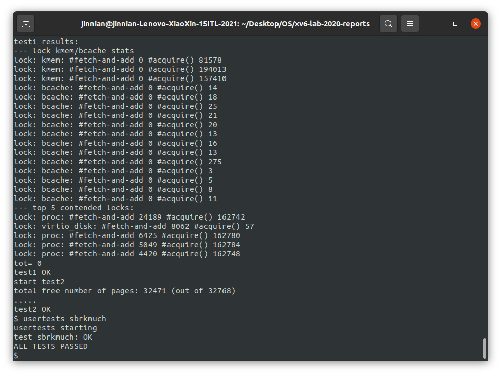
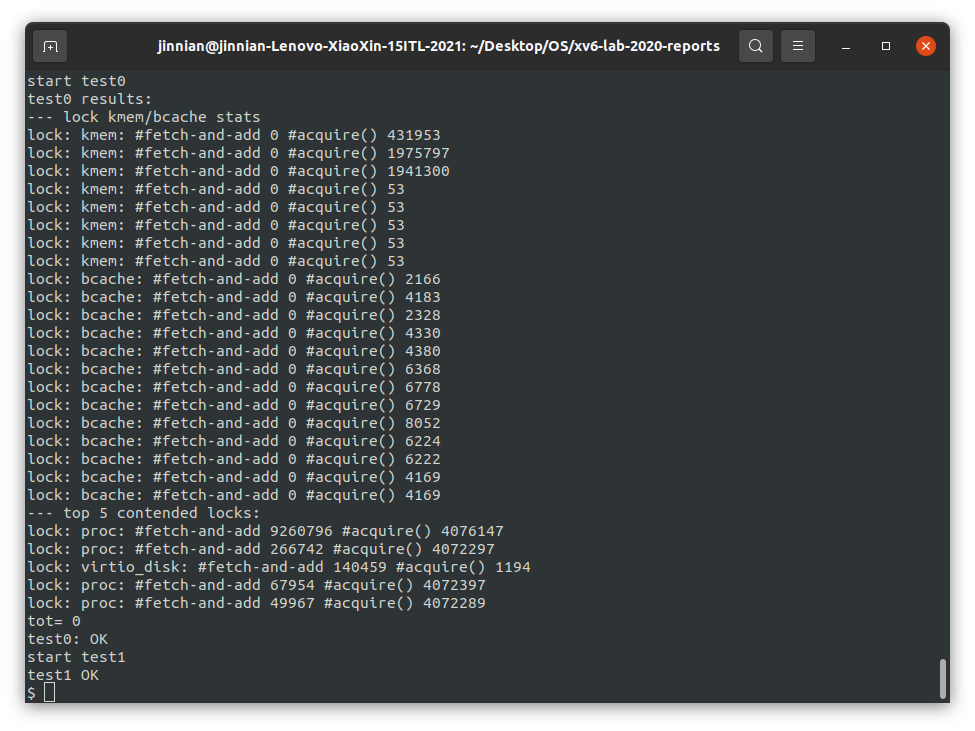
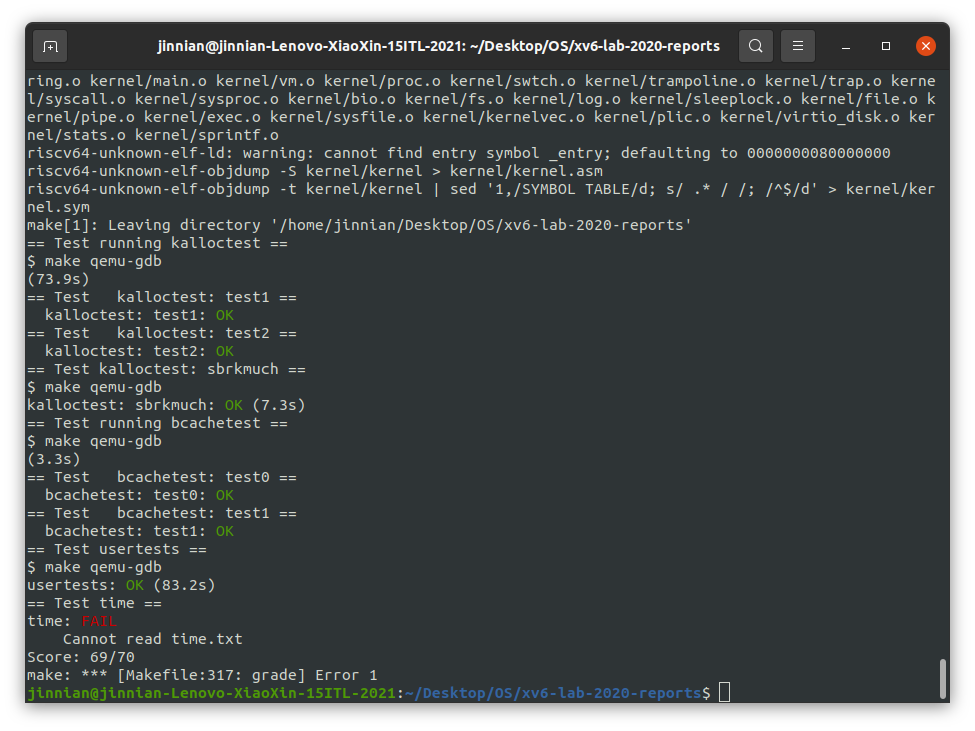

# Lab 8 Locks

> 多核机器上并行性差的一个常见症状是频繁的锁争用。提高并行性通常涉及更改数据结构和锁定策略以减少争用。本任务将对xv6内存分配器和块缓存执行此操作。

---

## Assignment 1 ——  Memory allocator

​	程序***user/kalloctest.c***强调了xv6的内存分配器：三个进程增长和缩小地址空间，导致对`kalloc`和`kfree`的多次调用。`kalloc`和`kfree`获得`kmem.lock`。`kalloctest`打印（作为“#fetch-and-add”）在`acquire`中由于尝试获取另一个内核已经持有的锁而进行的循环迭代次数，如`kmem`锁和一些其他锁。`acquire`中的循环迭代次数是锁争用的粗略度量。完成实验前，`kalloctest`的输出与此类似：

```shell
$ kalloctest\
start test1
test1 results:
--- lock kmem/bcache stats
lock: kmem: #fetch-and-add 83375 #acquire() 433015
lock: bcache: #fetch-and-add 0 #acquire() 1260
--- top 5 contended locks:
lock: kmem: #fetch-and-add 83375 #acquire() 433015
lock: proc: #fetch-and-add 23737 #acquire() 130718
lock: virtio_disk: #fetch-and-add 11159 #acquire() 114
lock: proc: #fetch-and-add 5937 #acquire() 130786
lock: proc: #fetch-and-add 4080 #acquire() 130786
tot= 83375
test1 FAIL
```

​	`acquire`为每个锁维护要获取该锁的`acquire`调用计数，以及`acquire`中循环尝试但未能设置锁的次数。`kalloctest`调用一个系统调用，使内核打印`kmem`和`bcache`锁（这是本实验的重点）以及5个最有具竞争的锁的计数。如果存在锁争用，则`acquire`循环迭代的次数将很大。系统调用返回`kmem`和`bcache`锁的循环迭代次数之和。

> `kalloctest`中锁争用的根本原因是`kalloc()`有一个空闲列表，由一个锁保护。要消除锁争用，必须重新设计内存分配器，以避免使用单个锁和列表。基本思想是为每个CPU维护一个空闲列表，每个列表都有自己的锁。因为每个CPU将在不同的列表上运行，不同CPU上的分配和释放可以并行运行。主要的挑战将是处理一个CPU的空闲列表为空，而另一个CPU的列表有空闲内存的情况；在这种情况下，一个CPU必须“窃取”另一个CPU空闲列表的一部分。也就是从其他核心“偷”空间。

**Question：**

​	目标是实现每个CPU的空闲列表，并在CPU的空闲列表为空时进行**窃取**。所有锁的命名必须以“`kmem`”开头。也就是说，为每个锁调用`initlock`，并传递一个以“`kmem`”开头的名称。运行`kalloctest`以查看是否减少了锁争用。要检查它是否仍然可以分配所有内存，请运行`usertests sbrkmuch`。输出将与下面所示的类似，在`kmem`锁上的争用总数将大大减少，尽管具体的数字会有所不同。确保`usertests`中的所有测试都通过。评分应该表明考试通过。

```sh
 $ kalloctest
start test1
test1 results:
--- lock kmem/bcache stats
lock: kmem: #fetch-and-add 0 #acquire() 42843
lock: kmem: #fetch-and-add 0 #acquire() 198674
lock: kmem: #fetch-and-add 0 #acquire() 191534
lock: bcache: #fetch-and-add 0 #acquire() 1242
--- top 5 contended locks:
lock: proc: #fetch-and-add 43861 #acquire() 117281
lock: virtio_disk: #fetch-and-add 5347 #acquire() 114
lock: proc: #fetch-and-add 4856 #acquire() 117312
lock: proc: #fetch-and-add 4168 #acquire() 117316
lock: proc: #fetch-and-add 2797 #acquire() 117266
tot= 0
test1 OK
start test2
total free number of pages: 32499 (out of 32768)
.....
test2 OK
$ usertests sbrkmuch
usertests starting
test sbrkmuch: OK
ALL TESTS PASSED
$ usertests
...
ALL TESTS PASSED
```

**Hints：**

- 可以使用 kernel/param.h 中的常量`NCPU`（即CPU核心的数量）

- 让`freerange`将所有空闲内存分配给运行`freerange`的 CPU 。
- 函数`cpuid`返回当前的核心编号，但只有在中断关闭时调用它并使用它的结果才是安全的。使用 `push_off()`和`pop_off()`来关闭和打开中断。

- 查看kernel/sprintf.c 中的`snprintf`函数以了解字符串格式化的想法。尽管可以将所有锁命名为“`kmem`”。

**Solution：**

> 在`kernel/kalloc.c`中，修改`kmem`结构体为数组形式
>
> `kinit()`要循环初始化每一个`kmem`的锁

```C
# kernel/kalloc.c
struct {
  struct spinlock lock;
  struct run *freelist;
} kmem[NCPU];

void kinit()
{
  for (int i = 0; i < NCPU; i++) {
    initlock(&kmem[i].lock, "kmem");
  }
  freerange(end, (void*)PHYSTOP);
}
```

> `kfree`将释放出来的freelist节点返回给调用`kfree`的CPU

```c
# kernel/kalloc.c
void
kfree(void *pa)
{
  struct run *r;

  if(((uint64)pa % PGSIZE) != 0 || (char*)pa < end || (uint64)pa >= PHYSTOP)
    panic("kfree");

  // Fill with junk to catch dangling refs.
  memset(pa, 1, PGSIZE);

  r = (struct run*)pa;

  push_off();
  int ncpu = cpuid();

  acquire(&kmem[ncpu].lock);
  r->next = kmem[ncpu].freelist;
  kmem[ncpu].freelist = r;
  release(&kmem[ncpu].lock);
  pop_off();
}
```

> `kalloc`中，当发现freelist已经用完后，需要向其他CPU的freelist借用节点

```C
# kernel/kalloc.c
void *
kalloc(void)
{
  struct run *r;

  push_off();
  int ncpu = cpuid();

  acquire(&kmem[ncpu].lock);
  r = kmem[ncpu].freelist;
  if(r) {
    kmem[ncpu].freelist = r->next;
  } 
  release(&kmem[ncpu].lock);
  if (!r) {
    // steal other cpu's freelist
    for (int i = 0; i < NCPU; i++) {
      if (i == ncpu) continue;
      acquire(&kmem[i].lock);
      r = kmem[i].freelist;     
      if (r) {
        kmem[i].freelist = r->next;
        release(&kmem[i].lock);
        break;
      }
      release(&kmem[i].lock);
    }
  }
  pop_off();
  
  if(r)
    memset((char*)r, 5, PGSIZE); // fill with junk
  return (void*)r;
}
```

**运行结果：**



---

## Assignment 2 —— Buffer cathe

​	xv6文件系统的buffer cache采用了一个全局的锁`bcache.lock`来负责对buffer cache进行读写保护，当xv6执行读写文件强度较大的任务时会产生较大的锁竞争压力，因此需要一个哈希表，将buf entry以`buf.blockno`为键哈希映射到这个哈希表的不同的BUCKET中，给每个BUCKET一个锁，`NBUCKET`最好选择素数，这里选择13。注意：这个实验不能像上一个一样给每个CPU一个`bcache`，因为文件系统在多个CPU之间是真正实现共享的，否则将会造成一个CPU只能访问某些文件的问题。	

​	如果多个进程密集地使用文件系统，它们可能会争夺`bcache.lock`，它保护***kernel/bio.c***中的磁盘块缓存。`bcachetest`创建多个进程，这些进程重复读取不同的文件，以便在`bcache.lock`上生成争用；如果查看***kernel/bio.c***中的代码，将看到`bcache.lock`保护已缓存的块缓冲区的列表、每个块缓冲区中的引用计数（`b->refcnt`）以及缓存块的标识（`b->dev`和`b->blockno`）。（在完成本实验之前）其输出如下所示：

```sh
$ bcachetest
start test0
test0 results:
--- lock kmem/bcache stats
lock: kmem: #fetch-and-add 0 #acquire() 33035
lock: bcache: #fetch-and-add 16142 #acquire() 65978
--- top 5 contended locks:
lock: virtio_disk: #fetch-and-add 162870 #acquire() 1188
lock: proc: #fetch-and-add 51936 #acquire() 73732
lock: bcache: #fetch-and-add 16142 #acquire() 65978
lock: uart: #fetch-and-add 7505 #acquire() 117
lock: proc: #fetch-and-add 6937 #acquire() 73420
tot= 16142
test0: FAIL
start test1
test1 OK
```

**Question：**

​	修改块缓存，以便在运行`bcachetest`时，bcache（buffer cache的缩写）中所有锁的`acquire`循环迭代次数接近于零。理想情况下，块缓存中涉及的所有锁的计数总和应为零，但只要总和小于500就可以。修改`bget`和`brelse`，以便bcache中不同块的并发查找和释放不太可能在锁上发生冲突（例如，不必全部等待`bcache.lock`）。必须保护每个块最多缓存一个副本的不变量。

**Hints：**

- 将所有的锁以“`bcache`”开头进行命名。也就是说，为每个锁调用`initlock`，并传递一个以“`bcache`”开头的名称。
- 可以使用固定数量的散列桶，而不动态调整哈希表的大小。使用素数个存储桶（例如13）来降低散列冲突的可能性。
- 在哈希表中搜索缓冲区并在找不到缓冲区时为该缓冲区分配条目必须是原子的，即不可分割的。
- 删除保存了所有缓冲区的列表（`bcache.head`等），改为标记上次使用时间的时间戳缓冲区（即使用***kernel/trap.c***中的`ticks`）。通过此更改，`brelse`不需要获取bcache锁，并且`bget`可以根据时间戳选择最近使用最少的块。:star:
- 可以在`bget`中串行化回收（即`bget`中的一部分：当缓存中的查找未命中时，它选择要复用的缓冲区）。
- 在某些情况下，可能需要持有两个锁；例如，在回收过程中，可能需要持有bcache锁和每个bucket（散列桶）一个锁。确保避免死锁。
- 替换块时，可能会将`struct buf`从一个bucket移动到另一个bucket，因为新块散列到不同的bucket。可能会遇到一个棘手的情况：新块可能会散列到与旧块相同的bucket中。在这种情况下，请确保避免死锁。
- 一些调试技巧：实现bucket锁，但将全局`bcache.lock`的`acquire`/`release`保留在`bget`的开头/结尾，以串行化代码。一旦确定它在没有竞争条件的情况下是正确的，请移除全局锁并处理并发性问题。还可以运行`make CPUS=1 qemu`以使用一个内核进行测试。

**Solution：**

> 在`kernel/bio.c`中，首先设置`NBUCKET`宏定义为13，声明外部变量`ticks`，修改`bcache`以为每个`BUCKET`设置一个链表头，并设置一个锁

```c
# kernel/bio.c
#define NBUCKET 13

uint extern ticks;

struct {
  struct spinlock lock[NBUCKET];
  struct buf buf[NBUF];

  // Linked list of all buffers, through prev/next.
  // Sorted by how recently the buffer was used.
  // head.next is most recent, head.prev is least.
  struct buf head[NBUCKET];
} bcache;
```

> 修改`kernel/buf.h`中的`buf`结构体，删除`struct buf *prev`，即将双向链表变为单向链表，添加`uint time`这个成员变量作为时间戳。

```c
# kernel/buf.h
int hash (int n) {
  int result = n % NBUCKET;
  return result;
}
```

> 修改`binit`函数，为每个`bcache.lock`以及`b->lock`进行初始化，并将所有`buf`先添加到bucket 0哈希表中

```c
void
binit(void)
{
  struct buf *b;

  for (int i = 0; i < NBUCKET; i++) {
    initlock(&bcache.lock[i], "bcache");
  }

  bcache.head[0].next = &bcache.buf[0];
  // for initialization, append all bufs to bucket 0
  for (b = bcache.buf; b < bcache.buf+NBUF-1; b++) {
    b->next = b+1;
    initsleeplock(&b->lock, "buffer");
  }
}
```

> 修改`bget`，先查找当前哈希表中有没有和传入参数`dev`、`blockno`相同的`buf`。先要将`blockno`哈希到一个id值，然后获得对应id值的`bcache.lock[id]`锁，然后在这个bucket id哈希链表中查找符合对应条件的`buf`，如果找到则返回，返回前释放掉`bcache.lock[id]`，并对`buf`加sleeplock。

```c
# kernel/bio.c/bget
int id = hash(blockno);
acquire(&bcache.lock[id]);
b = bcache.head[id].next;
while (b) {
    if (b->dev == dev && b->blockno == blockno) {
        b->refcnt++;
        if (holding(&bcache.lock[id]))
            release(&bcache.lock[id]);
        acquiresleep(&b->lock);
        return b;
    }
    b = b->next;
}
```

> 如果没有找到对应的`buf`，需要在整个哈希表中查找LRU(least recently used)`buf`，将其替换掉。这里由于总共有`NBUCKET`个哈希表，而此时一定是持有`bcache.lock[id]`这个哈希表的锁的，因此当查找其他哈希表时，需要获取其他哈希表的锁，这时就会有产生死锁的风险。
>
> 风险1：查找的哈希表正是自己本身这个哈希表，在已经持有自己哈希表锁的情况下，不能再尝试`acquire`一遍自己的锁。
>
> 风险2：假设有2个进程同时要进行此步骤，进程1已经持有了哈希表A的锁，尝试获取哈希表B的锁，进程2已经持有了哈希表B的锁，尝试获取哈希表A的锁，同样会造成死锁，因此要规定一个规则，当持有哈希表A的情况下如果能够获取哈希表B的锁，则当持有哈希表B锁的情况下不能够持有哈希表A的锁。该规则在`can_lock`函数中实现。

```c
# kernel/bio.c
int can_lock(int id, int j) {
  int num = NBUCKET/2;
  if (id <= num) {
    if (j > id && j <= (id+num))
      return 0;
  } else {
    if ((id < j && j < NBUCKET) || (j <= (id+num)%NBUCKET)) {
      return 0;
    }
  }
  return 1;
}
```

其中`id`是已经持有的锁，`j`是判断是否能获取该索引哈希表的锁。这个规则实际上规定了在持有某一个锁的情况下，只能再尝试获取`NBCUKET/2`个哈希表锁，另一半哈希表锁是不能获取的。

> 确定了这个规则之后，尝试遍历所有的哈希表，通过`b->time`查找LRU`buf`。先判断当前的哈希表索引是否为`id`，如果是，则不获取这个锁（已经获取过它了），但是还是要遍历这个哈希表的；同时也要判断当前哈希表索引是否满足`can_lock`规则，如果不满足，则不遍历这个哈希表，直接`continue`。如果哈希表索引`j`既不是`id`，也满足`can_lock`，则获取这个锁，并进行遍历。当找到了一个当前情况下的`b->time`最小值时，如果这个最小值和上一个最小值不在同一个哈希表中，则释放上一个哈希表锁，一直持有拥有当前情况下LRU`buf`这个哈希表的锁，直到找到新的LRU`buf`且不是同一个哈希表为止。找到LRU`buf`后，由于此时还拥有这个哈希表的锁，因此可以直接将这个`buf`从该哈希链表中剔除，并将其append到bucket`id`哈希表中，修改这个锁的`dev`、`blockno`、`valid`、`refcnt`等属性。最后释放所有的锁。

```c
# kernel/bio.c
int index = -1;
uint smallest_tick = __UINT32_MAX__;
// find the LRU unused buffer
for (int j = 0; j < NBUCKET; ++j) {
    if (j!=id && can_lock(id, j)) {
        // if j == id, then lock is already acquired
        // can_lock is to maintain an invariant of lock acquisition order
        // to avoid dead lock
        acquire(&bcache.lock[j]);
    } else if (!can_lock(id, j)) {
        continue;
    }
    b = bcache.head[j].next;
    while (b) {
        if (b->refcnt == 0) {
            if (b->time < smallest_tick) {
                smallest_tick = b->time;
                if (index != -1 && index != j && holding(&bcache.lock[index])) release(&bcache.lock[index]);
                index = j;
            }   
        }
        b = b->next;
    }
    if (j!=id && j!=index && holding(&bcache.lock[j])) release(&bcache.lock[j]);
}
if (index == -1) panic("bget: no buffers");
b = &bcache.head[index];

while (b) {
    if ((b->next)->refcnt == 0 && (b->next)->time == smallest_tick) {
        selected = b->next;
        b->next = b->next->next;
        break;
    }
    b = b->next;
}
if (index != id && holding(&bcache.lock[index])) release(&bcache.lock[index]);
b = &bcache.head[id];
while (b->next) {
    b = b->next;
}
b->next = selected;
selected->next = 0;
selected->dev = dev;
selected->blockno = blockno;
selected->valid = 0;
selected->refcnt = 1;
if (holding(&bcache.lock[id]))
    release(&bcache.lock[id]);
acquiresleep(&selected->lock);
return selected;
}
```

修改`brelse`。当`b->refcnt==0`时，说明这个`buf`已经被使用完了，可以进行释放，为其加上时间戳

```c
# kernel/bio.c
void
brelse(struct buf *b)
{
  if(!holdingsleep(&b->lock))
    panic("brelse");

  releasesleep(&b->lock);

  int id = hash(b->blockno);
  acquire(&bcache.lock[id]);
  b->refcnt--;
  if (b->refcnt == 0) {
    b->time = ticks;
  }
  
  release(&bcache.lock[id]);
}
```

修改`bpin`和`bunpin`，将`bcache.lock`修改为`bcache.lock[id]`

最后在`param.h`中修改`NBUF`的值，由于`can_lock`规则，`NBUF`实际上变成了原来的一半，可能会出现`buffer run out`的panic，无法通过`writebig`测试，因此适当增大`NBUF`，这里将其修改为了`(MAXOPBLOCKS*12)`

**运行测试：**



**评分：**



---

