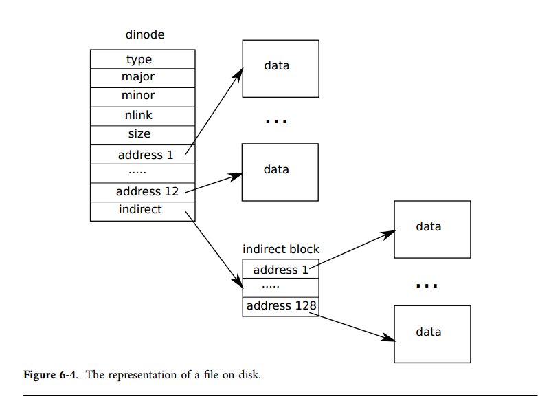
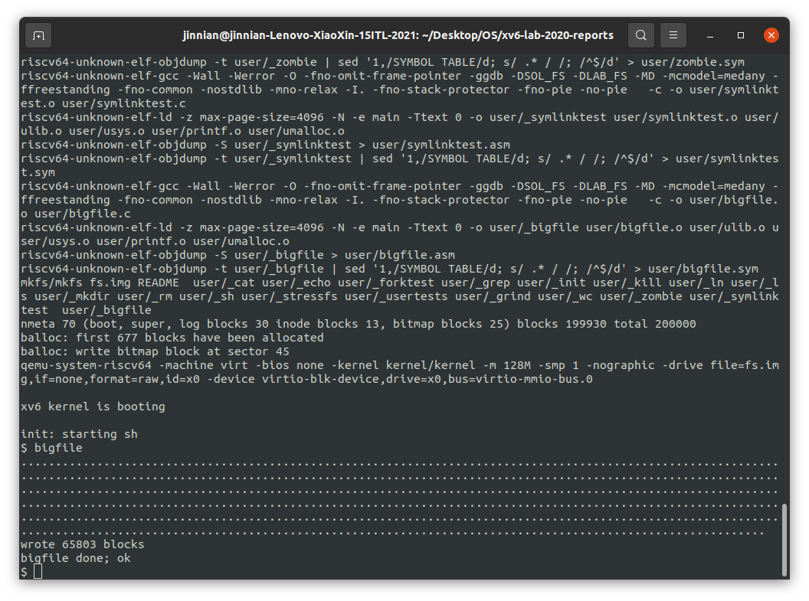
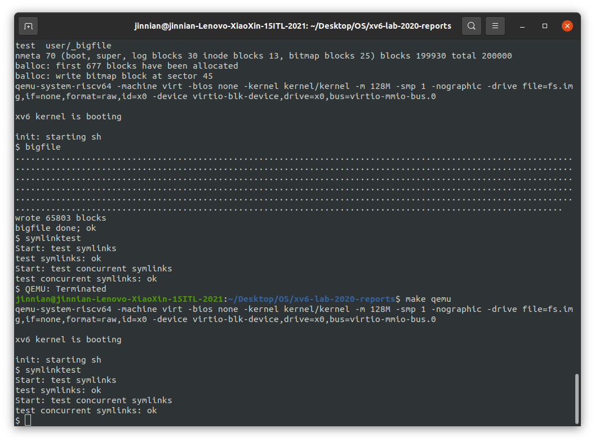
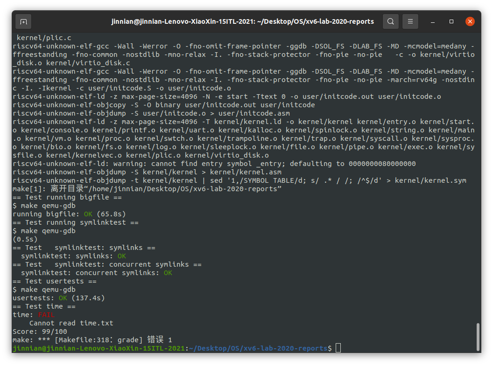

# Lab 9 File System

---

## 写在前面：

> *i 节点*这个术语可以有两个意思。它可以指的是磁盘上的记录文件大小、数据块扇区号的数据结构。也可以指内存中的一个 i 节点，它包含了一个磁盘上 i 节点的拷贝，以及一些内核需要的附加信息。
>
> 所有的磁盘上的 i 节点都被打包在一个称为 i 节点块的连续区域中。每一个 i 节点的大小都是一样的，所以对于一个给定的数字n，很容易找到磁盘上对应的 i 节点。事实上这个给定的数字就是操作系统中 i 节点的编号。
>
> 磁盘上的 i 节点由结构体 `dinode`定义
>
> 
>
> - `type` 域用来区分文件、目录和特殊文件的 i 节点。如果 `type` 是0的话就意味着这是一个空闲的 i 节点。
>
> - `nlink` 域用来记录指向了这一个 i 节点的目录项，这是用于判断一个 i 节点是否应该被释放的。
> - `size` 域记录了文件的字节数。
> - `addrs` 数组用于这个文件的数据块的块号。
>
> ​	内核在内存中维护活动的 i 节点。结构体 `inode`是磁盘中的结构体 `dinode` 在内存中的拷贝。内核只会在有 C 指针指向一个 i 节点的时候才会把这个 i 节点保存在内存中。`ref` 域用于统计有多少个 C 指针指向它。如果 `ref` 变为0，内核就会丢掉这个 i 节点。`iget` 和 `iput` 两个函数申请和释放 i 节点指针，修改引用计数。i 节点指针可能从文件描述符产生，从当前工作目录产生，也有可能从一些内核代码如 `exec` 中产生。

---

## Assignment 1 ——  Large files

​	在本任务中，增加 xv6 文件的大小上限。目前，xv6 文件限制为268个块或`268*BSIZE`字节（在xv6中`BSIZE`为1024）。此限制来自：一个xv6 inode包含12个“直接”块号和一个“间接”块号，“一级间接”块指一个最多可容纳256个块号的块，总共12+256=268个块。

​	`bigfile`命令可以创建最长的文件，并报告其大小：

```sh
$ bigfile
..
wrote 268 blocks
bigfile: file is too small
```

> 测试失败，因为`bigfile`希望能够创建一个包含65803个块的文件，但未修改的xv6将文件限制为268个块。

​	更改xv6文件系统代码，以支持每个inode中可包含256个一级间接块地址的“二级间接”块，每个一级间接块最多可以包含256个数据块地址。结果将是一个文件将能够包含多达65803个块，或256*256+256+11个块（11而不是12，因为我们将为二级间接块牺牲一个直接块号）。

**Preliminaries：**

​	`mkfs`程序创建xv6文件系统磁盘映像，并确定文件系统的总块数；此大小由***kernel/param.h***中的`FSSIZE`控制。

```C
#define FSSIZE       200000  // size of file system in blocks
```

​	该实验室存储库中的`FSSIZE`设置为200000个块。在`make`输出中看到来自`mkfs/mkfs`的以下输出：

```sh
nmeta 70 (boot, super, log blocks 30 inode blocks 13, bitmap blocks 25) blocks 199930 total 200000
```

> 这一行描述了`mkfs/mkfs`构建的文件系统：它有70个元数据块（用于描述文件系统的块）和199930个数据块，总计200000个块。
>
> 如果在实验期间的任何时候，发现必须从头开始重建文件系统，可以运行`make clean`，强制`make`重建 ***fs.img***。

​	磁盘索引节点的格式由 ***fs.h*** 中的`struct dinode`定义，在磁盘上查找文件数据的代码位于***fs.c***的`bmap()`中。在读取和写入文件时都会调用`bmap()`。写入时，`bmap()`会根据需要分配新块以保存文件内容，如果需要，还会分配间接块以保存块地址。`bmap()`处理两种类型的块编号。`bn`参数是一个“逻辑块号”——文件中相对于文件开头的块号。`ip->addrs[]`中的块号和`bread()`的参数都是磁盘块号。`bmap()`将文件的逻辑块号映射到磁盘块号。

**Question：**

​	修改`bmap()`，以便除了直接块和一级间接块之外，它还实现二级间接块。只需要有11个直接块，而不是12个，为新的二级间接块腾出空间；不允许更改磁盘`inode`的大小。`ip->addrs[]`的前11个元素应该是直接块；第12个应该是一个一级间接块（与当前的一样）；13号应该是你的新二级间接块。当`bigfile`写入65803个块并成功运行`usertests`时，此练习完成。

**Solution：**

> 修改`kernel/fs.h`中的宏定义

```
#define NDIRECT 11
#define NINDIRECT (BSIZE / sizeof(uint))
#define NDBINDIRECT ((BSIZE / sizeof(uint)) * (BSIZE / sizeof(uint)))
#define MAXFILE (NDIRECT + NINDIRECT + NDBINDIRECT)
```

> 并修改`fs.h`和`file.h`中的`struct inode`中的`addrs`

```
uint addrs[NDIRECT+1+1];
```

> 修改`kernel/fs.c`中的`bmap`，增加`bn<NDBINDIRECT`情况下的两级映射。先要让bn减掉上一级的`NINDIRECT`，DOUBLE INDIRECT BLOCK映射的第一级index应为`bn/NINDIRECT`，第二级index为`bn%NINDIRECT`。依次读取每一级block中的addr (blockno)，当不存在时进行`balloc`。

```c
# kernel/fs.c/bmap
bn -= NINDIRECT;

if (bn < NDBINDIRECT) {
    uint index_1 = bn/NINDIRECT;
    uint index_2 = bn%NINDIRECT;
    if ((addr = ip->addrs[NDIRECT+1]) == 0)
        ip->addrs[NDIRECT+1] = addr = balloc(ip->dev);
    bp = bread(ip->dev, addr);
    a = (uint*)bp->data;
    if ((addr = a[index_1]) == 0) {
        a[index_1] = addr = balloc(ip->dev);
        log_write(bp);
    }
    brelse(bp);
    bp = bread(ip->dev, addr);
    a = (uint*)bp->data;
    if ((addr = a[index_2]) == 0) {
        a[index_2] = addr = balloc(ip->dev);
        log_write(bp);
    }
    brelse(bp);
    return addr;
}
```

> 在`itrunc`中，也要释放掉DOUBLE INDIRECT BLOCK中每一级的block

```
# kernel/fs.c/itrunc
if (ip->addrs[NDIRECT+1]) {
    bp = bread(ip->dev, ip->addrs[NDIRECT+1]);
    a = (uint*)bp->data;
    for (j = 0; j < NINDIRECT; j++) {
        if (a[j]) {
            bp2 = bread(ip->dev, a[j]);
            b = (uint*)bp2->data;
            for (i = 0; i < NINDIRECT; i++) {
                if (b[i]) {
                    bfree(ip->dev, b[i]);
                }
            }
            brelse(bp2);
            bfree(ip->dev, a[j]);
        }
    }
    brelse(bp);
    bfree(ip->dev, ip->addrs[NDIRECT+1]);
    ip->addrs[NDIRECT+1] = 0;
}
```

**运行结果：**



## Assignment 2 ——  Symbolic links

​	本任务将向xv6添加符号链接。符号链接（或软链接）是指按路径名链接的文件；当一个符号链接打开时，内核跟随该链接指向引用的文件。符号链接类似于硬链接，但硬链接仅限于指向同一磁盘上的文件，而符号链接可以跨磁盘设备。尽管xv6不支持多个设备。

**Question：**

​	实现`symlink(char *target, char *path)`系统调用，该调用在引用由`target`命名的文件的路径处创建一个新的符号链接。有关更多信息，请参阅`symlink`手册页（注：执行`man symlink`）。

**Hints：**

- 首先，为`symlink`创建一个新的系统调用号，在`user/usys.pl`，`user/user.h`中添加一个入口，在`kernel/sysfile.c`中实现一个空的`sys_symlink`。
- 将新文件类型 ( `T_SYMLINK` ) 添加到 kernel/stat.h 以表示符号链接。
- 向 `kernel/fcntl.h `添加一个新标志 ( `O_NOFOLLOW` )，可与`open`系统调用一起使用。请注意，传递给 `open`的标志是使用按位 OR 运算符组合的，因此新标志不应与任何现有标志重叠。
- 实现`symlink(target, path)`系统调用以在指向目标的路径上创建一个新的符号链接。请注意，系统调用成功时不需要存在目标。你需要选择某个位置来存储符号链接的目标路径，例如，在 inode 的数据块中。`symlink`应该返回一个表示成功 (0) 或失败 (-1) 的整数，类似于`link`和`unlink`。
- 修改`open`系统调用以处理路径引用符号链接的情况。如果文件不存在，则`打开` 必须失败。当进程在 open 标志中指定`O_NOFOLLOW`时`，` open`应该`打开符号链接（而不是跟随符号链接）。
- 如果链接文件也是符号链接，则必须递归地跟随它，直到到达非链接文件。如果链接形成循环，则必须返回错误代码。如果链接的深度达到某个阈值（例如，10），可以通过返回错误代码来近似此值。
- 其他系统调用（例如，链接和取消链接）不得遵循符号链接；这些系统调用对符号链接本身进行操作。

**Solution：**

​	添加系统调用的方法同Lab 2，这里不再赘述。

> 在`kernel/fcntl.h`中添加`open`的flag`O_NOFOLLOW`，该flag不能和其他flag的位重叠

```c
#define O_NOFOLLOW 0x010 
```

> 在`kernel/stat.h`中添加inode类型`T_SYMLINK`

```C
#define T_SYMLINK 4   // Symlink
```

> 在`kernel/sysfile.c`中，添加`symlink`的实现：首先要判断是否存在`path`所代表的inode，如果不存在就用`create`添加一个`T_SYMLINK`类型的inode。在inode的最后添加需要软链接到的`target`的路径名称

```c
# kernel/sysfile.c
uint64 sys_symlink(void) {
  char target[MAXPATH];
  char path[MAXPATH];
  struct inode *ip;
  // char test[MAXPATH];

  if (argstr(0, target, MAXPATH) < 0 || argstr(1, path, MAXPATH) < 0) {
    return -1;
  }
  begin_op();
  if ((ip = namei(path)) == 0) {
    // the path inode does not exist
    ip = create(path, T_SYMLINK, 0, 0);
    iunlock(ip);
  } 
  ilock(ip);
  // write the target path name into the end of inode
  if (writei(ip, 0, (uint64)target, ip->size, MAXPATH) != MAXPATH) {
    panic("symlink");
  }
  iunlockput(ip);
  end_op();
  return 0;
} 
```

> 修改`open`，添加对`T_SYMLINK`类型文件的处理方法:要判断打开`open`的flag是否为`NOFOLLOW`，如果是的话，就不打开软链接所指向的文件，否则需要将inode递归地替换为软链接指向的文件，直到最终的inode类型不是`T_SYMLINK`为止。整个递归的深度不能超过10，否则报错。

```c
if (ip->type == T_SYMLINK) {
    if ((omode & O_NOFOLLOW) == 0) {
        // recursively follow symlink
        int count = 0;
        char sympath[MAXPATH];
        while (1) {
            if (count >= 10) {
                iunlockput(ip);
                end_op();
                return -1;
            }
            // read the path name from inode
            if (readi(ip, 0, (uint64)sympath, ip->size-MAXPATH, MAXPATH) != MAXPATH) {
                panic("open symlink");
            }
            iunlockput(ip);
            if ((ip = namei(sympath)) == 0) {
                // could not find this file
                end_op();
                return -1;
            }
            ilock(ip);
            if (ip->type != T_SYMLINK) {
                break;
            }
            count++;
        }
    }
}
```

**运行结果：**



**评分：**



---

