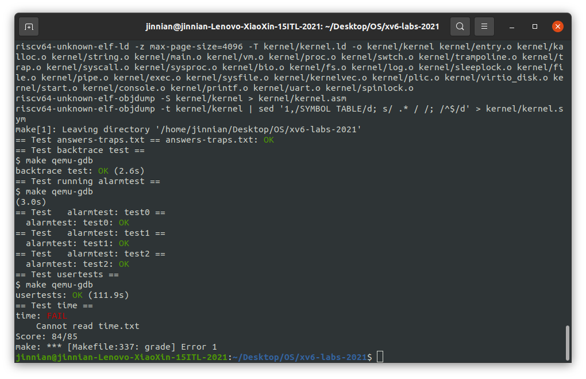
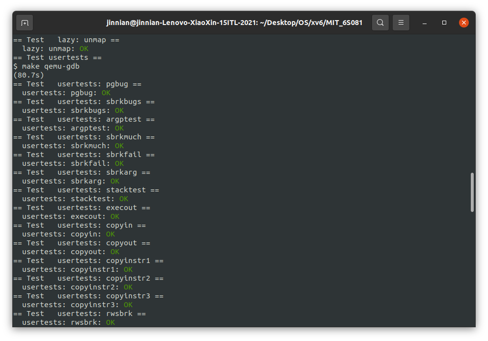

# 写在前面

> 代码地址：[xv6-lab](https://github.com/JingleCate/xv6-lab-2020-reports.git)
>
> 所有实验都需要提交一个耗时文件`time.txt`，由于没有提交，所以在评分时最后一项`failed`，减1分

# Lab 1 Utilities

---

## Assignment 1 —— sleep

​	这个任务要求利用调用**系统调用函数sleep**完成sleep n 。我们调用的是syscall的sleep，这时xv6提供的，而不是Linux环境中的< sys >中的sleep。

​	**步骤**：

- 在user文件夹下新建sleep.c，判断一下输入格式，调用一下sleep即可。

- 导包，user.h为xv6提供的系统函数，types.h为其提供的变量类型。

​	sleep.c文件：


​	cmd_parse是枚举类型，作为parse_cmd函数的返回类型.enum {wrong_para, success_parse, too_many_paras} cmd_parse三个值分别表示输入的sleep参数错误、输入成功、太多参数。

​	sleep运行结果及自动评价:


---

## Assignment 2 —— pingpong

本任务要求实现利用管道实现进程间的通信：父进程发送ping，子进程收到后发送pong，父进程收到后将其打印出来，下图方便理解


​	Hints 1：利用pipe()函数创建管道，pipe()函数接收一个长度为2的数组，数组下标0为读端、1为写端；
​	Hints 2：利用fork()函数创建新的进程；
​	Hints 3：利用read、write函数读写管道；

​	fd是文件描述符file description flag。每个进程都有一张表，而xv6 内核就以文件描述符作为这张表的索引，所以每个进程都有一个从0开始的文件描述符空间。按照惯例，进程从文件描述符0读入（标准输入），从文件描述符1输出（标准输出），从文件描述符2输出错误（标准错误输出）。	管道两端正是文件描述符，1表示输出，0表示读入，在其中任意一端操作都要关闭另一端(通过close系统调用)


​	main函数中展示了子中的进程操作，先从管道中读出	buffer中四个字节，读之前先关闭管道的写端，读完后输出子进程接收到'ping'，然后向另一管道（xv6中的管道是单向的）中写端，同理，写之前应该关闭该管道的读一端。

​	pingpong运行结果及自动评价：


---

## Assignment 3 —— primes

​	本任务要求完成质数筛选器，它要求用fork和pipe实现：输入为2 ~ 35，输出为2 ~ 35间的所有质数，例如：2、3、5、7等。第一次我们将2 ~ 35给到一个进程，这个进程发现给到的第一个数为2，则输出2，然后将不能被2除尽的数（3、5、7、9……）发送给下一个进程，下一个进程发现给到的第一个数为3，则输出3，然后将不能被3除尽的数（5、7……）发送给下一个进程……以此类推。下图辅助理解：


​	`read(fd, buf, n)`从 `fd` 读最多n 个字节（`fd`可能没有n 个字节），将它们拷贝到 `buf` 中，然后返回读出的字节数。每一个指向文件的文件描述符都和一个偏移关联（文件内指针）。`read`从当前文件偏移处读取数据，然后把偏移增加读出字节数。紧随其后的 `read` 会从新的起点开始读数据。当没有数据可读时，`read`就会返回0，这就表示文件结束了。

​	`write(fd, buf, n)`写 `buf` 中的n 个字节到 `fd` 并且返回实际写出的字节数。如果返回值小于n 那么只可能是发生了错误。就像 `read` 一样，`write`也从当前文件的偏移处开始写，在写的过程中增加这个偏移。


主函数如下：

```c
int main()
{
    // 创建管道
    int p1[2];
    pipe(p1);
    // 创建下一子进程
    int pid = fork();
    if (pid < 0)
    {
        fprintf(2, "fork error!\n");
        close(p1[RD]);
        close(p1[WR]);
        exit(1);
    }
    // child
    else if (pid == 0)
    {
        prime(p1);
    }
    // parent 
    else
    { // 关闭读
        close(p1[RD]);
        for (int i = 2; i <= 35; i++)
        {
            write(p1[WR], &i, sizeof(int));
        }
        close(p1[WR]);
        wait((int *)0);
    }

    exit(0);
}
```

主函数中创建初始管道，初始化管道中写入2～35数字，prime函数中是递归的子进程和管道，筛选每一个数的倍数，第一次递归输出2，然后筛选掉2的倍数；第二次输出3，递归筛选掉3的倍数；第三次输出5(4被筛掉了)，筛选掉5的倍数......依次类推。

​	primes运行结果及自动评价：


---

## Assignment 4 —— find

​	本任务要求写一个find函数，其基本用法为 find arg1 arg2， 即在目录arg1下找到arg2。这和file system有关。任务的一个Hint：Look at user/ls.c to see how to read directories。参考ls.c的写法。再复制grep.c的正则匹配代码，匹配目录或文件


​	其中用到了两个函数：`fstat` 可以获取一个文件描述符指向的文件的信息。它填充一个名为 `stat` 的结构体（程序中为实例化的st），它在 `stat.h` 中定义为：

```C
struct stat {
  int dev;     // File system's disk device
  uint ino;    // Inode number
  short type;  // Type of file
  short nlink; // Number of links to file
  uint64 size; // Size of file in bytes
};
```

​	`open`函数返回指定路径的文件描述符，用以传递给`fstat`函数

​	find运行结果及自动评价：


##  Assignment 5 —— xargs:star:


多参数实现，当用户输入"ctrl+d"时停止参数的输入。这里要说明的是：对于输入的命令，我们要用exec执行，其中exec接收两个参数，第一个参数为命令cmd，第二个参数为一个数组，该数组的格式必须为{cmd, “arg1”, “arg2”, …, 0}，以下是`xargstest.sh`中的内容

```shell
$ $ cat xargstest.sh
mkdir a
echo hello > a/b
mkdir c
echo hello > c/b
echo hello > b
find . b | xargs grep hello

```


​	xargs运行结果及自动评价：


​	由于第一次实验时已经创建了a和b文件夹，所以再一次创建会失败。

---

# Lab 2 Syscall

> 该实验添加两个系统调用`trace`和`sysinfo`

---

## Assignment 1 —— System call tracing

​	本任务中要求添加一个系统调用跟踪功能，该功能可能会在以后调试实验时帮助您。您将创建一个新的`trace`系统调用来控制跟踪。它应该采用一个参数`mask`，int 整数类型，其位指定要跟踪的系统调用。例如，为了跟踪 fork 系统调用，程序调用`trace(1 << SYS_fork)`，其中`SYS_fork`是来自`kernel/syscall.h`的系统调用号。如果掩码中设置了系统调用号，则必须修改 xv6 内核以在每个系统调用即将返回时打印一行。该行应包含进程 id、系统调用的名称和返回值；不需要打印系统调用参数。`trace`系统调用应该启用对调用它的进程以及它随后产生的任何子进程的跟踪，但不应影响其他进程。

​	系统调用原理（以 fork 为例）：

​	该实验需要打印其他系统调用的信息。根据上面的分析和文档说明，首先需要给user.h、usys.pl（用来生成usys.S的辅助脚本）和syscall.h添加对应的函数的系统调用号，然后给syscall.c的系统调用数组添加对应的函数指针和函数头，在sysproc.c添加对应的函数实现，sysproc.c里主要是接收参数并给proc结构体复制，具体代码如下：

```c
# kernel/sysproc.c
uint64 sys_trace(void) {
    int mask;
    if (argint(0, &mask) < 0) return -1;
    myproc()->mask = mask; return 0;
}

# user/user.h
// system calls
...
int trace(int);//添加trace原型

# user/usys.pl
...
entry("trace");

# kernel/syscall.h
// System call numbers
...
#define SYS_trace  22
    
# kernel/proc.h
// Per-process state
struct proc {
  ...
  char name[16];               // Process name (debugging)
  int mask;                    // Tracing parameter
};

# kernel/syscall.c
...
extern uint64 sys_trace(void);

static uint64 (*syscalls[])(void) = {
...
[SYS_trace]   sys_trace,
};

char* syscalls_name[] = {
[SYS_fork]    "fork",
[SYS_exit]    "exit",
[SYS_wait]    "wait",
[SYS_pipe]    "pipe",
[SYS_read]    "read",
[SYS_kill]    "kill",
[SYS_exec]    "exec",
[SYS_fstat]   "fstat",
[SYS_chdir]   "chdir",
[SYS_dup]     "dup",
[SYS_getpid]  "getpid",
[SYS_sbrk]    "sbrk",
[SYS_sleep]   "sleep",
[SYS_uptime]  "uptime",
[SYS_open]    "open",
[SYS_write]   "write",
[SYS_mknod]   "mknod",
[SYS_unlink]  "unlink",
[SYS_link]    "link",
[SYS_mkdir]   "mkdir",
[SYS_close]   "close",
[SYS_trace]   "trace",
};

void
syscall(void)
{
  ...
  if(num > 0 && num < NELEM(syscalls) && syscalls[num]) {
    p->trapframe->a0 = syscalls[num]();
    if((1 << num) & p->mask){//mask的二进制下为1的数位表示需要跟踪的进程
    	printf("%d: syscall %s -> %d\n",
    	       p->pid, syscalls_name[num], p->trapframe->a0);
    }
  } 
  ...
}

# kernel/proc.c
int
fork(void)
{
  ...
  safestrcpy(np->name, p->name, sizeof(p->name));
  np->mask = p->mask; //添加mask给子进程
  pid = np->pid;
  ...
}

static struct proc*
allocproc(void)
{
  ...
  p->context.sp = p->kstack + PGSIZE;
  p->mask = 0;//给每个进程mask赋个初值即可。

  return p;
}
```

`trace`运行结果及自动评测：结构是`pid: syscall '调用类型' -> 返回值`


---

## Assignment 2 —— Sysinfo

​	在这个任务中，添加一个系统调用`sysinfo`，它收集有关正在运行的系统的信息。系统调用有一个参数：指向`struct sysinfo`的指针 （参见`kernel/sysinfo.h`）。内核应填写此结构的字段：`freemem`字段应设置为空闲内存的字节数，`nproc` 字段应设置为`状态` 不是`UNUSED`即正在进行的进程数。官方提供了一个测试程序`sysinfotest`；如果它打印“sysinfotest：OK”，表示通过了这个任务。如下：

```C
struct sysinfo {
  uint64 freemem;   // amount of free memory (bytes)
  uint64 nproc;     // number of process
};
```

​	同上面的syscall一样，首先需要给user.h、usys.pl（用来生成usys.S的辅助脚本）和syscall.h添加对应的函数和系统调用号。

### 2.1 获取空闲内存和空闲进程

接下来，完善`getfreemem()`和`getnproc()`这两个函数。

### getfreemem()

根据提示查看`kernel/kalloc.c`文件，从中可以看出，`xv6`系统维护着一个`kmem.freelist`链表来存储空闲页，遍历`kmem.freelist`即可计算出空闲内存。因为要遍历该链表，为防止冲突，需要先获取`lock`，计算完后再`release`。

```C
# kernel/kalloc.c
uint64 getfreemem(void)
{
  uint64 freemem = 0;
  struct run *r;
  // 循环等待锁
  acquire(&kmem.lock);
  r = kmem.freelist;
  while(r){
    freemem += PGSIZE;//若r存在，加上页的内存大小
    r = r->next;
  }
  // 释放锁
  release(&kmem.lock);
  return freemem;
}

```

### getnproc()

根据提示查看`kernel/proc.c`，其内部定义了`struct proc proc[NPROC]`，所以我们只要遍历这个数组，统计其中`state != UNUSED`的个数即可。

```c
uint64 getnproc(void)
{
  uint64 res = 0;
  struct proc *p;
  for(p = proc; p < &proc[NPROC]; p++){
    if(p->state != UNUSED) res++;
  }
  return res;
}
```

### 2.2 sysinfo函数

​	仿照`sys_fstat()` (`kernel/sysfile.c`)和 `filestat()` (`kernel/file.c`)即可实现`sys_sysinfo()`的核心功能，把内核中的结构体`sysinfo`拷贝到用户区的指针中。

```C
# kernal/sysproc.c
uint64 sys_sysinfo(void)
{
  uint64 addr;
  struct sysinfo sinfo;
  // 获取用户态传入的sysinfo结构体
  if(argaddr(0, &addr) < 0)
    return -1;
  sinfo.freemem = getfreemem();
  sinfo.nproc = getnproc();
  // 将内核态中的info复制到用户态
  if(copyout(myproc()->pagetable, addr, (char *)&sinfo, sizeof(sinfo)) < 0)
    return -1;
  return 0;
}
```

​	运行结果及自动评分：


​	由于实验最后有一项提交`time.txt`文件的要求，没有提交故`FAIL`

---

# Lab 3 Page Table

---

## Assignment 1 —— vmprint

​	定义一个名为`vmprint()`的函数。它应该接受一个`pagetable_t`参数，并以下面描述的格式打印该页表。`在 exec.c 中的return argc`之前插入`if(p->pid==1) vmprint(p->pagetable)`，以打印第一个进程的页表,通过`make Grade`的`pte` 打印输出测试。

​	Hints:

- 可以将`vmprint()`放在`kernel/vm.c`中。
- 使用文件 kernel/riscv.h 末尾的宏。
- `freewalk`的功能可能有用。
- `在 kernel/defs.h 中定义vmprint`的原型，以便可以从 exec.c 中调用它。
- 在的 printf 调用中使用`%p`打印出完整的 64 位十六进制 PTE 和地址，如示例中所示。

​	示例：

```shell
xv6 kernel is booting

hart 2 starting
hart 1 starting
init: starting sh
page table 0x0000000087f6e000
..0: pte 0x0000000021fda801 pa 0x0000000087f6a000
.. ..0: pte 0x0000000021fda401 pa 0x0000000087f69000
.. .. ..0: pte 0x0000000021fdac1f pa 0x0000000087f6b000
.. .. ..1: pte 0x0000000021fda00f pa 0x0000000087f68000
.. .. ..2: pte 0x0000000021fd9c1f pa 0x0000000087f67000
..255: pte 0x0000000021fdb401 pa 0x0000000087f6d000
.. ..511: pte 0x0000000021fdb001 pa 0x0000000087f6c000
.. .. ..510: pte 0x0000000021fdd807 pa 0x0000000087f76000
.. .. ..511: pte 0x0000000020001c0b pa 0x0000000080007000
  
```

​	`vmprint`函数：

```cpp
# kernel/excu.c:119 return argc；前插入
if(p->pid==1) vmprint(p->pagetable);

# kernel/vm.c
void _vmprint(pagetable_t pagetable, int level)
{
  for(int i = 0; i < 512; i++){
    pte_t pte = pagetable[i];
    if((pte & PTE_V)){
      // this PTE points to a lower-level page table.
      for (int j = 0; j < level; j++)
      {
        if (j == 0) printf("..");
        else printf(" ..");
      }
      uint64 child = PTE2PA(pte);
      printf("%d: pte %p pa %p\n", i, pte, child);
      // 查看flag位是否被设置，若被设置则为最低一层，
      // 见vm.c161行，可以看到只有最底层被设置了符号位
      if ((pte & (PTE_R|PTE_W|PTE_X)) == 0)
        _vmprint((pagetable_t)child, level + 1);
    }
  }
}

void vmprint(pagetable_t pagetable)
{
  printf("page table %p\n", pagetable);
  _vmprint(pagetable, 1);
}
```

​	`vmprint`运行结果：


---

## Assignment 2 —— A kernel page table per process

​	xv6 拥有一个单独的内核页表供所有进入内核的进程使用，该页表与实际物理内存直接映射，不需要转换地址。但如果想使用用户态的一个地址时，当内核态需要使用一个用户态指针时，需要翻译转换虚拟地址为物理地址。因此，本实验的目标是给每个进程创建一个内核态页表。第一项工作是修改内核，以便每个进程在内核中执行时都使用自己的内核页表副本。修改`struct proc`为每个进程维护一个内核页表，并修改调度器在切换进程时切换内核页表。对于这一步，每个进程的内核页表应该与现有的全局内核页表相同。如果`usertests`运行正确，就通过了这部分的实验。

​	Hints:

- 为进程的内核页表 添加一个字段到`struct proc 。`

  ```C
  # kernel/proc.h
  struct proc {
    struct spinlock lock;
    ......
    pagetable_t kernelpt;        // 内核映射表
  };
  ```

- 为新进程生成内核页表的合理方法是实现`kvminit`的修改版本，该版本生成新页表而不是修改`kernel_pagetable`。需要从`allocproc`调用此函数。

  ```C
  # kernel/vm.c
  // 模仿vm.c中kvminit的方式构建每个进程自己的内核映射表 TODO:删除
  pagetable_t proc_kpt_init()
  {
    pagetable_t kpt;
    kpt = uvmcreate();
    if (kpt == 0) return 0;
    uvmmap(kpt, UART0, UART0, PGSIZE, PTE_R | PTE_W);
    uvmmap(kpt, VIRTIO0, VIRTIO0, PGSIZE, PTE_R | PTE_W);
    uvmmap(kpt, CLINT, CLINT, 0x10000, PTE_R | PTE_W);
    uvmmap(kpt, PLIC, PLIC, 0x400000, PTE_R | PTE_W);
    uvmmap(kpt, KERNBASE, KERNBASE, (uint64)etext-KERNBASE, PTE_R | PTE_X);
    uvmmap(kpt, (uint64)etext, (uint64)etext, PHYSTOP-(uint64)etext, PTE_R | PTE_W);
    uvmmap(kpt, TRAMPOLINE, (uint64)trampoline, PGSIZE, PTE_R | PTE_X);
    return kpt;
  }
  
  // 添加映射到用户进程的kernel pagetable
  void uvmmap(pagetable_t pagetable, uint64 va, uint64 pa, uint64 sz, int perm)
  {
    if(mappages(pagetable, va, sz, pa, perm) != 0)
      panic("kvmmap");
  }
  
  # kernel/proc.c/allocproc allocproc调用，仿照创建空表
    // 添加kernel pagetable
    p->kernelpt = proc_kpt_init();
    if (p->kernelpt == 0){
      freeproc(p);
      release(&p->lock);
      return 0;
    }
  ```

- 确保每个进程的内核页表都有该进程的内核堆栈的映射。在未修改的 xv6 中，所有内核堆栈都设置在`procinit`中。需要将部分或全部功能移至`allocproc`。

  ```C
  #  kernel/proc.c/allocproc 
    // 把内核映射放到到进程的内核栈里
    // Allocate a page for the process's kernel stack.
    // Map it high in memory, followed by an invalid
    // guard page.
    char *pa = kalloc();
    if(pa == 0)
      panic("kalloc");
    uint64 va = KSTACK((int) (p - proc));
    // 添加kernel stack的映射到用户的kernel pagetable里
    uvmmap(p->kernelpt, va, (uint64)pa, PGSIZE, PTE_R | PTE_W);
    p->kstack = va;
  ```

- 修改`scheduler()`以将进程的内核页表加载到内核的`satp`寄存器中（请参阅`kvminithart`以获得灵感）。不要忘记在调用`w_satp()` 之后调用`sfence_vma()`。

- `scheduler()`应该在没有进程运行时 使用`kernel_pagetable 。`

  ```C
  # kernel/proc.c
  void
  scheduler(void)
  {
    struct proc *p;
    struct cpu *c = mycpu();
    
    c->proc = 0;
    for(;;){
      // Avoid deadlock by ensuring that devices can interrupt.
      intr_on();
  
      int found = 0;
      for(p = proc; p < &proc[NPROC]; p++) {
        acquire(&p->lock);
        if(p->state == RUNNABLE) {
          // Switch to chosen process.  It is the process's job
          // to release its lock and then reacquire it
          // before jumping back to us.
          p->state = RUNNING;
          c->proc = p;
          // 将当前进程的kernel page存入stap寄存器中
          w_satp(MAKE_SATP(p->kernelpt));
          sfence_vma();
          swtch(&c->context, &p->context);
  
          // Process is done running for now.
          // It should have changed its p->state before coming back.
          c->proc = 0;
          found = 1;
        }
        release(&p->lock);
      }
  #if !defined (LAB_FS)
      if(found == 0) {
        intr_on();
        // 没有进程在运行则使用内核原来的kernel pagtable
        w_satp(MAKE_SATP(kernel_pagetable));
        sfence_vma();
        asm volatile("wfi");
      }
  #else
      ;
  #endif
    }
  }
  ```

- `在freeproc`中释放进程的内核页表。

  ```C
  # kernel/proc.c
  static void
  freeproc(struct proc *p)
  {
    if(p->trapframe)
      kfree((void*)p->trapframe);
    p->trapframe = 0;
    // 删除kernel stack
    if (p->kstack)
    {
      pte_t* pte = walk(p->kernelpt, p->kstack, 0);
      if (pte == 0)
        panic("freeproc: kstack");
      kfree((void*)PTE2PA(*pte));
    }
    p->kstack = 0;
  .........
  }
  ```

- `vmprint`在调试页表时可能会派上用场。

- 修改xv6功能或添加新功能都可以；可能至少需要在`kernel/vm.c` 和`kernel/proc.c`中执行此操作。（但是，不要修改`kernel/vmcopyin.c`、`kernel/stats.c`、 `user/usertests.c`和`user/stats.c`。）

- 缺少页表映射可能会导致内核遇到页面错误。它将打印一个包含`sepc=0x00000000XXXXXXXXX`的错误。 可以通过在`kernel/kernel.asm中搜索``XXXXXXXX`来找出故障发生的位置。

---

## Assignment 3 —— Simplify `copyin/copyinstr`

​	`将kernel/vm.c中的``copyin` 主体替换为对`copyin_new` 的调用（在 kernel `/vmcopyin.c`中定义）；`对copyinstr`和`copyinstr_new`执行相同的操作。将用户地址的映射添加到每个进程的内核页表，以便 `copyin_new`和`copyinstr_new`工作。如果`usertests`运行正确并且所有的`make Grade`测试都通过了，那么你就通过了这个作业。

​	Hints:

- `先将copyin()`替换为对`copyin_new` 的调用，并使其工作，然后再转到`copyinstr`。
- 在内核更改进程的用户映射的每一点，都以相同的方式更改进程的内核页表。这些点包括`fork()`、`exec()`和`sbrk()`。
- 不要忘记在`userinit`的内核页表中包含第一个进程的用户页表。
- 用户地址的 PTE 在进程的内核页表中需要什么权限？（在内核模式下无法访问设置 了`PTE_U的页面。）`
- 不要忘记上述 PLIC 限制。

```C
# kernel/vm.c
//先仿照uvmcopy创建一个从用户态页表复制到内核态页表的函数
void
uvm_user2ker_copy(pagetable_t u, pagetable_t k, uint64 start, uint64 end)
{
  
  pte_t *user;
  pte_t *kernel;
  for(uint64 i = start; i < end; i += PGSIZE)
  {
    user = walk(u, i, 0);
    kernel = walk(k, i, 1);
/*
	根据内核态页表的特点--直接映射到物理内存
	我们无需使用mappage建立映射
	记得消除PTE_U标志位
*/
    *kernel = (*user) & (~PTE_U);
  }

}


# kernel/proc.c	
void
userinit(void)
{
  struct proc *p;
  ......
  uvminit(p->pagetable, initcode, sizeof(initcode));
  p->sz = PGSIZE;

  uvm_user2ker_copy(p->pagetable, p->kernel_pagetable, 0, p->sz);
  ......
}


int
fork(void)
{
  int i, pid;
  	....
  np->sz = p->sz;
  uvm_user2ker_copy(np->pagetable, np->kernel_pagetable, 0, np->sz);
    ....
  return pid;
}


# kernel/exec.c	
int
exec(char *path, char **argv)
{
  char *s, *last;
  ......
  // Load program into memory.
  for(i=0, off=elf.phoff; i<elf.phnum; i++, off+=sizeof(ph)){
    ......
    uint64 sz1;
    if((sz1 = uvmalloc(pagetable, sz, ph.vaddr + ph.memsz)) == 0)
      goto bad;
/*
	判断是否越界
*/
    if(sz1 > PLIC)
      goto bad;
	......
  }
  ......
  uvm_user2ker_copy(p->pagetable, p->kernel_pagetable, 0, sz);

  if(p->pid == 1)
    vmprint(p->pagetable);
  
  return argc; // this ends up in a0, the first argument to main(argc, argv)
  ......
}


# kernel/syproc.c
uint64
sys_sbrk(void)
{
  .....
  if(growproc(n) < 0)
    return -1;
  if(n > 0)
  {
    uvm_user2ker_copy(myproc()->pagetable, myproc()->kernel_pagetable, addr, addr + n);
  }
  //考虑到内核页表内容是根据用户页表改变，所以只增加/覆盖内容，不删除内容（我猜可行

  return addr;
}

```

---

# Lab 4 Traps

---

## Assignment 2 —— RISC-V assembly

```assembly
Q: 哪些寄存器存储了函数调用的参数？举个例子，main 调用 printf 的时候，13 被存在了哪个寄存器中？
A: a0-a7; a2;

Q: main 中调用函数 f 对应的汇编代码在哪？对 g 的调用呢？ (提示：编译器有可能会内联(inline)一些函数)
A: 没有这样的代码。 g(x) 被内联到 f(x) 中，然后 f(x) 又被进一步内联到 main() 中

Q: printf 函数所在的地址是？
A: 0x0000000000000630, main 中使用 pc 相对寻址来计算得到这个地址。

Q: 在 main 中 jalr 跳转到 printf 之后，ra 的值是什么？
A: 0x0000000000000040, jalr 指令的下一条汇编指令的地址。

Q: 运行下面的代码

	unsigned int i = 0x00646c72;
	printf("H%x Wo%s", 57616, &i);      

输出是什么？
如果 RISC-V 是大端序的，要实现同样的效果，需要将 i 设置为什么？需要将 57616 修改为别的值吗？
A: "He110 World"; 0x726c6400; 不需要，57616 的十六进制是 110，无论端序（十六进制和内存中的表示不是同个概念）

Q: 在下面的代码中，'y=' 之后会答应什么？ (note: 答案不是一个具体的值) 为什么?

	printf("x=%d y=%d", 3);

A: 输出的是一个受调用前的代码影响的“随机”的值。因为 printf 尝试读的参数数量比提供的参数数量多。
第二个参数 `3` 通过 a1 传递，而第三个参数对应的寄存器 a2 在调用前不会被设置为任何具体的值，而是会
包含调用发生前的任何已经在里面的值。
```

---

## Assignment 2 —— Back trace 

​	`在kernel/printf.c`中 实现`backtrace()`函数。`在sys_sleep`中插入对该函数的调用，然后运行，它调用`sys_sleep`。您的输出应如下所示： ``bttest``

```
backtrace：
0x0000000080002cda 
0x0000000080002bb6 
0x0000000080002898
```

​	`bttest` 后退出 qemu。在终端中：地址可能略有不同，但如果运行`addr2line -e kernel/kernel`（或`riscv64-unknown-elf-addr2line -e kernel/kernel`）并剪切并粘贴上述地址，如下所示：

```
$ addr2line -e kernel/kernel
0x0000000080002de2 
0x0000000080002f4a 
0x0000000080002bfc 
Ctrl-D
```

​	应该可以看到如下内容：

```
 kernel/sysproc.c:74
 kernel/syscall.c:224
 kernel/trap.c:85
```

​	Hints:

- 将回溯的原型添加到`kernel/defs.h`以便您可以在`sys_sleep`中调用回溯。

  ```C
  // kernel/printf.c
  ...
  void            printfinit(void);
  void            backtrace(void);
  
  // kernel/sysproc.c
  
  uint64 sys_sleep(void)
  {
    int n;
    uint ticks0;
  
    backtrace(); // print stack backtrace.
    ...
  }
  ```

  

- GCC 编译器将当前执行函数的帧指针存储在寄存器 s0 中。将以下函数添加到 `kernel/riscv.h`：

  ```c
  // 获取上一级栈帧地址
  static inline uint64
  r_fp()
  {
    uint64 x;
    asm volatile("mv %0, s0" : "=r" (x) );
    return x;
  }
  ```

  并在`backtrace`中调用此函数以读取当前帧指针。此函数使用内联汇编来读取 s0 。

- 堆栈帧布局，请注意，返回地址位于距堆栈帧的帧指针的固定偏移量 (-8) 处，而保存的帧指针位于距帧指针的固定偏移量 (-16) 处。

  

  fp 指向当前栈帧的开始地址，sp 指向当前栈帧的结束地址。（栈从高地址往低地址生长，所以 fp 虽然是帧开始地址，但是地址比 sp 高）。栈帧中从高到低第一个 8 字节 `fp-8` 是 return address，也就是当前调用层应该返回到的地址。栈帧中从高到低第二个 8 字节 `fp-16` 是 previous address，指向上一层栈帧的 fp 开始地址。剩下的为保存的寄存器、局部变量等。一个栈帧的大小不固定，但是至少 16 字节。 在 xv6 中，使用一个页来存储栈，如果 fp 已经到达栈页的上界，则说明已经到达栈底。

- xv6 为 xv6 内核中的每个堆栈在 PAGE 对齐地址处分配一个页面。可以使用`PGROUNDDOWN(fp)`和`PGROUNDUP(fp)`计算堆栈页面的顶部和底部地址 （请参阅`kernel/riscv.h`。这些数字有助于`回溯`终止其循环。

​	`backtrace`函数：

```C
// kernel/printf.c
void backtrace() {
  uint64 fp = r_fp();
  while(fp != PGROUNDUP(fp)) { // 如果已经到达栈底
    uint64 ra = *(uint64*)(fp - 8); // return address
    printf("%p\n", ra);
    fp = *(uint64*)(fp - 16); // previous fp
  }
}
```

​	实验运行结果：


---

## Assignment 3 —— Alarm

​	在本任务中，向 xv6 添加一个功能，该功能会在进程使用 CPU 时间时定期提醒它。这对于想要限制它们占用多少 CPU 时间的计算绑定进程，或者对于想要计算但又想要采取一些定期操作的进程可能很有用。更一般地说，您将实现一种原始形式的用户级中断/故障处理程序；例如，您可以使用类似的东西来处理应用程序中的页面错误。如果它通过了警报测试和用户测试，则您的解决方案是正确的。

​	添加一个新的`sigalarm(interval, handler)`系统调用。如果应用程序调用`sigalarm(n, fn)` ，那么在程序消耗的 每` n `个CPU 时间之后，内核应该调用应用程序函数`fn`。当`fn`返回时，应用程序应该从中断的地方继续。在 xv6 中，`tick` 是一个相当随意的时间单位，由硬件定时器产生中断的频率决定。如果应用程序调用`sigalarm(0, 0)`，内核应该停止生成定期警报调用。在 xv6 存储库中找到文件`user/alarmtest.c`，将其添加到 Makefile。在添加`sigalarm`和`sigreturn` 系统调用（见下文） 之前，它不会正确编译。alarmtest` 在`test0`中调用`sigalarm(2,periodic)`以要求内核每 2 个滴答声强制调用一次`periodic()`，然后旋转一段时间。可以在user/alarmtest.asm 中看到alarmtest 的汇编代码，这对于调试可能很方便。当 `alarmtest`产生这样的输出并且 usertests 也正确运行时，解决方案是正确的。

​	test 0 : 调用中断程序：

- 添加调用：在`user.h`声明调用，在`syscall.h`添加系统调用号等等

  ```C
  # kernel/user.h
  int sigalarm(int ticks, void (*handler)());
  int sigreturn(void);
  
  # kernel/syscall.h
  #define SYS_sigalarm 22
  #define SYS_sigreturn 23
  ```

- 将警报间隔和指向处理函数的指针存储在`proc` 结构的新字段中（在`kernel/proc.h `中）

  ```C
  # kernel/proc.h
  struct proc {
    // ......
    int alarm_interval;          // 时钟周期，0 为禁用
    void(*alarm_handler)();      // 时钟回调处理函数
    int alarm_ticks;             // 下一次时钟响起前还剩下的 ticks 数
    struct trapframe *alarm_trapframe;  // 时钟中断时刻的 trapframe，用于中断处理完成后恢复原程序的正常执行
    int alarm_goingoff;          // 是否已经有一个时钟回调正在执行且还未返回（用于防止在 alarm_handler 中途闹钟到期再次调用 alarm_handler，导致 alarm_trapframe 被覆盖）
  };
  ```

- `sigalarm`和`sigreturn`实现：:star2:不要忘记`defs.h`添加函数声明

  ```C
  # kernel/sysproc.c
  uint64 sys_sigalarm(void) {
    int n;
    uint64 fn;
    if(argint(0, &n) < 0)
      return -1;
    if(argaddr(1, &fn) < 0)
      return -1;
    
    return sigalarm(n, (void(*)())(fn));
  }
  
  uint64 sys_sigreturn(void) {
  	return sigreturn();
  }
  
  // kernel/trap.c
  int sigalarm(int ticks, void(*handler)()) {
    // 设置 myproc 中的相关属性
    struct proc *p = myproc();
    p->alarm_interval = ticks;
    p->alarm_handler = handler;
    p->alarm_ticks = ticks;
    return 0;
  }
  
  int sigreturn() {
    // 将 trapframe 恢复到时钟中断之前的状态，恢复原本正在执行的程序流
    struct proc *p = myproc();
    *p->trapframe = *p->alarm_trapframe;
    p->alarm_goingoff = 0;
    return 0;
  }
  ```

- 仿照`allocproc`中分配中断帧的方式分配`alarm`中断帧和初始化

  ```C
  # kernel/proc.c/allocproc:130
    // Allocate a trapframe page for alarm_trapframe.
    if((p->alarm_trapframe = (struct trapframe *)kalloc()) == 0){
      release(&p->lock);
      return 0;
    }
  
    p->alarm_interval = 0;
    p->alarm_handler = 0;
    p->alarm_ticks = 0;
    p->alarm_goingoff = 0;
  ```

- 释放代码：

  ```C
  # kernel/proc.c/freeproc:169
    if(p->alarm_trapframe)
      kfree((void*)p->alarm_trapframe);
    p->alarm_trapframe = 0;
    
    // ......
    
    p->alarm_interval = 0;
    p->alarm_handler = 0;
    p->alarm_ticks = 0;
    p->alarm_goingoff = 0;
  
  ```

- 在 `usertrap `函数中，实现时钟机制具体代码：

  ```C
  # kernel/trap.c/usertrap:80
  ...
    if(p->killed)
      exit(-1);
  
  --> begin:80
    // give up the CPU if this is a timer interrupt.
    // if(which_dev == 2)
    //   yield();
  
    // give up the CPU if this is a timer interrupt.
    if(which_dev == 2) {
      if(p->alarm_interval != 0) { // 如果设定了时钟事件
        if(--p->alarm_ticks <= 0) { // 时钟倒计时 -1 tick，如果已经到达或超过设定的 tick 数
          if(!p->alarm_goingoff) { // 确保没有时钟正在运行
            p->alarm_ticks = p->alarm_interval;
            // jump to execute alarm_handler
            *p->alarm_trapframe = *p->trapframe; // backup trapframe
            p->trapframe->epc = (uint64)p->alarm_handler;
            p->alarm_goingoff = 1;
          }
          // 如果一个时钟到期的时候已经有一个时钟处理函数正在运行，则会推迟到原处理函数运行完成后的下一个 tick 才触发这次时钟
        }
      }
      yield();
    }
  
    usertrapret();
  ```

  在每次时钟中断的时候，如果进程有已经设置的时钟（`alarm_interval != 0`），则进行 alarm_ticks 倒数。当 alarm_ticks 倒数到小于等于 0 的时候，如果没有正在处理的时钟，则尝试触发时钟，将原本的程序流保存起来（`*alarm_trapframe = *trapframe`），然后通过修改 pc 寄存器的值，将程序流转跳到 alarm_handler 中，alarm_handler 执行完毕后再恢复原本的执行流（`*trapframe = *alarm_trapframe`）。这样从原本程序执行流的视角，就是不可感知的中断了。

  ​	实验运行结果：

  

  ​	测试结果：

  

  ---

  # Lab 5 xv6 lazy page allocation

  ---

  >  操作系统可以使用页表硬件的技巧之一是延迟分配用户空间堆内存（lazy allocation of user-space heap memory）。Xv6应用程序使用`sbrk()`系统调用向内核请求堆内存。在内核中，`sbrk()`分配物理内存并将其映射到进程的虚拟地址空间。内核为一个大请求分配和映射内存可能需要很长时间。例如，考虑由262144个4096字节的页组成的千兆字节；即使单独一个页面的分配开销很低，但合起来如此大的分配数量将不可忽视。此外，有些程序申请分配的内存比实际使用的要多（例如，实现稀疏数组），或者为了以后的不时之需而分配内存。为了让`sbrk()`在这些情况下更快地完成，复杂的内核会延迟分配用户内存。也就是说，`sbrk()`不分配物理内存，只是记住分配了哪些用户地址，并在用户页表中将这些地址标记为无效。当进程第一次尝试使用延迟分配中给定的页面时，CPU生成一个页面错误（page fault），内核通过分配物理内存、置零并添加映射来处理该错误。

  ## Assignment 1 —— Eliminate allocation from sbrk()

  ​	该任务要求删除`sbrk(n)`系统调用中的页面分配代码（位于***sysproc.c***中的函数`sys_sbrk()`）。`sbrk(n)`系统调用将进程的内存大小增加n个字节，然后返回新分配区域的开始部分（即旧的大小）。新的`sbrk(n)`应该只将进程的大小（`myproc()->sz`）增加n，然后返回旧的大小。它不应该分配内存——因此应该删除对`growproc()`的调用（但是仍然需要增加进程的大小！）。

  ​	在`sbrk()`时只增长进程的`myproc()->sz`而不实际分配内存：

  ```C
  # kernel/sysproc.c
  uint64 sys_sbrk(void)
  {
    int addr;
    int n;
    if(argint(0, &n) < 0)
      return -1;
    addr = myproc()->sz;
    myproc()->sz += n;
    // if(growproc(n) < 0)
    //   return -1;
    return addr;
  }
  ```

   	运行结果：

  ```shell
  init: starting sh
  $ echo hi
  usertrap(): unexpected scause 0x000000000000000f pid=3
              sepc=0x0000000000001258 stval=0x0000000000004008
  va=0x0000000000004000 pte=0x0000000000000000
  panic: uvmunmap: not mapped
  ```

  

  ---

  ## Assignment 2 —— Lazy allocation

  > 进程第一次尝试使用延迟分配中给定的页面时，CPU生成一个页面错误`page fault`

  ​	该任务修改***trap.c***中的代码以响应来自用户空间的页面错误，方法是新分配一个物理页面并映射到发生错误的地址，然后返回到用户空间，让进程继续执行。在生成“`usertrap(): …`”消息的`printf`调用之前添加代码，修改任何其他xv6内核代码，以使`echo hi`正常工作。13为page load fault，15为page write fault

  ​	**Hints：**

  - 在`usertrap()`中查看`r_scause()`的返回值是否为13或15来判断该错误是否为页面错误

    > 13为`page load fault`，15为`page write fault`

  - `stval`寄存器中保存了造成页面错误的虚拟地址，可以通过`r_stval()`读取

  - 参考***vm.c***中的`uvmalloc()`中的代码，那是一个`sbrk()`通过`growproc()`调用的函数。你将需要对`kalloc()`和`mappages()`进行调用

  - 使用`PGROUNDDOWN(va)`将出错的虚拟地址向下舍入到页面边界

  - 当前`uvmunmap()`会导致系统`panic`崩溃；请修改程序保证正常运行

    ```C
    # kernel/vm.c/uvmunmap
    if((pte = walk(pagetable, a, 0)) == 0)
        continue;
    // panic("uvmunmap: walk");
    if((*pte & PTE_V) == 0)
        continue;	    
    // panic("uvmunmap: not mapped");
    if(PTE_FLAGS(*pte) == PTE_V)
        panic("uvmunmap: not a leaf");
    if(do_free){
    ```

    

  - 如果内核崩溃，请在***kernel/kernel.asm***中查看`sepc`

  - 使用pgtbl lab的`vmprint`函数打印页表的内容

  - 如果看到错误“incomplete type proc”，请include“spinlock.h”然后是“proc.h”。

  ```C
  # kernel/trap.c/usertrap:
   } else if((which_dev = devintr()) != 0){
      // ok
    } else {
      if (r_scause() == 13 || r_scause() == 15) {
        // page fault
        uint64 va = r_stval();
        char *mem;
        va = PGROUNDDOWN(va);
        if ((mem = kalloc()) == 0) {
  		panic("cannot allocate for lazy alloc\n");
          exit(-1);
        } 
        if (mappages(p->pagetable, va, PGSIZE, (uint64)mem, PTE_W|PTE_X|PTE_R|PTE_U) != 0) {
          kfree(mem);
  		panic("cannot map for lazy alloc\n");
  		exit(-1);
        }
      }
      else {
        printf("usertrap(): unexpected scause %p pid=%d\n", r_scause(), p->pid);
        printf("            sepc=%p stval=%p\n", r_sepc(), r_stval());
        p->killed = 1;
      }
    }
  ```

  ---

  ## Assignment 3 ——  Lazytests and Usertests (moderate)

  **Hints：**

  - 处理`sbrk()`参数为负的情况。

    ```C
    if (n < 0) {
        // deallocate the memory
        if ((myproc()->sz + n) < 0) {
            return -1;
        } else {
            if (uvmdealloc(myproc()->pagetable, addr, addr+n) != (addr+n)) {
                return -1;
            }
        }
    }
    ```

    

  - 如果某个进程在高于`sbrk()`分配的任何虚拟内存地址上出现页错误，则终止该进程 & 处理用户栈下面的无效页面上发生的错误。

    >当造成的page fault在进程的user stack以下（栈底）或者在`p->sz`以上（堆顶）时，kill这个进程。在kernel/trap.c的`usertrap`中增加以下判断条件

    ```C
    if ((va < p->sz) && (va > PGROUNDDOWN(p->trapframe->sp)))
    ```

    

  - 在`fork()`中正确处理父到子内存拷贝。

    > `fork()`中将父进程的内存复制给子进程的过程中用到了`uvmcopy`，`uvmcopy`原本在发现缺失相应的PTE等情况下会panic，这里也要`continue`掉。在kernel/proc.c的`uvmcopy`中

    ```C
    # kernel/proc.c/uvmcopy
    if((pte = walk(old, i, 0)) == 0)
        continue;
    // panic("uvmcopy: pte should exist");
    if((*pte & PTE_V) == 0)
        continue;
    // panic("uvmcopy: page not present");
    
    ```

    

  - 处理这种情形：进程从`sbrk()`向系统调用（如`read`或`write`）传递有效地址，但尚未分配该地址的内存。

  - 正确处理内存不足：如果在页面错误处理程序中执行`kalloc()`失败，则终止当前进程。

  ```C
  # kernel/vm.c/excu:
  if((pte == 0) || ((*pte & PTE_V) == 0)) {
      if (va > myproc()->sz || va < PGROUNDDOWN(myproc()->trapframe->sp)) {
          return 0;
      } 
      if ((mem = (uint64)kalloc()) == 0) return 0;
      va = PGROUNDDOWN(va);
      if (mappages(myproc()->pagetable, va, PGSIZE, mem, PTE_W|PTE_X|PTE_R|PTE_U) != 0) {
          kfree((void*)mem);
          return 0;
      }
      return mem;
  }
  ```

  运行结果及评分：

  

  

---

# Lab 5 xv6 lazy page allocation

---

>  操作系统可以使用页表硬件的技巧之一是延迟分配用户空间堆内存（lazy allocation of user-space heap memory）。Xv6应用程序使用`sbrk()`系统调用向内核请求堆内存。在内核中，`sbrk()`分配物理内存并将其映射到进程的虚拟地址空间。内核为一个大请求分配和映射内存可能需要很长时间。例如，考虑由262144个4096字节的页组成的千兆字节；即使单独一个页面的分配开销很低，但合起来如此大的分配数量将不可忽视。此外，有些程序申请分配的内存比实际使用的要多（例如，实现稀疏数组），或者为了以后的不时之需而分配内存。为了让`sbrk()`在这些情况下更快地完成，复杂的内核会延迟分配用户内存。也就是说，`sbrk()`不分配物理内存，只是记住分配了哪些用户地址，并在用户页表中将这些地址标记为无效。当进程第一次尝试使用延迟分配中给定的页面时，CPU生成一个页面错误（page fault），内核通过分配物理内存、置零并添加映射来处理该错误。

## Assignment 1 —— Eliminate allocation from sbrk()

​	该任务要求删除`sbrk(n)`系统调用中的页面分配代码（位于***sysproc.c***中的函数`sys_sbrk()`）。`sbrk(n)`系统调用将进程的内存大小增加n个字节，然后返回新分配区域的开始部分（即旧的大小）。新的`sbrk(n)`应该只将进程的大小（`myproc()->sz`）增加n，然后返回旧的大小。它不应该分配内存——因此应该删除对`growproc()`的调用（但是仍然需要增加进程的大小！）。

​	在`sbrk()`时只增长进程的`myproc()->sz`而不实际分配内存：

```C
# kernel/sysproc.c
uint64 sys_sbrk(void)
{
  int addr;
  int n;
  if(argint(0, &n) < 0)
    return -1;
  addr = myproc()->sz;
  myproc()->sz += n;
  // if(growproc(n) < 0)
  //   return -1;
  return addr;
}
```

 	运行结果：

```shell
init: starting sh
$ echo hi
usertrap(): unexpected scause 0x000000000000000f pid=3
            sepc=0x0000000000001258 stval=0x0000000000004008
va=0x0000000000004000 pte=0x0000000000000000
panic: uvmunmap: not mapped
```


---

## Assignment 2 —— Lazy allocation

> 进程第一次尝试使用延迟分配中给定的页面时，CPU生成一个页面错误`page fault`

​	该任务修改***trap.c***中的代码以响应来自用户空间的页面错误，方法是新分配一个物理页面并映射到发生错误的地址，然后返回到用户空间，让进程继续执行。在生成“`usertrap(): …`”消息的`printf`调用之前添加代码，修改任何其他xv6内核代码，以使`echo hi`正常工作。13为page load fault，15为page write fault

​	**Hints：**

- 在`usertrap()`中查看`r_scause()`的返回值是否为13或15来判断该错误是否为页面错误

  > 13为`page load fault`，15为`page write fault`

- `stval`寄存器中保存了造成页面错误的虚拟地址，可以通过`r_stval()`读取

- 参考***vm.c***中的`uvmalloc()`中的代码，那是一个`sbrk()`通过`growproc()`调用的函数。你将需要对`kalloc()`和`mappages()`进行调用

- 使用`PGROUNDDOWN(va)`将出错的虚拟地址向下舍入到页面边界

- 当前`uvmunmap()`会导致系统`panic`崩溃；请修改程序保证正常运行

  ```C
  # kernel/vm.c/uvmunmap
  if((pte = walk(pagetable, a, 0)) == 0)
      continue;
  // panic("uvmunmap: walk");
  if((*pte & PTE_V) == 0)
      continue;	    
  // panic("uvmunmap: not mapped");
  if(PTE_FLAGS(*pte) == PTE_V)
      panic("uvmunmap: not a leaf");
  if(do_free){
  ```

  

- 如果内核崩溃，请在***kernel/kernel.asm***中查看`sepc`

- 使用pgtbl lab的`vmprint`函数打印页表的内容

- 如果看到错误“incomplete type proc”，请include“spinlock.h”然后是“proc.h”。

```C
# kernel/trap.c/usertrap:
 } else if((which_dev = devintr()) != 0){
    // ok
  } else {
    if (r_scause() == 13 || r_scause() == 15) {
      // page fault
      uint64 va = r_stval();
      char *mem;
      va = PGROUNDDOWN(va);
      if ((mem = kalloc()) == 0) {
		panic("cannot allocate for lazy alloc\n");
        exit(-1);
      } 
      if (mappages(p->pagetable, va, PGSIZE, (uint64)mem, PTE_W|PTE_X|PTE_R|PTE_U) != 0) {
        kfree(mem);
		panic("cannot map for lazy alloc\n");
		exit(-1);
      }
    }
    else {
      printf("usertrap(): unexpected scause %p pid=%d\n", r_scause(), p->pid);
      printf("            sepc=%p stval=%p\n", r_sepc(), r_stval());
      p->killed = 1;
    }
  }
```

---

## Assignment 3 ——  Lazytests and Usertests (moderate)

**Hints：**

- 处理`sbrk()`参数为负的情况。

  ```C
  if (n < 0) {
      // deallocate the memory
      if ((myproc()->sz + n) < 0) {
          return -1;
      } else {
          if (uvmdealloc(myproc()->pagetable, addr, addr+n) != (addr+n)) {
              return -1;
          }
      }
  }
  ```

  

- 如果某个进程在高于`sbrk()`分配的任何虚拟内存地址上出现页错误，则终止该进程 & 处理用户栈下面的无效页面上发生的错误。

  >当造成的page fault在进程的user stack以下（栈底）或者在`p->sz`以上（堆顶）时，kill这个进程。在kernel/trap.c的`usertrap`中增加以下判断条件

  ```C
  if ((va < p->sz) && (va > PGROUNDDOWN(p->trapframe->sp)))
  ```

  

- 在`fork()`中正确处理父到子内存拷贝。

  > `fork()`中将父进程的内存复制给子进程的过程中用到了`uvmcopy`，`uvmcopy`原本在发现缺失相应的PTE等情况下会panic，这里也要`continue`掉。在kernel/proc.c的`uvmcopy`中

  ```C
  # kernel/proc.c/uvmcopy
  if((pte = walk(old, i, 0)) == 0)
      continue;
  // panic("uvmcopy: pte should exist");
  if((*pte & PTE_V) == 0)
      continue;
  // panic("uvmcopy: page not present");
  
  ```

  

- 处理这种情形：进程从`sbrk()`向系统调用（如`read`或`write`）传递有效地址，但尚未分配该地址的内存。

- 正确处理内存不足：如果在页面错误处理程序中执行`kalloc()`失败，则终止当前进程。

```C
# kernel/vm.c/excu:
if((pte == 0) || ((*pte & PTE_V) == 0)) {
    if (va > myproc()->sz || va < PGROUNDDOWN(myproc()->trapframe->sp)) {
        return 0;
    } 
    if ((mem = (uint64)kalloc()) == 0) return 0;
    va = PGROUNDDOWN(va);
    if (mappages(myproc()->pagetable, va, PGSIZE, mem, PTE_W|PTE_X|PTE_R|PTE_U) != 0) {
        kfree((void*)mem);
        return 0;
    }
    return mem;
}
```

运行结果及评分：


# Lab 6 Copy-on-Write

---

## Assignment 1 Implement copy-on write

- Problem：

  xv6 中的 `fork()` 系统调用将所有父进程的用户空间内存复制到子进程中。如果父级很大，则复制可能需要很长时间。更糟糕的是，这项工作常常被大量浪费。例如，子进程中的 `fork()` 后跟 `exec() `将导致子进程丢弃复制的内存，可能不会使用大部分内存。另一方面，如果父母和孩子都使用一个页面，并且一个或两个都写它，那么确实需要一个副本。

- Solution：

  写时复制 `(COW) fork()` 的目标是推迟为子进程分配和复制物理内存页面，直到实际需要副本（如果有的话）。`COW fork() `只为子级创建一个页表，用户内存的 PTE 指向父级的物理页面。`COW fork() `将 `parent `和 `child` 中的所有用户 PTE 标记为不可写。当任一进程尝试写入这些 COW 页之一时，CPU 将强制发生页错误。内核页面错误处理程序检测到这种情况，为出错进程分配物理内存页面，将原始页面复制到新页面中，并修改出错进程中的相关 PTE 以引用新页面，这次使用PTE 标记为可写。当页面错误处理程序返回时，用户进程将能够写入它的页面副本。

  `COW fork()` 使实现用户内存的物理页面的释放变得有点麻烦。一个给定的物理页可以被多个进程的页表引用，并且只有在最后一个引用消失时才应该被释放。

  > 基于cow的fork()函数只在子进程中创建指向父进程物理页面的页表，而不创建真实的物理页面；在调用fork()函数后，子进程和父进程的PTE（page table entry）均被置为不可写，并且予以一个COW标记（每个 PTE，有一种方法来记录它是否是 COW 映射可能很有用。为此，可以使用 RISC-V PTE 中的 RSW（为软件保留）位），表示该PTE是属于cow的，这样，当其中一个进程要写的时候，就会在trap.c中捕捉到写错误同时发现va对应的PTE是被COW标记的，就会对原物理页进行复制操作，并修改该PTE映射的物理页为被复制的物理页。此外还需要注意一个细节：我们应该为每一块物理页面添加一个引用指针，用于记录它被进程引用的次数。当其引用次数为0的时候，我们就应该将其释放。这种情况对应着两个进程都复制了原物理页，那么原物理页就没有存在的必要了，调用kfree释放即可。如下：
  >
  > 

​	Hints：

1. 修改 `uvmcopy()` 以将父级的物理页面映射到子级，而不是分配新页面。在子级和父级的 PTE 中使`PTE_W`（写权限）无效。

   ```C
   int
   uvmcopy(pagetable_t old, pagetable_t new, uint64 sz)
   {
     pte_t *pte;
     uint64 pa, i;
     uint flags;
   //  char *mem;
      
     for(i = 0; i < sz; i += PGSIZE){
       if((pte = walk(old, i, 0)) == 0)
         panic("uvmcopy: pte should exist");
       if((*pte & PTE_V) == 0)
         panic("uvmcopy: page not present");
       pa = PTE2PA(*pte);
       flags = PTE_FLAGS(*pte);
       if (flags & PTE_W) {
         flags = (flags | PTE_COW) & (~PTE_W);
         *pte = PA2PTE(pa) | flags;
       } 
       refcinc((void*)pa); // increase the reference count of the physical page to 1
   //    if((mem = kalloc()) == 0)
   //      goto err;
   //    memmove(mem, (char*)pa, PGSIZE);
       if(mappages(new, i, PGSIZE, pa, flags) != 0){
   //      kfree(mem);
         goto err;
       }
     }
     return 0;
   }
   ```

2. 修改 `usertrap()` 以识别页面错误。当 COW 页面发生缺页时，使用 kalloc() 分配新页面，将旧页面复制到新页面，并将新页面安装到 PTE 中并设置`PTE_W` 。

   > 在`usertrap()`中用`scause() == 13 || scause() == 15`来判断是否为page fault，当发现是page fault并且`r_stval()`的物理页是COW页时，说明需要分配物理页，并重新映射到这个页表相应的虚拟地址上，当无法分配时，需要kill这个进程。注意：需要判断虚拟地址是否是有效的，其中包括需要判断这个虚拟地址是不是处在stack的guard page上，通过`va <= PGROUNDDOWN(p->trapframe->sp) && va >= PGROUNDDOWN(p->trapframe->sp) - PGSIZE`进行判断。

   ```C
   # kernel/trap.c/usertrap:70
   } else if((which_dev = devintr()) != 0){
       // ok
   } else if (r_scause() == 13 || r_scause() == 15) {
       uint64 va = r_stval();
      
       if (va >= MAXVA || (va <= PGROUNDDOWN(p->trapframe->sp) && va >= PGROUNDDOWN(p->trapframe->sp) - PGSIZE)) {
           p->killed = 1;
       } else if (cow_alloc(p->pagetable, va) != 0) {
           p->killed = 1;
       }
   } else {
       p->killed = 1;
   }
   ```

3. 确保在对它的最后一个 PTE 引用消失时释放每个物理页面 。为每个物理页保留一个“引用计数”，该“引用计数”是指引用该页的用户页表的数量。当`kalloc()`分配页面时，将页面的引用计数设置为 1 。当 fork 导致子共享页面时增加页面的引用计数，并在每次任何进程从其页表中删除页面时减少页面的计数。 `kfree()`如果其引用计数为零，则应仅将页面放回空闲列表中。可以将这些计数保存在固定大小的整数数组中。可以使用页的物理地址除以 4096 来索引数组，并为数组赋予等于 kalloc.c 中 `kinit()`放置在空闲列表中的任何页的最高物理地址的元素数。经过计算，kalloc最多可分配**32723**的物理页面，因此，直接开辟了一个32723大小的`ref`数组，用以记录。

   ```C
   # kernel/kalloc.c
   // allocate a physical address for virtual address va in pagetable
   // for copy on write lab
   int cow_alloc(pagetable_t pagetable, uint64 va) {
     uint64 pa;
     pte_t *pte;
     uint flags;
      
     if (va >= MAXVA) return -1; 
     va = PGROUNDDOWN(va);
     pte = walk(pagetable, va, 0);
     if (pte == 0) return -1;
     if ((*pte & PTE_V) == 0) return -1;
     pa = PTE2PA(*pte);
     if (pa == 0) return -1;
     flags = PTE_FLAGS(*pte);
      
     if (flags & PTE_COW) {
       char *mem = kalloc();
       if (mem == 0) return -1;
       memmove(mem, (char*)pa, PGSIZE);
       flags = (flags & ~PTE_COW) | PTE_W;
       *pte = PA2PTE((uint64)mem) | flags;
       kfree((void*)pa);
       return 0;
     }
     return 0;
   }
   
   # kernel/kalloc.c 
   //为了记录每个物理页被多少进程的页表引用，需要在kalloc.c中定义一个结构体refc，
   //其中有一个大小为PGROUNDUP(PHYSTOP)/PGSIZE的int array来存放每个物理页的引用数
   // struct to maintain the ref counts
   struct {
     struct spinlock lock;
     int count[PGROUNDUP(PHYSTOP) / PGSIZE];
   } refc;
   
   # kernel/kalloc.c
   void
   refcinit()
   {
     initlock(&refc.lock, "refc");
     for (int i = 0; i < PGROUNDUP(PHYSTOP) / PGSIZE; i++) {
       refc.count[i] = 0;
     }
   }
      
   void
   refcinc(void *pa)
   {
     acquire(&refc.lock);
     refc.count[PA2IDX(pa)]++;
     release(&refc.lock);
   }
      
   void
   refcdec(void *pa)
   {
     acquire(&refc.lock);
     refc.count[PA2IDX(pa)]--;
     release(&refc.lock);
   }
   // 获得索引
   int
   getrefc(void *pa)
   {
     return refc.count[PA2IDX(pa)];
   }
   // 初始化函数   
   void
   kinit()
   {
     refcinit();
     initlock(&kmem.lock, "kmem");
     freerange(end, (void*)PHYSTOP);
   }
   
   # kernel/kalloc.c 修改kfree
   void
   kfree(void *pa)
   {
     struct run *r;
      
     if(((uint64)pa % PGSIZE) != 0 || (char*)pa < end || (uint64)pa >= PHYSTOP)
       panic("kfree");
     refcdec(pa);
     if (getrefc(pa) > 0) return;
     // Fill with junk to catch dangling refs.
     memset(pa, 1, PGSIZE);
      
     r = (struct run*)pa;
      
     acquire(&kmem.lock);
     r->next = kmem.freelist;
     kmem.freelist = r;
     release(&kmem.lock);
   }
   ```

4. 修改 `copyout() `以在遇到 COW 页面时使用与页面错误相同的方案。

   ```C
   # kernel/vm.c
   int
   copyout(pagetable_t pagetable, uint64 dstva, char *src, uint64 len)
   {
     uint64 n, va0, pa0;
     pte_t *pte;
     while(len > 0){
       va0 = PGROUNDDOWN(dstva);
       if(va0 >= MAXVA){
         //printf("copyout(): va is greater than MAXVA\n");
         return -1;
       }
       pte = walk(pagetable, va0, 0);
       if(*pte & PTE_COW){
         //printf("copyout(): got page COW faults at %p\n", va0);
         char *mem;
         if((mem = kalloc()) == 0)
         {
           printf("copyout(): memery alloc fault\n");
           return -1;
         }
         memset(mem, 0, sizeof(mem));
         uint64 pa = walkaddr(pagetable, va0);
         if(pa){
           memmove(mem, (char*)pa, PGSIZE);
           int perm = PTE_FLAGS(*pte);
           perm |= PTE_W;
           perm &= ~PTE_COW;
           if(mappages(pagetable, va0, PGSIZE, (uint64)mem, perm) != 0){
             printf("copyout(): can not map page\n");
             kfree(mem); 
             return -1;
           }
           kfree((void*) pa);
         }
       }
       pa0 = walkaddr(pagetable, va0);
       if(pa0 == 0)
         return -1;
       n = PGSIZE - (dstva - va0);
       if(n > len)
         n = len;
       memmove((void *)(pa0 + (dstva - va0)), src, n);
   
       len -= n;
       src += n;
       dstva = va0 + PGSIZE;
     }
     return 0;
   }
   ```

   

​	运行结果及评分：


---

# Lab 7 Multithreading

---

## Assignment 1 —— switching between threads

​	本任务要求为用户级线程系统设计上下文切换机制，然后实现它。xv6有两个文件：***user/uthread.c***和***user/uthread_switch.S**，以及一个规则：运行在Makefile中以构建`uthread`程序。uthread.c包含大多数用户级线程包，以及三个简单测试线程的代码。线程包缺少一些用于创建线程和在线程之间切换的代码。最终目标是提出一个创建线程和保存/恢复寄存器以在线程之间切换的计划，并实现该计划。完成后，`make grade`应该表明解决方案通过了`uthread`测试。

​	**Hints：**

- 在`thread_creat()`、`thread_switch` 和 `thread_schedule() `中添加你的代码

  > 第一次创建进程时需要初始化`ra`和`sp`寄存器. `ra`寄存器需要存放传入的函数地址, `sp`寄存器传入当前线程的栈底(最开始的位置)

  ```C
  # user/uthread.c
  void thread_create(void (*func)())
  {
    struct thread *t;
     
    for (t = all_thread; t < all_thread + MAX_THREAD; t++) {
      if (t->state == FREE) break;
    t->state = RUNNABLE;
    // YOUR CODE HERE
    t->context.ra = (uint64)func;
    t->context.sp = (uint64)t->stack + STACK_SIZE;
    }
  }
  
  # user/uthread.c/thread_schedule
  //thread_schedule()中,直接调用thread_switch,仿照swtch的格式进行上下文切换
  
      /* YOUR CODE HERE
       * Invoke thread_switch to switch from t to next_thread:
       * thread_switch(??, ??);
       */
      thread_switch((uint64)&t->context, (uint64)&current_thread->context);
  ```

- 修改 `struct thread` 来保存上下文

  ```C
  struct thread {
    char       stack[STACK_SIZE]; /* the thread's stack */
    int        state;             /* FREE, RUNNING, RUNNABLE */
    struct context context;
  };
  struct thread all_thread[MAX_THREAD];
  struct thread *current_thread;
  extern void thread_switch(uint64, uint64);
  ```

- 在 `thread_schedule() `中调用` thread_switch()` --该函数应该在 `uthread_switch.S `中实现

  

- `thread_switch() `只需要保存和还原唤醒线程和被唤醒线程的上下文

​	运行结果：


---

## Assignment 2 ——  Using threads 

​	在本任务中，使用哈希表的线程和锁的并行编程。在具有多个内核的真实Linux或MacOS计算机（不是xv6，不是qemu）上执行此任务。这个任务使用UNIX的pthread线程库。使用`man pthreads`在手册页面上找到关于它的信息。

​	文件***notxv6/ph.c***包含一个简单的哈希表，如果单个线程使用，该哈希表是正确的，但是多个线程使用时，该哈希表是不正确的。类似于：

```shell
$ ./ph 1
100000 puts, 3.991 seconds, 25056 puts/second
0: 0 keys missing
100000 gets, 3.981 seconds, 25118 gets/second
```

> `ph`运行两个基准程序。首先，它通过调用`put()`将许多键添加到哈希表中，并以每秒为单位打印puts的接收速率。之后它使用`get()`从哈希表中获取键。它打印由于puts而应该在哈希表中但丢失的键的数量（在本例中为0），并以每秒为单位打印gets的接收数量。

​	当增加使用哈希表的线程：

```shell
$ ./ph 2
100000 puts, 1.885 seconds, 53044 puts/second
1: 16579 keys missing
0: 16579 keys missing
200000 gets, 4.322 seconds, 46274 gets/second
```

考虑以下情况：

​	有两个键 k1 和 k2，他们属于散列表中的同一链表，并且链表中都还不存在这两个键值对。现在有两个线程 t1 和 t2，它们分别尝试在该链表中插入这两个键值。

那么有如下的可能情况：

​	t1 先检查了链表中不存在 k1，于是准备调用 `insert()` 在链表前插入键值对。这个时候，线程调度器切换到了 t2（也可能是在多核环境下，两个线程并行执行，但是 t2 比 t1 快）。然后 t2 也发现了链表中不存在 k2，所以调用 `insert()` 插入。插入之后，k2 成了链表的第一个元素。随后 t1 也真正的插入了 k1。但是，因为 t1 并不知道 t2 已经把 k2 插入到了开头，于是在其认为的链表开头（k2 所处位置）插入了 k1，k2 就被覆盖掉了，于是造成了键值对丢失。

​	为了避免这种事件序列，在***notxv6/ph.c***中的`put`和`get`中插入`lock`和`unlock`语句，以便在两个线程中丢失的键数始终为0。相关的pthread调用包括：

- `pthread_mutex_t lock; // declare a lock`
- `pthread_mutex_init(&lock, NULL); // initialize the lock`
- `pthread_mutex_lock(&lock); // acquire lock`
- `pthread_mutex_unlock(&lock); // release lock`

```C
# notxv6/ph.c
// 定义一个全局变量pthread_mutex_t lock[NBUCKET]; 其中NBUCKET是同时可以进行操作的线程最大数量
#define NBUCKET 5
pthread_mutex_t lock[NBUCKET];

// 在main函数中初始化
for (int i=0; i<NBUCKET; i++) pthread_mutex_init(&lock[i], NULL);

// 在put()和get()函数中上锁和解锁以保护对哈希表键值对的读写操作.
static 
void put(int key, int value)
{
  int i = key % NBUCKET;
  pthread_mutex_lock(&lock[i]);
  // is the key already present?
  struct entry *e = 0;
  for (e = table[i]; e != 0; e = e->next) {
    if (e->key == key)
      break;
  }
  if(e){
    // update the existing key.
    e->value = value;
  } else {
    // the new is new.
    insert(key, value, &table[i], table[i]);
  }
  pthread_mutex_unlock(&lock[i]);
}

static struct entry*
get(int key)
{
  int i = key % NBUCKET;
   
  pthread_mutex_lock(&lock[i]);
  struct entry *e = 0;
  for (e = table[i]; e != 0; e = e->next) {
    if (e->key == key) break;
  }
  pthread_mutex_unlock(&lock[i]);
  return e;
}

```

---

## Assignment 3 ——  Barrier

​	在本任务中，完成一个[屏障](http://en.wikipedia.org/wiki/Barrier_(computer_science))：应用程序中的一个点，所有参与的线程都必须等待，直到所有其他参与的线程也到达该点。使用 pthread 条件变量，这是一种类似于 xv6 的睡眠和唤醒的序列协调技术。

> In [parallel computing](https://en.wikipedia.org/wiki/Parallel_computing), a **barrier** is a type of [synchronization](https://en.wikipedia.org/wiki/Synchronization_(computer_science)) method. A barrier for a group of threads or processes in the source code means any thread/process must stop at this point and cannot proceed until all other threads/processes reach this barrier.
>
> T：在并行计算中，**屏障**是一种同步方法。源代码中一组线程或进程的屏障意味着任何线程/进程必须在此时停止，并且在所有其他线程/进程到达此屏障之前无法继续。

​	文件***notxv6/barrier.c***包含一个残缺的屏障实现：

```shell
$ ./barrier 2
barrier: notxv6/barrier.c:42: thread: Assertion `i == t' failed.
```

> 2指定在屏障上同步的线程数（***barrier.c***中的`nthread`）。每个线程执行一个循环。在每次循环迭代中，线程都会调用`barrier()`，然后以随机微秒数休眠。如果一个线程在另一个线程到达屏障之前离开屏障将触发断言（assert）。期望的行为是每个线程在`barrier()`中阻塞，直到`nthreads`的所有线程都调用了`barrier()`。

​	目标是实现期望的屏障行为。除了在`ph`作业中看到的lock原语外，还需要以下新的pthread原语：

- `pthread_cond_wait(&cond, &mutex);` // 在cond上进入睡眠，释放锁mutex，在醒来时重新获取
- `pthread_cond_broadcast(&cond);`  // 唤醒睡在cond的所有线程

**Hints：**

- 必须处理一系列的`barrier`调用，称每一连串的调用为一轮（round）。`bstate.round`记录当前轮数。每次当所有线程都到达屏障时，都应增加`bstate.round`。
- 必须处理这样的情况：一个线程在其他线程退出`barrier`之前进入了下一轮循环。特别是，在前后两轮中重复使用`bstate.nthread`变量。确保在前一轮仍在使用`bstate.nthread`时，离开`barrier`并循环运行的线程不会增加`bstate.nthread`。

**Solution：**

​	当每个线程调用了`barrier()`之后,需要增加`bstate.nthread`以表明到达当前round的线程数量增加了1, 但是由于`bstate`这个数据结构是线程之间共享的, 因此需要用`pthread_mutex_lock`对这个数据结构进行保护. 当`bstate.nthread`的数量达到线程总数`nthread`之后, 将`bstate.round`加1. 注意, 一定要等到所有的线程都达到了这个round, 将`bstate.nthread`清零之后才能将所有正在睡眠的线程唤醒, 否则如果先唤醒线程的话其他线程如果跑得很快, 在之前的线程将`bstate.nthread`清零之前就调用了`bstate.nthread++`,会出现问题(round之间是共用`bstate.nthread`的)。

```C
# notxv6/barrier.c
static void 
barrier()
{
  // YOUR CODE HERE
  //
  // Block until all threads have called barrier() and
  // then increment bstate.round.
  //
  pthread_mutex_lock(&bstate.barrier_mutex);
  bstate.nthread++;
  if (bstate.nthread == nthread) {
    bstate.round++;
    bstate.nthread = 0;
    pthread_cond_broadcast(&bstate.barrier_cond);
    pthread_mutex_unlock(&bstate.barrier_mutex);
  } else {
    pthread_cond_wait(&bstate.barrier_cond, &bstate.barrier_mutex);
    pthread_mutex_unlock(&bstate.barrier_mutex);
  }
}
```

​	运行结果及评分：

 

---

# Lab 8 Locks

> 多核机器上并行性差的一个常见症状是频繁的锁争用。提高并行性通常涉及更改数据结构和锁定策略以减少争用。本任务将对xv6内存分配器和块缓存执行此操作。

---

## Assignment 1 ——  Memory allocator

​	程序***user/kalloctest.c***强调了xv6的内存分配器：三个进程增长和缩小地址空间，导致对`kalloc`和`kfree`的多次调用。`kalloc`和`kfree`获得`kmem.lock`。`kalloctest`打印（作为“#fetch-and-add”）在`acquire`中由于尝试获取另一个内核已经持有的锁而进行的循环迭代次数，如`kmem`锁和一些其他锁。`acquire`中的循环迭代次数是锁争用的粗略度量。完成实验前，`kalloctest`的输出与此类似：

```shell
$ kalloctest\
start test1
test1 results:
--- lock kmem/bcache stats
lock: kmem: #fetch-and-add 83375 #acquire() 433015
lock: bcache: #fetch-and-add 0 #acquire() 1260
--- top 5 contended locks:
lock: kmem: #fetch-and-add 83375 #acquire() 433015
lock: proc: #fetch-and-add 23737 #acquire() 130718
lock: virtio_disk: #fetch-and-add 11159 #acquire() 114
lock: proc: #fetch-and-add 5937 #acquire() 130786
lock: proc: #fetch-and-add 4080 #acquire() 130786
tot= 83375
test1 FAIL
```

​	`acquire`为每个锁维护要获取该锁的`acquire`调用计数，以及`acquire`中循环尝试但未能设置锁的次数。`kalloctest`调用一个系统调用，使内核打印`kmem`和`bcache`锁（这是本实验的重点）以及5个最有具竞争的锁的计数。如果存在锁争用，则`acquire`循环迭代的次数将很大。系统调用返回`kmem`和`bcache`锁的循环迭代次数之和。

> `kalloctest`中锁争用的根本原因是`kalloc()`有一个空闲列表，由一个锁保护。要消除锁争用，必须重新设计内存分配器，以避免使用单个锁和列表。基本思想是为每个CPU维护一个空闲列表，每个列表都有自己的锁。因为每个CPU将在不同的列表上运行，不同CPU上的分配和释放可以并行运行。主要的挑战将是处理一个CPU的空闲列表为空，而另一个CPU的列表有空闲内存的情况；在这种情况下，一个CPU必须“窃取”另一个CPU空闲列表的一部分。也就是从其他核心“偷”空间。

**Question：**

​	目标是实现每个CPU的空闲列表，并在CPU的空闲列表为空时进行**窃取**。所有锁的命名必须以“`kmem`”开头。也就是说，为每个锁调用`initlock`，并传递一个以“`kmem`”开头的名称。运行`kalloctest`以查看是否减少了锁争用。要检查它是否仍然可以分配所有内存，请运行`usertests sbrkmuch`。输出将与下面所示的类似，在`kmem`锁上的争用总数将大大减少，尽管具体的数字会有所不同。确保`usertests`中的所有测试都通过。评分应该表明考试通过。

```sh
 $ kalloctest
start test1
test1 results:
--- lock kmem/bcache stats
lock: kmem: #fetch-and-add 0 #acquire() 42843
lock: kmem: #fetch-and-add 0 #acquire() 198674
lock: kmem: #fetch-and-add 0 #acquire() 191534
lock: bcache: #fetch-and-add 0 #acquire() 1242
--- top 5 contended locks:
lock: proc: #fetch-and-add 43861 #acquire() 117281
lock: virtio_disk: #fetch-and-add 5347 #acquire() 114
lock: proc: #fetch-and-add 4856 #acquire() 117312
lock: proc: #fetch-and-add 4168 #acquire() 117316
lock: proc: #fetch-and-add 2797 #acquire() 117266
tot= 0
test1 OK
start test2
total free number of pages: 32499 (out of 32768)
.....
test2 OK
$ usertests sbrkmuch
usertests starting
test sbrkmuch: OK
ALL TESTS PASSED
$ usertests
...
ALL TESTS PASSED
```

**Hints：**

- 可以使用 kernel/param.h 中的常量`NCPU`（即CPU核心的数量）

- 让`freerange`将所有空闲内存分配给运行`freerange`的 CPU 。
- 函数`cpuid`返回当前的核心编号，但只有在中断关闭时调用它并使用它的结果才是安全的。使用 `push_off()`和`pop_off()`来关闭和打开中断。

- 查看kernel/sprintf.c 中的`snprintf`函数以了解字符串格式化的想法。尽管可以将所有锁命名为“`kmem`”。

**Solution：**

> 在`kernel/kalloc.c`中，修改`kmem`结构体为数组形式
>
> `kinit()`要循环初始化每一个`kmem`的锁

```C
# kernel/kalloc.c
struct {
  struct spinlock lock;
  struct run *freelist;
} kmem[NCPU];

void kinit()
{
  for (int i = 0; i < NCPU; i++) {
    initlock(&kmem[i].lock, "kmem");
  }
  freerange(end, (void*)PHYSTOP);
}
```

> `kfree`将释放出来的freelist节点返回给调用`kfree`的CPU

```c
# kernel/kalloc.c
void
kfree(void *pa)
{
  struct run *r;

  if(((uint64)pa % PGSIZE) != 0 || (char*)pa < end || (uint64)pa >= PHYSTOP)
    panic("kfree");

  // Fill with junk to catch dangling refs.
  memset(pa, 1, PGSIZE);

  r = (struct run*)pa;

  push_off();
  int ncpu = cpuid();

  acquire(&kmem[ncpu].lock);
  r->next = kmem[ncpu].freelist;
  kmem[ncpu].freelist = r;
  release(&kmem[ncpu].lock);
  pop_off();
}
```

> `kalloc`中，当发现freelist已经用完后，需要向其他CPU的freelist借用节点

```C
# kernel/kalloc.c
void *
kalloc(void)
{
  struct run *r;

  push_off();
  int ncpu = cpuid();

  acquire(&kmem[ncpu].lock);
  r = kmem[ncpu].freelist;
  if(r) {
    kmem[ncpu].freelist = r->next;
  } 
  release(&kmem[ncpu].lock);
  if (!r) {
    // steal other cpu's freelist
    for (int i = 0; i < NCPU; i++) {
      if (i == ncpu) continue;
      acquire(&kmem[i].lock);
      r = kmem[i].freelist;     
      if (r) {
        kmem[i].freelist = r->next;
        release(&kmem[i].lock);
        break;
      }
      release(&kmem[i].lock);
    }
  }
  pop_off();
  
  if(r)
    memset((char*)r, 5, PGSIZE); // fill with junk
  return (void*)r;
}
```

**运行结果：**


---

## Assignment 2 —— Buffer cathe

​	xv6文件系统的buffer cache采用了一个全局的锁`bcache.lock`来负责对buffer cache进行读写保护，当xv6执行读写文件强度较大的任务时会产生较大的锁竞争压力，因此需要一个哈希表，将buf entry以`buf.blockno`为键哈希映射到这个哈希表的不同的BUCKET中，给每个BUCKET一个锁，`NBUCKET`最好选择素数，这里选择13。注意：这个实验不能像上一个一样给每个CPU一个`bcache`，因为文件系统在多个CPU之间是真正实现共享的，否则将会造成一个CPU只能访问某些文件的问题。	

​	如果多个进程密集地使用文件系统，它们可能会争夺`bcache.lock`，它保护***kernel/bio.c***中的磁盘块缓存。`bcachetest`创建多个进程，这些进程重复读取不同的文件，以便在`bcache.lock`上生成争用；如果查看***kernel/bio.c***中的代码，将看到`bcache.lock`保护已缓存的块缓冲区的列表、每个块缓冲区中的引用计数（`b->refcnt`）以及缓存块的标识（`b->dev`和`b->blockno`）。（在完成本实验之前）其输出如下所示：

```sh
$ bcachetest
start test0
test0 results:
--- lock kmem/bcache stats
lock: kmem: #fetch-and-add 0 #acquire() 33035
lock: bcache: #fetch-and-add 16142 #acquire() 65978
--- top 5 contended locks:
lock: virtio_disk: #fetch-and-add 162870 #acquire() 1188
lock: proc: #fetch-and-add 51936 #acquire() 73732
lock: bcache: #fetch-and-add 16142 #acquire() 65978
lock: uart: #fetch-and-add 7505 #acquire() 117
lock: proc: #fetch-and-add 6937 #acquire() 73420
tot= 16142
test0: FAIL
start test1
test1 OK
```

**Question：**

​	修改块缓存，以便在运行`bcachetest`时，bcache（buffer cache的缩写）中所有锁的`acquire`循环迭代次数接近于零。理想情况下，块缓存中涉及的所有锁的计数总和应为零，但只要总和小于500就可以。修改`bget`和`brelse`，以便bcache中不同块的并发查找和释放不太可能在锁上发生冲突（例如，不必全部等待`bcache.lock`）。必须保护每个块最多缓存一个副本的不变量。

**Hints：**

- 将所有的锁以“`bcache`”开头进行命名。也就是说，为每个锁调用`initlock`，并传递一个以“`bcache`”开头的名称。
- 可以使用固定数量的散列桶，而不动态调整哈希表的大小。使用素数个存储桶（例如13）来降低散列冲突的可能性。
- 在哈希表中搜索缓冲区并在找不到缓冲区时为该缓冲区分配条目必须是原子的，即不可分割的。
- 删除保存了所有缓冲区的列表（`bcache.head`等），改为标记上次使用时间的时间戳缓冲区（即使用***kernel/trap.c***中的`ticks`）。通过此更改，`brelse`不需要获取bcache锁，并且`bget`可以根据时间戳选择最近使用最少的块。:star:
- 可以在`bget`中串行化回收（即`bget`中的一部分：当缓存中的查找未命中时，它选择要复用的缓冲区）。
- 在某些情况下，可能需要持有两个锁；例如，在回收过程中，可能需要持有bcache锁和每个bucket（散列桶）一个锁。确保避免死锁。
- 替换块时，可能会将`struct buf`从一个bucket移动到另一个bucket，因为新块散列到不同的bucket。可能会遇到一个棘手的情况：新块可能会散列到与旧块相同的bucket中。在这种情况下，请确保避免死锁。
- 一些调试技巧：实现bucket锁，但将全局`bcache.lock`的`acquire`/`release`保留在`bget`的开头/结尾，以串行化代码。一旦确定它在没有竞争条件的情况下是正确的，请移除全局锁并处理并发性问题。还可以运行`make CPUS=1 qemu`以使用一个内核进行测试。

**Solution：**

> 在`kernel/bio.c`中，首先设置`NBUCKET`宏定义为13，声明外部变量`ticks`，修改`bcache`以为每个`BUCKET`设置一个链表头，并设置一个锁

```c
# kernel/bio.c
#define NBUCKET 13

uint extern ticks;

struct {
  struct spinlock lock[NBUCKET];
  struct buf buf[NBUF];

  // Linked list of all buffers, through prev/next.
  // Sorted by how recently the buffer was used.
  // head.next is most recent, head.prev is least.
  struct buf head[NBUCKET];
} bcache;
```

> 修改`kernel/buf.h`中的`buf`结构体，删除`struct buf *prev`，即将双向链表变为单向链表，添加`uint time`这个成员变量作为时间戳。

```c
# kernel/buf.h
int hash (int n) {
  int result = n % NBUCKET;
  return result;
}
```

> 修改`binit`函数，为每个`bcache.lock`以及`b->lock`进行初始化，并将所有`buf`先添加到bucket 0哈希表中

```c
void
binit(void)
{
  struct buf *b;

  for (int i = 0; i < NBUCKET; i++) {
    initlock(&bcache.lock[i], "bcache");
  }

  bcache.head[0].next = &bcache.buf[0];
  // for initialization, append all bufs to bucket 0
  for (b = bcache.buf; b < bcache.buf+NBUF-1; b++) {
    b->next = b+1;
    initsleeplock(&b->lock, "buffer");
  }
}
```

> 修改`bget`，先查找当前哈希表中有没有和传入参数`dev`、`blockno`相同的`buf`。先要将`blockno`哈希到一个id值，然后获得对应id值的`bcache.lock[id]`锁，然后在这个bucket id哈希链表中查找符合对应条件的`buf`，如果找到则返回，返回前释放掉`bcache.lock[id]`，并对`buf`加sleeplock。

```c
# kernel/bio.c/bget
int id = hash(blockno);
acquire(&bcache.lock[id]);
b = bcache.head[id].next;
while (b) {
    if (b->dev == dev && b->blockno == blockno) {
        b->refcnt++;
        if (holding(&bcache.lock[id]))
            release(&bcache.lock[id]);
        acquiresleep(&b->lock);
        return b;
    }
    b = b->next;
}
```

> 如果没有找到对应的`buf`，需要在整个哈希表中查找LRU(least recently used)`buf`，将其替换掉。这里由于总共有`NBUCKET`个哈希表，而此时一定是持有`bcache.lock[id]`这个哈希表的锁的，因此当查找其他哈希表时，需要获取其他哈希表的锁，这时就会有产生死锁的风险。
>
> 风险1：查找的哈希表正是自己本身这个哈希表，在已经持有自己哈希表锁的情况下，不能再尝试`acquire`一遍自己的锁。
>
> 风险2：假设有2个进程同时要进行此步骤，进程1已经持有了哈希表A的锁，尝试获取哈希表B的锁，进程2已经持有了哈希表B的锁，尝试获取哈希表A的锁，同样会造成死锁，因此要规定一个规则，当持有哈希表A的情况下如果能够获取哈希表B的锁，则当持有哈希表B锁的情况下不能够持有哈希表A的锁。该规则在`can_lock`函数中实现。

```c
# kernel/bio.c
int can_lock(int id, int j) {
  int num = NBUCKET/2;
  if (id <= num) {
    if (j > id && j <= (id+num))
      return 0;
  } else {
    if ((id < j && j < NBUCKET) || (j <= (id+num)%NBUCKET)) {
      return 0;
    }
  }
  return 1;
}
```

其中`id`是已经持有的锁，`j`是判断是否能获取该索引哈希表的锁。这个规则实际上规定了在持有某一个锁的情况下，只能再尝试获取`NBCUKET/2`个哈希表锁，另一半哈希表锁是不能获取的。

> 确定了这个规则之后，尝试遍历所有的哈希表，通过`b->time`查找LRU`buf`。先判断当前的哈希表索引是否为`id`，如果是，则不获取这个锁（已经获取过它了），但是还是要遍历这个哈希表的；同时也要判断当前哈希表索引是否满足`can_lock`规则，如果不满足，则不遍历这个哈希表，直接`continue`。如果哈希表索引`j`既不是`id`，也满足`can_lock`，则获取这个锁，并进行遍历。当找到了一个当前情况下的`b->time`最小值时，如果这个最小值和上一个最小值不在同一个哈希表中，则释放上一个哈希表锁，一直持有拥有当前情况下LRU`buf`这个哈希表的锁，直到找到新的LRU`buf`且不是同一个哈希表为止。找到LRU`buf`后，由于此时还拥有这个哈希表的锁，因此可以直接将这个`buf`从该哈希链表中剔除，并将其append到bucket`id`哈希表中，修改这个锁的`dev`、`blockno`、`valid`、`refcnt`等属性。最后释放所有的锁。

```c
# kernel/bio.c
int index = -1;
uint smallest_tick = __UINT32_MAX__;
// find the LRU unused buffer
for (int j = 0; j < NBUCKET; ++j) {
    if (j!=id && can_lock(id, j)) {
        // if j == id, then lock is already acquired
        // can_lock is to maintain an invariant of lock acquisition order
        // to avoid dead lock
        acquire(&bcache.lock[j]);
    } else if (!can_lock(id, j)) {
        continue;
    }
    b = bcache.head[j].next;
    while (b) {
        if (b->refcnt == 0) {
            if (b->time < smallest_tick) {
                smallest_tick = b->time;
                if (index != -1 && index != j && holding(&bcache.lock[index])) release(&bcache.lock[index]);
                index = j;
            }   
        }
        b = b->next;
    }
    if (j!=id && j!=index && holding(&bcache.lock[j])) release(&bcache.lock[j]);
}
if (index == -1) panic("bget: no buffers");
b = &bcache.head[index];

while (b) {
    if ((b->next)->refcnt == 0 && (b->next)->time == smallest_tick) {
        selected = b->next;
        b->next = b->next->next;
        break;
    }
    b = b->next;
}
if (index != id && holding(&bcache.lock[index])) release(&bcache.lock[index]);
b = &bcache.head[id];
while (b->next) {
    b = b->next;
}
b->next = selected;
selected->next = 0;
selected->dev = dev;
selected->blockno = blockno;
selected->valid = 0;
selected->refcnt = 1;
if (holding(&bcache.lock[id]))
    release(&bcache.lock[id]);
acquiresleep(&selected->lock);
return selected;
}
```

修改`brelse`。当`b->refcnt==0`时，说明这个`buf`已经被使用完了，可以进行释放，为其加上时间戳

```c
# kernel/bio.c
void
brelse(struct buf *b)
{
  if(!holdingsleep(&b->lock))
    panic("brelse");

  releasesleep(&b->lock);

  int id = hash(b->blockno);
  acquire(&bcache.lock[id]);
  b->refcnt--;
  if (b->refcnt == 0) {
    b->time = ticks;
  }
  
  release(&bcache.lock[id]);
}
```

修改`bpin`和`bunpin`，将`bcache.lock`修改为`bcache.lock[id]`

最后在`param.h`中修改`NBUF`的值，由于`can_lock`规则，`NBUF`实际上变成了原来的一半，可能会出现`buffer run out`的panic，无法通过`writebig`测试，因此适当增大`NBUF`，这里将其修改为了`(MAXOPBLOCKS*12)`

**运行测试：**


**评分：**


---

# Lab 9 File System

---

## 写在前面：

> *i 节点*这个术语可以有两个意思。它可以指的是磁盘上的记录文件大小、数据块扇区号的数据结构。也可以指内存中的一个 i 节点，它包含了一个磁盘上 i 节点的拷贝，以及一些内核需要的附加信息。
>
> 所有的磁盘上的 i 节点都被打包在一个称为 i 节点块的连续区域中。每一个 i 节点的大小都是一样的，所以对于一个给定的数字n，很容易找到磁盘上对应的 i 节点。事实上这个给定的数字就是操作系统中 i 节点的编号。
>
> 磁盘上的 i 节点由结构体 `dinode`定义
>
> 
>
> - `type` 域用来区分文件、目录和特殊文件的 i 节点。如果 `type` 是0的话就意味着这是一个空闲的 i 节点。
>
> - `nlink` 域用来记录指向了这一个 i 节点的目录项，这是用于判断一个 i 节点是否应该被释放的。
> - `size` 域记录了文件的字节数。
> - `addrs` 数组用于这个文件的数据块的块号。
>
> ​	内核在内存中维护活动的 i 节点。结构体 `inode`是磁盘中的结构体 `dinode` 在内存中的拷贝。内核只会在有 C 指针指向一个 i 节点的时候才会把这个 i 节点保存在内存中。`ref` 域用于统计有多少个 C 指针指向它。如果 `ref` 变为0，内核就会丢掉这个 i 节点。`iget` 和 `iput` 两个函数申请和释放 i 节点指针，修改引用计数。i 节点指针可能从文件描述符产生，从当前工作目录产生，也有可能从一些内核代码如 `exec` 中产生。

---

## Assignment 1 ——  Large files

​	在本任务中，增加 xv6 文件的大小上限。目前，xv6 文件限制为268个块或`268*BSIZE`字节（在xv6中`BSIZE`为1024）。此限制来自：一个xv6 inode包含12个“直接”块号和一个“间接”块号，“一级间接”块指一个最多可容纳256个块号的块，总共12+256=268个块。

​	`bigfile`命令可以创建最长的文件，并报告其大小：

```sh
$ bigfile
..
wrote 268 blocks
bigfile: file is too small
```

> 测试失败，因为`bigfile`希望能够创建一个包含65803个块的文件，但未修改的xv6将文件限制为268个块。

​	更改xv6文件系统代码，以支持每个inode中可包含256个一级间接块地址的“二级间接”块，每个一级间接块最多可以包含256个数据块地址。结果将是一个文件将能够包含多达65803个块，或256*256+256+11个块（11而不是12，因为我们将为二级间接块牺牲一个直接块号）。

**Preliminaries：**

​	`mkfs`程序创建xv6文件系统磁盘映像，并确定文件系统的总块数；此大小由***kernel/param.h***中的`FSSIZE`控制。

```C
#define FSSIZE       200000  // size of file system in blocks
```

​	该实验室存储库中的`FSSIZE`设置为200000个块。在`make`输出中看到来自`mkfs/mkfs`的以下输出：

```sh
nmeta 70 (boot, super, log blocks 30 inode blocks 13, bitmap blocks 25) blocks 199930 total 200000
```

> 这一行描述了`mkfs/mkfs`构建的文件系统：它有70个元数据块（用于描述文件系统的块）和199930个数据块，总计200000个块。
>
> 如果在实验期间的任何时候，发现必须从头开始重建文件系统，可以运行`make clean`，强制`make`重建 ***fs.img***。

​	磁盘索引节点的格式由 ***fs.h*** 中的`struct dinode`定义，在磁盘上查找文件数据的代码位于***fs.c***的`bmap()`中。在读取和写入文件时都会调用`bmap()`。写入时，`bmap()`会根据需要分配新块以保存文件内容，如果需要，还会分配间接块以保存块地址。`bmap()`处理两种类型的块编号。`bn`参数是一个“逻辑块号”——文件中相对于文件开头的块号。`ip->addrs[]`中的块号和`bread()`的参数都是磁盘块号。`bmap()`将文件的逻辑块号映射到磁盘块号。

**Question：**

​	修改`bmap()`，以便除了直接块和一级间接块之外，它还实现二级间接块。只需要有11个直接块，而不是12个，为新的二级间接块腾出空间；不允许更改磁盘`inode`的大小。`ip->addrs[]`的前11个元素应该是直接块；第12个应该是一个一级间接块（与当前的一样）；13号应该是你的新二级间接块。当`bigfile`写入65803个块并成功运行`usertests`时，此练习完成。

**Solution：**

> 修改`kernel/fs.h`中的宏定义

```
#define NDIRECT 11
#define NINDIRECT (BSIZE / sizeof(uint))
#define NDBINDIRECT ((BSIZE / sizeof(uint)) * (BSIZE / sizeof(uint)))
#define MAXFILE (NDIRECT + NINDIRECT + NDBINDIRECT)
```

> 并修改`fs.h`和`file.h`中的`struct inode`中的`addrs`

```
uint addrs[NDIRECT+1+1];
```

> 修改`kernel/fs.c`中的`bmap`，增加`bn<NDBINDIRECT`情况下的两级映射。先要让bn减掉上一级的`NINDIRECT`，DOUBLE INDIRECT BLOCK映射的第一级index应为`bn/NINDIRECT`，第二级index为`bn%NINDIRECT`。依次读取每一级block中的addr (blockno)，当不存在时进行`balloc`。

```c
# kernel/fs.c/bmap
bn -= NINDIRECT;

if (bn < NDBINDIRECT) {
    uint index_1 = bn/NINDIRECT;
    uint index_2 = bn%NINDIRECT;
    if ((addr = ip->addrs[NDIRECT+1]) == 0)
        ip->addrs[NDIRECT+1] = addr = balloc(ip->dev);
    bp = bread(ip->dev, addr);
    a = (uint*)bp->data;
    if ((addr = a[index_1]) == 0) {
        a[index_1] = addr = balloc(ip->dev);
        log_write(bp);
    }
    brelse(bp);
    bp = bread(ip->dev, addr);
    a = (uint*)bp->data;
    if ((addr = a[index_2]) == 0) {
        a[index_2] = addr = balloc(ip->dev);
        log_write(bp);
    }
    brelse(bp);
    return addr;
}
```

> 在`itrunc`中，也要释放掉DOUBLE INDIRECT BLOCK中每一级的block

```
# kernel/fs.c/itrunc
if (ip->addrs[NDIRECT+1]) {
    bp = bread(ip->dev, ip->addrs[NDIRECT+1]);
    a = (uint*)bp->data;
    for (j = 0; j < NINDIRECT; j++) {
        if (a[j]) {
            bp2 = bread(ip->dev, a[j]);
            b = (uint*)bp2->data;
            for (i = 0; i < NINDIRECT; i++) {
                if (b[i]) {
                    bfree(ip->dev, b[i]);
                }
            }
            brelse(bp2);
            bfree(ip->dev, a[j]);
        }
    }
    brelse(bp);
    bfree(ip->dev, ip->addrs[NDIRECT+1]);
    ip->addrs[NDIRECT+1] = 0;
}
```

**运行结果：**


## Assignment 2 ——  Symbolic links

​	本任务将向xv6添加符号链接。符号链接（或软链接）是指按路径名链接的文件；当一个符号链接打开时，内核跟随该链接指向引用的文件。符号链接类似于硬链接，但硬链接仅限于指向同一磁盘上的文件，而符号链接可以跨磁盘设备。尽管xv6不支持多个设备。

**Question：**

​	实现`symlink(char *target, char *path)`系统调用，该调用在引用由`target`命名的文件的路径处创建一个新的符号链接。有关更多信息，请参阅`symlink`手册页（注：执行`man symlink`）。

**Hints：**

- 首先，为`symlink`创建一个新的系统调用号，在`user/usys.pl`，`user/user.h`中添加一个入口，在`kernel/sysfile.c`中实现一个空的`sys_symlink`。
- 将新文件类型 ( `T_SYMLINK` ) 添加到 kernel/stat.h 以表示符号链接。
- 向 `kernel/fcntl.h `添加一个新标志 ( `O_NOFOLLOW` )，可与`open`系统调用一起使用。请注意，传递给 `open`的标志是使用按位 OR 运算符组合的，因此新标志不应与任何现有标志重叠。
- 实现`symlink(target, path)`系统调用以在指向目标的路径上创建一个新的符号链接。请注意，系统调用成功时不需要存在目标。你需要选择某个位置来存储符号链接的目标路径，例如，在 inode 的数据块中。`symlink`应该返回一个表示成功 (0) 或失败 (-1) 的整数，类似于`link`和`unlink`。
- 修改`open`系统调用以处理路径引用符号链接的情况。如果文件不存在，则`打开` 必须失败。当进程在 open 标志中指定`O_NOFOLLOW`时`，` open`应该`打开符号链接（而不是跟随符号链接）。
- 如果链接文件也是符号链接，则必须递归地跟随它，直到到达非链接文件。如果链接形成循环，则必须返回错误代码。如果链接的深度达到某个阈值（例如，10），可以通过返回错误代码来近似此值。
- 其他系统调用（例如，链接和取消链接）不得遵循符号链接；这些系统调用对符号链接本身进行操作。

**Solution：**

​	添加系统调用的方法同Lab 2，这里不再赘述。

> 在`kernel/fcntl.h`中添加`open`的flag`O_NOFOLLOW`，该flag不能和其他flag的位重叠

```c
#define O_NOFOLLOW 0x010 
```

> 在`kernel/stat.h`中添加inode类型`T_SYMLINK`

```C
#define T_SYMLINK 4   // Symlink
```

> 在`kernel/sysfile.c`中，添加`symlink`的实现：首先要判断是否存在`path`所代表的inode，如果不存在就用`create`添加一个`T_SYMLINK`类型的inode。在inode的最后添加需要软链接到的`target`的路径名称

```c
# kernel/sysfile.c
uint64 sys_symlink(void) {
  char target[MAXPATH];
  char path[MAXPATH];
  struct inode *ip;
  // char test[MAXPATH];

  if (argstr(0, target, MAXPATH) < 0 || argstr(1, path, MAXPATH) < 0) {
    return -1;
  }
  begin_op();
  if ((ip = namei(path)) == 0) {
    // the path inode does not exist
    ip = create(path, T_SYMLINK, 0, 0);
    iunlock(ip);
  } 
  ilock(ip);
  // write the target path name into the end of inode
  if (writei(ip, 0, (uint64)target, ip->size, MAXPATH) != MAXPATH) {
    panic("symlink");
  }
  iunlockput(ip);
  end_op();
  return 0;
} 
```

> 修改`open`，添加对`T_SYMLINK`类型文件的处理方法:要判断打开`open`的flag是否为`NOFOLLOW`，如果是的话，就不打开软链接所指向的文件，否则需要将inode递归地替换为软链接指向的文件，直到最终的inode类型不是`T_SYMLINK`为止。整个递归的深度不能超过10，否则报错。

```c
if (ip->type == T_SYMLINK) {
    if ((omode & O_NOFOLLOW) == 0) {
        // recursively follow symlink
        int count = 0;
        char sympath[MAXPATH];
        while (1) {
            if (count >= 10) {
                iunlockput(ip);
                end_op();
                return -1;
            }
            // read the path name from inode
            if (readi(ip, 0, (uint64)sympath, ip->size-MAXPATH, MAXPATH) != MAXPATH) {
                panic("open symlink");
            }
            iunlockput(ip);
            if ((ip = namei(sympath)) == 0) {
                // could not find this file
                end_op();
                return -1;
            }
            ilock(ip);
            if (ip->type != T_SYMLINK) {
                break;
            }
            count++;
        }
    }
}
```

**运行结果：**


**评分：**


---

# Lab 10 Mmap

---

## 写在前面

> mmap：将一个文件或者其他对象映射到进程的地址空间，实现文件磁盘地址和进程虚拟地址空间中一段虚拟地址的一一对应关系。
>
> 
>
> 为什么要建立文件磁盘地址和进程虚拟地址空间的映射？因为常规的文件系统操作是用户态发起`read`syscall，然后在buffer cache中查找是否有相应的数据，如果没有就从磁盘中拷贝数据到buffer cache中，因为buffer cache处在内核态，因此需要将buffer cache`copyout`到用户进程的虚拟内存中，这就需要2次拷贝操作，而在mmap中只需要直接将文件数据拷贝到对应的用户空间虚拟内存即可。

---

## Assignment 1 —— mmap

​	`mmap`和`munmap`系统调用允许UNIX程序对其地址空间进行详细控制。它们可用于在进程之间共享内存，将文件映射到进程地址空间，并作为用户级页面错误方案的一部分，如本课程中讨论的垃圾收集算法。本实验将把`mmap`和`munmap`添加到xv6中，重点关注内存映射文件（memory-mapped files）。

```sh
$ man 2 mmap
void *mmap(void *addr, size_t length, int prot, int flags, int fd, off_t offset);
```


​	可以通过多种方式调用`mmap`，但本实验只需要与内存映射文件相关的功能子集。假设`addr`始终为零，这意味着内核应该决定映射文件的虚拟地址。`mmap`返回该地址，如果失败则返回`0xffffffffffffffff`。`length`是要映射的字节，它可能与文件的长度不同。`prot`指示内存是否应映射为可读、可写，以及/或者可执行的；可以认为`prot`是`PROT_READ`或`PROT_WRITE`或两者兼有。`flags`要么是`MAP_SHARED`（映射内存的修改应写回文件），要么是`MAP_PRIVATE`（映射内存的修改不应写回文件）。不必在`flags`中实现任何其他位。`fd`是要映射的文件的打开文件描述符。可以假定`offset`为零（它是要映射的文件的起点）。允许进程映射同一个`MAP_SHARED`文件而不共享物理页面。

​	`munmap(addr, length)`应删除指定地址范围内的`mmap`映射。如果进程修改了内存并将其映射为`MAP_SHARED`，则应首先将修改写入文件。`munmap`调用可能只覆盖`mmap`区域的一部分，但您可以认为它取消映射的位置要么在区域起始位置，要么在区域结束位置，要么就是整个区域(但不会在区域中间“打洞”)。

**Question：**

​	实现`mmap`和`munmap`的功能以通过mmaptest的测试。

**Hints：**

- 首先，向`UPROGS`添加`_mmaptest`，以及`mmap`和`munmap`系统调用，以便让***user/mmaptest.c***进行编译。现在，只需从`mmap`和`munmap`返回错误。
- 惰性地填写页表，以响应页错误。也就是说，`mmap`不应该分配物理内存或读取文件。相反，在`usertrap`中（或由`usertrap`调用）的页面错误处理代码中执行此操作，就像在lazy page allocation实验中一样。惰性分配的原因是确保大文件的`mmap`是快速的，并且比物理内存大的文件的`mmap`是可能的。
- 跟踪`mmap`为每个进程映射的内容。定义VMA（虚拟内存区域）结构体，记录`mmap`创建的虚拟内存范围的地址、长度、权限、文件等。由于xv6内核中没有内存分配器，因此可以声明一个固定大小的VMA数组，并根据需要从该数组进行分配。大小为16应该就足够了。
- 实现`mmap`：在进程的地址空间中找到一个未使用的区域来映射文件，并将VMA添加到进程的映射区域表中。VMA应该包含指向映射文件对应`struct file`的指针；`mmap`应该增加文件的引用计数，以便在文件关闭时结构体不会消失（提示：请参阅`filedup`）。运行`mmaptest`：第一次`mmap`应该成功，但是第一次访问被`mmap`的内存将导致页面错误并终止`mmaptest`。
- 添加代码以导致在`mmap`的区域中产生页面错误，从而分配一页物理内存，将4096字节的相关文件读入该页面，并将其映射到用户地址空间。使用`readi`读取文件，它接受一个偏移量参数，在该偏移处读取文件（但必须lock/unlock传递给`readi`的索引结点）。不要忘记在页面上正确设置权限。运行`mmaptest`；它应该到达第一个`munmap`。
- 实现`munmap`：找到地址范围的VMA并取消映射指定页面（提示：使用`uvmunmap`）。如果`munmap`删除了先前`mmap`的所有页面，它应该减少相应`struct file`的引用计数。如果未映射的页面已被修改，并且文件已映射到`MAP_SHARED`，请将页面写回该文件。查看`filewrite`以获得灵感。
- 理想情况下，您的实现将只写回程序实际修改的`MAP_SHARED`页面。RISC-V PTE中的脏位（`D`）表示是否已写入页面。但是，`mmaptest`不检查非脏页是否没有回写；因此，您可以不用看`D`位就写回页面。
- 修改`exit`将进程的已映射区域取消映射，就像调用了`munmap`一样。运行`mmaptest`；`mmap_test`应该通过，但可能不会通过`fork_test`。
- 修改`fork`以确保子对象具有与父对象相同的映射区域。不要忘记增加VMA的`struct file`的引用计数。在子进程的页面错误处理程序中，可以分配新的物理页面，而不是与父级共享页面。后者会更酷，但需要更多的实施工作。运行`mmaptest`；它应该通过`mmap_test`和`fork_test`。

**Solution：**

> 在`kernel/proc.h`中添加对`vma`结构体的定义，每个进程中最多可以有16个VMA。

```C
#define MAXVMA 16
struct vma {
  int valid;                // whether the vma is valid
  uint64 addr;              // starting virtual address of vma
  int len;                  // length of vma, unit: bytes
  int prot;                 // permission
  int flags;                // flag
  struct file *f;           // pointer to mapped file
  int off;                  // offset of the valid mapped address
  int valid_len;            // length of the valid mapped address
};
struct vma procvma[MAXVMA]; // process vma
```

> `kernel/sysfile.c`中添加注册`sys_mmap`，在`mmap`中先不要分配物理内存，只是完成对`vma`结构体的写入。找到新的空闲内存地址`p->sz`作为`vma`返回的地址并`p->sz+=len`，让后面需要使用这个返回的内存地址时陷入缺页异常，在trap中再分配物理内存完成lazy allocation

```c
uint64
sys_mmap(void)
{
  int length, prot, flags, fd;
  struct file *f;
  if (argint(1, &length)<0 || argint(2, &prot)<0 || argint(3, &flags)<0 || argfd(4, &fd, &f)<0) {
    return -1;
  }
  if (!f->writable && (prot & PROT_WRITE) && (flags & MAP_SHARED)) return -1; // to assert that readonly file could not be opened with PROT_WRITE && MAP_SHARED flags
  struct proc *p = myproc();
  struct vma *pvma = p->procvma;
  for (int i = 0; i < MAXVMA; i++) {
    if(pvma[i].valid == 0) {
      pvma[i].addr = p->sz;
      pvma[i].f = filedup(f);  // increment the refcount for f
      pvma[i].flags = flags;
      pvma[i].len = PGROUNDUP(length);
      pvma[i].prot = prot;
      pvma[i].valid = 1;
      pvma[i].off = 0;
      pvma[i].valid_len = pvma[i].len;
      p->sz += pvma[i].len;
      return pvma[i].addr;
    }
  }
  return -1;
}
```

> 在`kernel/trap.c`中添加lazy allocation：需要判断page fault的地址是合理的，如果fault的地址低于了当前进程的栈底(`p->trapframe->sp`)或者高于等于当前进程的堆顶(`p->sz`)就说明是不合理的，需要进入exception。然后判断当前fault的地址是在哪一个VMA的合法范围中，找到这个VMA后分配一页物理页，并用`mappages`将这一页物理页映射到fault的用户内存中，然后用`readi`打开需要映射的文件，将对应的文件内容用`readi`放入这一页内存中去。

```c
  } else if((which_dev = devintr()) != 0){
    // ok
  } else if (r_scause() == 13 || r_scause() == 15) {
    uint64 va = r_stval();
    if (va < p->trapframe->sp || va >= p->sz) {
      goto exception;
    }
    struct vma *pvma = p->procvma;
    va = PGROUNDDOWN(va);

    for (int i = 0; i < MAXVMA; i++) {
      if (pvma[i].valid && va >= pvma[i].addr + pvma[i].off && va < pvma[i].addr + pvma[i].off + pvma[i].valid_len) {  
        // allocate one page in the physical memory
        char *mem = kalloc();
        if (mem == 0) goto exception;
        memset(mem, 0, PGSIZE);
        int flag = (pvma[i].prot << 1) | PTE_U; // PTE_R == 2 and PROT_READ == 1
        if (mappages(p->pagetable, va, PGSIZE, (uint64)mem, flag) != 0) {
          kfree(mem);
          goto exception;
        }   
        int off = va - pvma[i].addr;
        ilock(pvma[i].f->ip);
        readi(pvma[i].f->ip, 1, va, off, PGSIZE);
        iunlock(pvma[i].f->ip);
        break;
      }
    }
  } else {
    exception:
    printf("usertrap(): unexpected scause %p pid=%d\n", r_scause(), p->pid);
    printf("            sepc=%p stval=%p\n", r_sepc(), r_stval());
    p->killed = 1;
  }
```

> 实现`munmap`：首先需要找到对应的vma，然后根据unmap的大小和起点的不同进行讨论。如果是从vma有效部分的起点开始，当整个vma都被unmap掉时，需要标记这个打开的文件被关闭（但是现在还不能关闭，因为后面可能需要写回硬盘中的文件），将当前的vma设置为invalid，减小`p->sz`（这一部分可能有点问题，因为如果是unmap中间的vma的话不需要减小`p->sz`，但是本实验中是可以通过测试的）。如果只是部分vma被unmap，则修改vma的`off`和`valid_len`，如果是从中间部分开始被unmap一直到结尾，则不需要修改`off`，只需要修改`valid_len`和需要被`uvmunmap`的`length`。然后判断是否是`MAP_SHARED`，如果是就用`_filewrite`写回原文件，这里是对`filewrite`函数进行了修改，使其能够从某个offset开始写。

```c
int sys_munmap(void)
{
  uint64 addr;
  int length;
  if (argaddr(0, &addr) < 0 || argint(1, &length) < 0) {
    return -1;
  }
  struct proc *p = myproc();
  struct vma *pvma = p->procvma;
  int close = 0;
  // find the corresponding vma
  for (int i = 0; i < MAXVA; i++) {
    if (pvma[i].valid && addr >= pvma[i].addr && addr < pvma[i].addr + pvma[i].len) {
      addr = PGROUNDDOWN(addr);
      if (addr == pvma[i].addr + pvma[i].off) {
        // starting at begin of the valid address of vma
        if (length >= pvma[i].valid_len) {
          // whole vma is unmmaped
          pvma[i].valid = 0;
          length = pvma[i].valid_len;
          close = 1;
          p->sz -= pvma[i].len;
        } else {
          pvma[i].off += length;
          pvma[i].valid_len -= length;
        }
      } else {
        // starting at middle, should unmap until the end
        length = pvma[i].addr + pvma[i].off + pvma[i].valid_len - addr;
        pvma[i].valid_len -= length;
      }
      if (pvma[i].flags & MAP_SHARED) {
        // write the page back to the file
        if (_filewrite(pvma[i].f, addr, length, addr - pvma[i].addr) == -1) return -1; 
      }
      uvmunmap(p->pagetable, addr, PGROUNDUP(length)/PGSIZE, 0);
      if (close) fileclose(pvma[i].f);
      return 0;
    }
  }
  return -1;
} 

int
_filewrite(struct file *f, uint64 addr, int n, uint off) {
  int r, ret = 0;

  if(f->writable == 0)
    return -1;

  if(f->type == FD_PIPE){
    ret = pipewrite(f->pipe, addr, n);
  } else if(f->type == FD_DEVICE){
    if(f->major < 0 || f->major >= NDEV || !devsw[f->major].write)
      return -1;
    ret = devsw[f->major].write(1, addr, n);
  } else if(f->type == FD_INODE){
    // write a few blocks at a time to avoid exceeding
    // the maximum log transaction size, including
    // i-node, indirect block, allocation blocks,
    // and 2 blocks of slop for non-aligned writes.
    // this really belongs lower down, since writei()
    // might be writing a device like the console.
    int max = ((MAXOPBLOCKS-1-1-2) / 2) * BSIZE;
    int i = 0;
    while(i < n){
      int n1 = n - i;
      if(n1 > max)
        n1 = max;

      begin_op();
      ilock(f->ip);
      if ((r = writei(f->ip, 1, addr + i, off, n1)) > 0)
        off += r;
      iunlock(f->ip);
      end_op();

      if(r != n1){
        // error from writei
        break;
      }
      i += r;
    }
    // ret = (i == n ? n : -1);
  } else {
    panic("filewrite");
  }
  return ret;
}
```

最后`uvmunmap`掉这个vma中对应的虚拟内存（这里释不释放物理内存都可以通过测试），如果需要关闭文件就调用`fileclose`。

最后，由于`p->sz`以内的内存不是都有对应的映射，因此可能会造成`uvmunmap`和`uvmcopy`出现panic。直接将对应的panic注释掉并continue就可以

```c
// uvmunmap
// if((*pte & PTE_V) == 0)
      // panic("uvmunmap: not mapped");

// uvmcopy
    if((*pte & PTE_V) == 0)
      panic("uvmcopy: page not present");
      continue;
    //  panic("uvmcopy: page not present");
```

测试过程中发现`kfree`中似乎会试图杀掉0这个物理内存，没有搞明白是在哪里杀的，因此直接修改`kfree`，当`pa==0`时直接return避免panic

**运行结果：**


**评分**：


---

